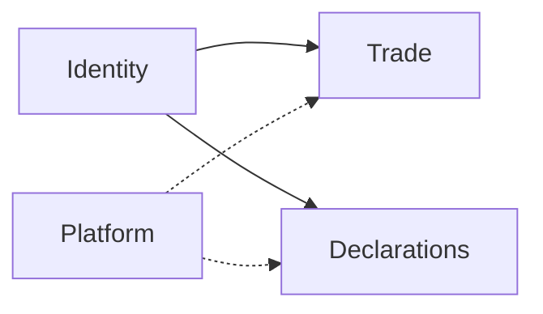

# Feed Farm Trade — architecture

**SSOT:** [doc/frontend/adr/001A-feed-farm-trade-architecture.md](../../../doc/frontend/adr/001A-feed-farm-trade-architecture.md)

**Platform model:** one SaaS platform · two modules (`declarations` | `fft`) · shared Platform/Identity/AdminCN/env/CI. Infra updates are **together**. Only module domain/RBAC/UI homes differ.

Agent one-screen (detail lives in 001A):



**Module rule:** no domain imports Trade ↔ Declarations. Compose at adapter if both needed.  
**Not a rule:** inventing a separate FFT infra/deploy/auth stack — that is the same platform as Declarations.

| Layer | Name |
|-------|------|
| UI / nav / FE docs | **Feed Farm Trade** |
| Flags / ops ADRs / domain slang | **Feed Farm Trade** (`FFT_*`) |

```text
app/fft/**/page.tsx → features/fft/* → app/actions/fft.ts → modules/fft/domain/*
layout: requireFftAccess + AdminCnShell only
```

| Concern | Path |
|---------|------|
| Layout gate | `app/fft/layout.tsx` |
| Entitlement | `features/portal-chrome/resolve-shell-access.ts` |
| Permissions | `modules/fft/domain/rbac-catalog.ts` |
| Session | `modules/fft/auth/fft-session.ts` |
| Store | `modules/fft/domain/store.ts` |
| Actions | `app/actions/fft.ts` |
| UI locale arg | `features/fft/trade-ui-locale.ts` |
| Ops SSOT | `docs/fft/RUNTIME.md` · gate-register |

**Dead residue (compulsory retire):** `/fft/[locale]`, `FftShell`, locale switcher, Hot Sales / `/trade` product identity — do not remount. Register: [deprecation-and-migration/reference.md](../agent-skills/skills/deprecation-and-migration/reference.md).

**Coding:** use [slice-playbook.md](slice-playbook.md) · [action-map.md](action-map.md) · [example-slice.md](example-slice.md).
