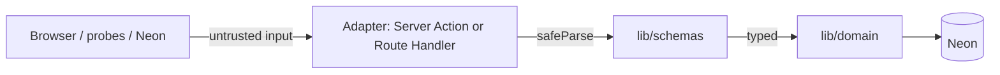

# API boundaries

Contract-first, one version, validate at the edge. Aligns with API & interface design + Next.js data patterns.

## Trust boundaries

| Layer | May | Must not |
|-------|-----|----------|
| Adapter (`app/actions`, `app/api`) | Session guard, Zod parse, map errors, `revalidatePath` | Raw SQL, business rules duplication |
| `lib/schemas` | Shape + refine | DB access |
| `lib/domain` | Parameterized queries, domain rules | Read `Request` / cookies directly |
| UI / RSC | Call domain (reads) or Actions (mutations) | Import `pg` / build SQL strings |

## Adapter choice

| Need | Adapter |
|------|---------|
| Same-origin UI mutation | **Server Action** |
| Same-origin UI read | **RSC → domain** (no HTTP) |
| Health / Auth proxy / draft XHR / external REST | **Route Handler** under `/api` |

One domain function can serve both Action and Route Handler — DRY.

## Session guards (examples)

| Guard | Used by |
|-------|---------|
| `requireAdminSession` | Operator Actions |
| `requireClientSession` / client helpers | Client Actions |
| `requireAccountSession` | Account routes/actions |
| Trade access helpers | `app/actions/trade` |

Route Handlers that mutate must authenticate equivalently (cookie session), not rely on “public `/api`” alone except health and Neon Auth proxy.

## Validation rule

- **At boundary:** `parseSchema` / `safeParse` on Action input or `request.json()`  
- **Not** re-validate the same shape inside every domain helper  
- Third-party responses (if any) are untrusted — parse before use  

## One-version rule

Do not ship `/api/v1` and `/api/v2` in parallel. Extend resources additively (optional fields). Deprecate with a written plan before removal.

## Related

- [02-rest-resources.md](02-rest-resources.md)  
- [03-error-contract.md](03-error-contract.md)  
- [../frontend/04-bff-and-data.md](../frontend/04-bff-and-data.md)  
