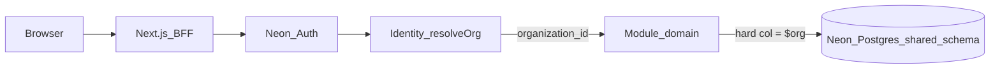

# Multi-tenant ecosystem (Afenda-Lite)

| Field | Value |
|-------|-------|
| **Status** | Living architecture SSOT — v1 hard cutover **shipped**; **multi-org ready** (M1–M4) **shipped** (logical tenancy; not multi-DB); Neon efficiency ladder A–E **closed** 2026-07-12 |
| **Decision lock** | **2026-07-12** — §0 below is binding for agents before product coding. Rejected / deferred items require explicit user reopen. |
| **Mode** | Architecture (inventory + Neon production posture) |
| **Decision ADR** | [doc/backend/adr/002-platform-tenancy-rbac.md](../backend/adr/002-platform-tenancy-rbac.md) |
| **Ops runbook** | [docs/runbooks/multi-org-ops.md](../../docs/runbooks/multi-org-ops.md) |
| **Phase evidence** | [doc/frontend/14-org-admin-rbac-tenancy-tasks.md](../frontend/14-org-admin-rbac-tenancy-tasks.md) |
| **Audience** | Agents + engineers — load this before inventing tenancy features or changing Neon Postgres posture |
| **Enables** | Correct tenancy claims; safe SQL/index changes; Neon production efficiency without reopening ADR-002 |
| **Agent skill** | [`.cursor/skills/neon-tenancy-efficiency`](../../.cursor/skills/neon-tenancy-efficiency/SKILL.md) — runnable efficiency + anti-drift ladder (§6) |

**Anti-claim:** Do **not** say “full multi-DB SaaS isolation” or “Neon project-per-tenant.” **D5** is an **accepted non-goal** (single Neon project/branch deploy). After M1–M4: **multi-org ready** means logical tenancy + switcher + scoped templates + org-required ops.

**ASSUMPTIONS (labeled):** Neon Console autoscaling / scale-to-zero / protected-branch toggles are operator-owned and may change outside git. This doc states the **target production posture**; verify live settings in Neon Console against branch `br-tiny-hill-ao82jp6f` before claiming compliance.

**Live verify snapshot (2026-07-12 — Launch org):** Neon Cloud `org-fragrant-lake-90358173` · project `young-hat-54755363` (**Afenda-Lite**) · branch `production` protected · PITR **7 days** (Launch max) · daily snapshots 17:00 UTC retain 14d · compute 0.25–2 CU · `suspend_timeout=0` · region `aws-ap-southeast-1`. Ops detail: [multi-org-ops.md](../../docs/runbooks/multi-org-ops.md). Agent ladder: [neon-tenancy-efficiency reference](../../.cursor/skills/neon-tenancy-efficiency/reference.md) A–E **closed**.

---

## 0. Decision lock — coding freeze (2026-07-12)

**Authority:** ADR-002 + Neon [multitenancy](https://neon.com/docs/guides/multitenancy) + [production checklist](https://neon.com/docs/get-started/production-checklist) · **Ops:** [neon-tenancy-efficiency](../../.cursor/skills/neon-tenancy-efficiency/SKILL.md) · **Deprecation:** [register](../../.cursor/skills/agent-skills/skills/deprecation-and-migration/reference.md)

Agents **must not** reopen rows marked **Rejected** or **Deferred** unless the user explicitly reopens that ID in the current turn. Efficiency / tenancy coding proceeds only on **Shipped** invariants and **Allowed next**.

### Shipped (locked — build on these)

| Invariant | Evidence |
|-----------|----------|
| Shared schema + hard `organization_id = $org` | Migrations `026`→`028`; `organizationScopeSql` |
| App predicates on BFF (not Neon RLS) | ADR-002 rule 8; Server Actions path |
| Multi-org ready M1–M4 (logical) | Switcher, scoped templates, isolation e2e, org-required ops |
| Neon prod posture C-pack | Protected branch; pooler runtime; PITR 7d; snapshots; restore drill |
| Efficiency ladder A–E | Skill reference closed 2026-07-12 |
| Domain hard-root anti-drift D7 + e2e org resolve D8 | Closed 2026-07-12 |

### Rejected (do not implement / do not re-teach)

| ID | Approach | Why locked out | Reopen only if |
|----|----------|----------------|----------------|
| **R1** | Soft SQL `(organization_id IS NULL OR = $org)` | Fail-open dual-mode deleted at Gate 0 | Never — hard-deleted |
| **R2** | First-org stamp `ORDER BY … LIMIT 1` (app or ops) | Wrong-tenant backfill under multi-org | Never — use explicit org / sole membership |
| **R3** | Neon RLS / Data API as default tenant isolation | Product path is BFF + domain SQL; RLS is Data API concern | New ADR accepting Data API tenant tables |
| **R4** | Schema-per-tenant | Neon discourages for SaaS; migration fan-out; weak vs project model | Explicit infra program |
| **R5** | Project-per-tenant as “efficiency fix” (D5) | Neon’s preferred isolation model ≠ our Modular Monolith / one Vercel deploy | Compliance, noisy-neighbor, or per-tenant PITR program |
| **R6** | Merge FFT **domain** catalogs into `platform_*` | Couples FFT gate-register to platform IAM | Separate ADR + FFT reopen |
| **R7** | Raise min CU / invent ERP env placeholders to green checks | Masks pooler/null/org bugs; ERP keys are 2D-3 tenant-owned | Measured latency evidence / integration pack |

### Deferred (not backlog bugs — do not start without reopen)

| ID | Item | Reason deferred | Reopen trigger |
|----|------|-----------------|----------------|
| **D4 / M5** | `organization_id` on FFT children (`fft_order`, …) | Parent `fft_event` + `getEventById(…, org)` is enough for v1 | Cross-event analytics / proven join pain |
| **D5** | Neon project-per-tenant fleet | Accepted shared-schema non-goal (same as R5) | Same as R5 |
| — | Prod `PORTAL_ORG_SWITCHER_ENABLED` | Needs second membership + rollback | Operator multi-org go-live |
| — | FFT P3 prod flag promotion | Gate-register only | Explicit FFT reopen |

### Allowed next (coding may start here)

1. Product features that **preserve** hard org filters on every new tenant-root query/write.
2. Weekly anti-drift pack from the skill reference (verify, don’t reopen R*/D*).
3. Named slices outside this freeze (Declarations / FFT product UI) — **not** tenancy-model experiments.

**Anti-claim for every PR:** do not say multi-DB isolation, project-per-tenant, or “RLS protects tenants on the BFF path.”

**Command cheat sheet (consistency):** [docs/runbooks/post-lock-coding-cheatsheet.md](../../docs/runbooks/post-lock-coding-cheatsheet.md)

---

## 1. Context

Afenda-Lite is a multi-module SaaS (Declarations + Feed Farm Trade) on one Next.js Modular Monolith, one Vercel project, and one Neon Postgres project. Tenants are **Neon Auth organizations**. Product authorization is **app-owned** (platform RBAC + module catalogs), not Neon Auth role names.

Official Neon multitenancy guidance describes three patterns ([Multitenancy with Neon](https://neon.com/docs/guides/multitenancy)):

| Neon pattern | Isolation | Ops cost | Fits Afenda-Lite today? |
|--------------|-----------|----------|-------------------------|
| **Project-per-tenant** (Neon’s preferred for strong isolation) | Instance-level; per-tenant PITR / region | Control plane + per-project migrations | **No** — D5 accepted non-goal; single deploy / shared shell |
| **Schema-per-tenant** | Schema boundary | Migration fan-out; connection routing | **No** — not chosen |
| **Shared schema + tenant key** | Row predicates (+ optional RLS) | One schema, one pool | **Yes — production model** |

**Best practice for this product (evaluated):** stay on **shared schema** with hard `organization_id NOT NULL`, composite indexes led by `organization_id`, and **application-enforced** predicates on Server Actions / domain SQL. Do **not** adopt Neon Data API + RLS for tenant tables unless a future ADR reopens that path. Do **not** migrate to project-per-tenant without an explicit infra program (closes D5).

---

## 2. Responsibilities and boundaries

```text
Tier 1  Neon Auth     organization / member / session.activeOrganizationId
Tier 2  Platform RBAC platform_* + fft.access (module entry)
Tier 3  Modules       hard organization_id = $org on tenant roots
```

| Layer | Owns | Must not own |
|-------|------|--------------|
| Neon Auth | Identity, org membership, invites, `activeOrganizationId` | Product permission codes |
| Platform RBAC | Catalog codes, org-scoped roles/assignments, `fft.access` entry | FFT domain event/order permissions |
| Module domain | Hard SQL `organization_id = $org`, business rules | Raw `process.env` tenancy hacks; `organizations[0]` |
| Neon Postgres | Pooling, autoscaling, branch/protect, restore | App authorization (no RLS on product path) |

**Product path:** RSC / Server Actions → Zod → `requireSession` / platform guards → `modules/*/domain` → parameterized SQL. Data API is **not** used for tenant data → Neon RLS is **out of scope** (ADR-002).

---

## 3. Components and request flow



Resolve order (M1): `activeOrganizationId` (if member) → slug match → **sole membership** → create + `setActive`. **Never** `organizations[0]` when membership length > 1 (throws `NO_ACTIVE_ORGANIZATION`).

Hard SQL helper: [`modules/platform/db/organization-scope.ts`](../../modules/platform/db/organization-scope.ts) → `col = $n` only (no soft `(NULL OR org)`).

### What is shipped (v1 hard cutover)

| Capability | Evidence |
|------------|----------|
| Hard SQL scope | `organizationScopeSql` → `col = $n` |
| Required org on tenant APIs | Declarations + FFT domain; Actions pass org from `resolvePlatformOrgContext` |
| Users directory | `listOrganizationUsers` / `getOrganizationUser` ⋈ `neon_auth.member` |
| FFT module entry | `hasFftModuleAccess` → platform `fft.access` only (no login promote) |
| Schema | Migration `027` — eight roots `NOT NULL` + org indexes; `028` scoped template unique |
| Ops / CI | `npm run audit:tenancy-nulls` · `check:tenancy-residue` · `backfill:fft-access` |

### Code entrypoints

| Concern | Path |
|---------|------|
| Org resolve | `modules/identity/portal-organization.ts` → `resolveActivePortalOrganization` |
| Adapter context | `modules/identity/domain/platform-rbac-access.ts` → `resolvePlatformOrgContext` |
| Hard SQL | `modules/platform/db/organization-scope.ts` |
| FFT entry | `modules/fft/auth/fft-module-access.ts` |
| Pool / pooler detect | `modules/platform/db.ts` · `modules/platform/db-config.ts` |
| Migration | `db/migrations/025` → `026` → `027` → `028` |
| Org switcher | `PORTAL_ORG_SWITCHER_ENABLED` + `setActiveOrganizationAction` + `features/portal-chrome/organization-switcher.tsx` |

---

## 4. Configuration inventory

### Repo env (tenancy-relevant)

| Var | Meaning |
|-----|---------|
| `PORTAL_ORG_SLUG` / `PORTAL_ORG_NAME` | Neon Auth org bootstrap identity (optional; defaults from `APP_URL` / product name) |
| `PORTAL_ORG_SWITCHER_ENABLED` | Show org switcher in AdminCN header (default off) |
| `APP_URL` | Invite Origin + slug fallback |
| `FFT_RBAC_ENABLED` | FFT **domain** dual-read flag — **not** soft SQL tenancy |
| `DATABASE_URL` | Production must use Neon **`-pooler`** hostname (see §6) |
| `NEON_ORG_ID` | Neon **Cloud** account org — **not** the Auth tenant id |

No Neon Auth organization UUID is hardcoded in app runtime; tenant id is resolved from session / list / create.

### Neon Auth (Tier 1)

| Object | Role |
|--------|------|
| `neon_auth.organization` | Tenant registry |
| `neon_auth.member` | Membership SoT for Users UI |
| `session.activeOrganizationId` | Preferred resolver input |

### App DB tenant roots (`organization_id NOT NULL` after `027`)

| Module | Tables |
|--------|--------|
| Declarations | `surveys`, `client_invitations`, `client_profiles`, `client_assignments` |
| FFT | `fft_event`, `fft_sales_member`, `fft_role`, `fft_role_assignment` |

Platform: `platform_role.organization_id` may be NULL only when `is_system_template = TRUE`. Assignments are always org-scoped.

---

## 5. Key decisions (why not Neon’s default project-per-tenant)

| Decision | Rationale | Source |
|----------|-----------|--------|
| Shared schema + `organization_id` | One Modular Monolith, one Vercel deploy, shared AdminCN; lowest ops for beta / lite ERP | ADR-002 |
| Hard `NOT NULL` + hard filters | Fail closed after Gate 0; no soft dual-mode residue | Migration `027` |
| App predicates, not RLS | Product path is Server Actions; Data API unused; RLS required only for Data API tables | [Neon RLS](https://neon.com/docs/guides/row-level-security); ADR-002 |
| Defer project-per-tenant (D5) | Stronger isolation / per-tenant PITR / compliance would justify Neon’s preferred model — not required for current scale | [Neon multitenancy](https://neon.com/docs/guides/multitenancy) |
| Keep FFT domain catalogs separate | Avoid coupling FFT gate-register to platform IAM | ADR-002 |

Revisit D5 only when compliance, noisy-neighbor, or per-tenant restore requirements force instance-level isolation.

---

## 6. Neon Postgres — production efficiency posture

Mapped from Neon’s [production checklist](https://neon.com/docs/get-started/production-checklist) and [connection pooling](https://neon.com/docs/connect/connection-pooling) onto Afenda-Lite. Optimize **shared-schema** efficiency; do not imply multi-project tenancy.

### 6.1 Connections (mandatory for serverless)

| Rule | Afenda practice |
|------|-----------------|
| App / Vercel runtime | `DATABASE_URL` with **`-pooler`** host (PgBouncer transaction mode) |
| Migrations / `pg_dump` / session features | Direct (non-pooler) endpoint — never run migrations through the pooler |
| Detection | `isPoolerConnection` in `modules/platform/db-config.ts`; readiness degrades when prod requires pooler and URL is direct |
| Client pool | `pg.Pool` + `attachDatabasePool` on Vercel (`modules/platform/db.ts`) |

Pooler limits scale with compute size (`max_connections`); PgBouncer accepts up to 10k client connections but concurrent active transactions per user/db ≈ 90% of `max_connections`. Prefer short transactions; avoid session `SET` on pooled connections.

### 6.2 Compute, latency, and cost

| Setting | Production target | Why |
|---------|-------------------|-----|
| Paid plan | Required for prod | Free plan compute-hour limits |
| Region | Same region as Vercel app | Latency dominates untuned SQL |
| Production branch | Root + **default** + **protected** | Snapshots, billing clarity, prevent accidental reset |
| Autoscaling min CU | High enough to keep working set in LFC | Undersized min → cache thrash after scale-down |
| Autoscaling max CU | Headroom for spikes | Also caps local disk for temp / heavy queries |
| Scale-to-zero | **Disable** for user-facing prod if cold starts are unacceptable | OK for idle preview/dev branches |

Local policy remains: dev uses production Neon branch `br-tiny-hill-ao82jp6f` ([AGENTS.md](../../AGENTS.md)) — treat cold-start and scale-to-zero as production UX, not “dev only.”

### 6.3 Shared-schema query efficiency

| Practice | Rule |
|----------|------|
| Tenant column | Every tenant-root table: `organization_id uuid NOT NULL` |
| Predicate | Every tenant query: hard `organization_id = $org` via domain helpers |
| Indexes | Prefer **`(organization_id, …)` leading** on hot paths; migration `027` created org indexes — extend composites when query plans show seq scans |
| Child tables | FFT children may inherit org via `fft_event` (D4/M5); do not omit org filter on joins |
| Extensions | Enable `pg_stat_statements` on prod for slow-query triage ([Neon checklist](https://neon.com/docs/get-started/production-checklist)) |

### 6.4 Resilience and restore

| Practice | Rule |
|----------|------|
| Instant restore history | Size window to incident discovery time vs history storage cost — **Afenda-Lite Launch: 7 days max** (`604800`); verified 2026-07-12 |
| Snapshot schedule | On root/prod branch; test restore before you need it — daily 17:00 UTC + 14d retention + manual baseline; restore drill recorded in [multi-org-ops](../../docs/runbooks/multi-org-ops.md) |
| Connection retries | Drivers/pools must survive compute restart / scale events |
| Branch hygiene | Expire preview branches; do not leave orphan compute cost |
| IP Allow | Restrict prod DB endpoints to trusted networks when ops maturity allows |

### 6.5 Security boundary (shared schema)

- Isolation is **logical**: a missing `WHERE organization_id = $1` is a **critical bug**, not a Neon misconfig.
- Defense in depth today: Zod + session org resolve + hard SQL helper + `audit:tenancy-nulls` + L4 `e2e/tenancy-isolation.spec.ts`.
- Neon RLS remains a **future option** only if Data API or a defense-in-depth ADR is accepted — not a silent add-on to the current BFF path.

---

## 7. Failure modes

| Failure | Symptom | Immediate action |
|---------|---------|------------------|
| Cross-tenant leak | Wrong org data in UI / API | Stop deploy; grep domain for unscoped queries; run isolation e2e |
| Null org on root | Insert/update violates `NOT NULL` | Fix writer; `npm run audit:tenancy-nulls` |
| Multi-membership without active org | `NO_ACTIVE_ORGANIZATION` | User selects org (switcher) or set active org |
| Pool exhaustion | Timeouts / `query_wait_timeout` | Confirm `-pooler` URL; shorten transactions; raise compute if needed |
| Cold start after idle | Multi-hundred-ms first query | Disable scale-to-zero on prod endpoint if SLA requires it |
| Ops stamp wrong org | Backfill into wrong tenant | Never `ORDER BY … LIMIT 1` with multiple Auth orgs — see runbook |

Ops procedures: [docs/runbooks/multi-org-ops.md](../../docs/runbooks/multi-org-ops.md).

---

## 8. Explicit non-goals of v1

- Neon RLS on the product BFF path
- Merging FFT **domain** permission catalogs into `platform_*`
- Flipping prod `FFT_*` flags without gate-register
- Adding `organization_id` to every FFT child table (`fft_order`, etc.) — parent event join is enough for v1 (M5)
- Project-per-tenant / schema-per-tenant without a program that closes D5

M1–M4 are **shipped** (§9) — not non-goals.

---

## 9. Residual debt and multi-org roadmap

### Residual single-org / infra debt

| ID | Debt | Status |
|----|------|--------|
| D1 | First-org fallback when no active org / slug miss | **Closed (M1)** — sole membership only; multi-org fails closed |
| D2 | Global `UNIQUE(template_key)` on `platform_role` / `fft_role` | **Closed (M2)** — migration `028` scoped unique |
| D3 | No org-switcher UI | **Closed (M1)** — gated by `PORTAL_ORG_SWITCHER_ENABLED` |
| D4 | FFT children inherit org via `fft_event` only | **Accepted deferred (M5)** — not a bug; entry via `getEventById(…, org)` |
| D5 | Single Neon project/branch deploy | **Accepted non-goal** — shared-schema model; see §5 / §8 (not a backlog item) |
| D6 | Ops scripts that stamp “first org” | **Closed (M4)** — `backfill-fft-access` requires explicit org |
| D7 | Domain hard-root anti-drift (RBAC / closing-soon / profile delete) | **Closed 2026-07-12** — see skill reference block D |
| D8 | E2E helper first-org `LIMIT 1` stamp | **Closed 2026-07-12** — membership / `PORTAL_ORGANIZATION_ID` / `E2E_ORGANIZATION_ID` |

### Post-v1 requirements

| Phase | Track | Status | Requirement |
|-------|-------|--------|-------------|
| **M1** | Membership UX | **Shipped** | Org switcher + fail-closed bootstrap |
| **M2** | RBAC templates | **Shipped** | Scoped unique `(organization_id, template_key)` (`028`) |
| **M3** | Isolation proof | **Shipped** | L4 `e2e/tenancy-isolation.spec.ts` |
| **M4** | Ops multi-org | **Shipped** | Org-required backfill + [multi-org-ops runbook](../../docs/runbooks/multi-org-ops.md) |
| **M5** | Optional data | Proposed | `organization_id` on hot FFT children if cross-event analytics need it |

### Definition of Done — “multi-org ready”

Agents and humans may claim **multi-org ready** only when:

- [x] **M1** Accepted and shipped (switcher + fail-closed bootstrap)
- [x] **M2** Accepted and shipped (template uniqueness per org)
- [x] **M3** Accepted and green in CI (`tenancy-isolation` missing-UUID cases; foreign-org env optional)
- [x] **M4** Accepted (ops playbooks)

**M5** remains optional. Language after M1–M4: **multi-org ready** (logical tenancy + switcher + scoped templates + ops). Still **not** multi-DB / project-per-tenant isolation (D5).

---

## 10. Related sources

| Doc | Role |
|-----|------|
| [neon-tenancy-efficiency skill](../../.cursor/skills/neon-tenancy-efficiency/SKILL.md) | Agent ladder: pooler, tenancy audits, SQL, weekly anti-drift |
| [ADR-002](../backend/adr/002-platform-tenancy-rbac.md) | Decision record (IAM + hard tenancy) |
| [multi-org-ops runbook](../../docs/runbooks/multi-org-ops.md) | Operator procedures |
| [Neon multitenancy](https://neon.com/docs/guides/multitenancy) | Official pattern comparison |
| [Neon production checklist](https://neon.com/docs/get-started/production-checklist) | Compute / restore / pooling |
| [Neon connection pooling](https://neon.com/docs/connect/connection-pooling) | Pooler vs direct |
| [Neon RLS](https://neon.com/docs/guides/row-level-security) | Required for Data API — not current product path |
