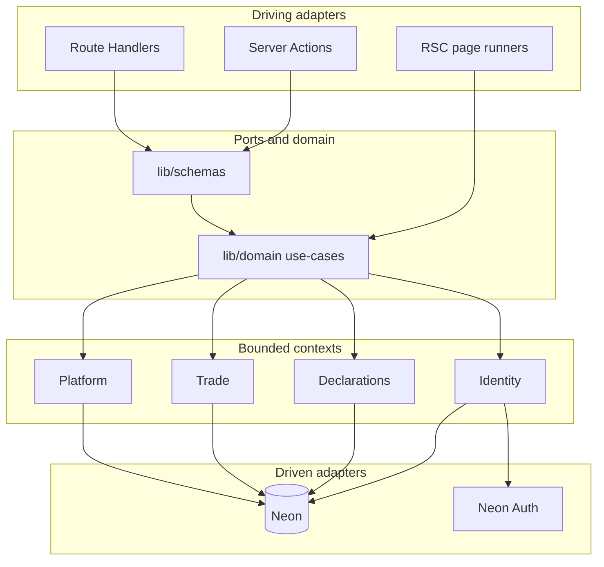

# Modular Monolith + Hexagonal (method reference)

**Framework version:** Next.js App Router Modular Monolith + Hexagonal (Ports & Adapters)  
**ADR:** [adr/001-modular-monolith-hexagonal.md](adr/001-modular-monolith-hexagonal.md)

## What it means

| Term | Meaning here |
|------|----------------|
| Modular monolith | One deployable; code split by **bounded context**, not by network |
| Hexagonal | Domain/use-cases at the center; **driving** adapters (UI/HTTP) and **driven** adapters (DB/Auth) at the edges |
| Port | Contract (TypeScript interface / documented use-case set) that adapters call |
| Adapter | Next.js RSC, Server Action, or Route Handler (driving); SQL / Neon Auth (driven) |

## Layers (do / don't)

| Layer | May | Must not |
|-------|-----|----------|
| Driving adapter | Session guard, Zod parse, map errors, `revalidatePath` | Raw SQL, business rules duplication |
| Port / use-case (`lib/domain` exports) | Orchestrate domain rules, call DB helpers | Import `Request`, `next/headers`, UI |
| Zod (`lib/schemas`) | Shape inbound DTOs | Touch DB |
| Driven (SQL / Neon Auth) | Persist / identity provider | Know about React or HTTP status codes |

## Next.js data-pattern decision tree (mandatory)

**Byte-identical** to [../frontend/04-bff-and-data.md](../frontend/04-bff-and-data.md):

```text
Need data?
├── Server Component read?     → lib/domain (or page runner) directly
├── Client mutation?           → Server Action ('use server')
├── Client read that cannot be passed from parent?
│     → prefer lift fetch to Server parent; else Route Handler
├── Webhook / third-party HTTP / health / auth proxy / autosave XHR?
│     → Route Handler under app/api/**
└── External/mobile REST consumer?
      → Route Handler implementing doc/api REST contract
```

## Diagram



## KISS defaults

- Do **not** add `lib/application/` unless a port cannot be expressed as domain exports.  
- Do **not** introduce repository classes until a second store appears.  
- Do **not** expose every use-case as HTTP — see `api-now` vs `contract-only` in [../api/02-rest-resources.md](../api/02-rest-resources.md).  

## Related

- [04-nextjs-adapter-map.md](04-nextjs-adapter-map.md)  
- [05-contract-rules.md](05-contract-rules.md)  
- [02-bounded-contexts.md](02-bounded-contexts.md)  
