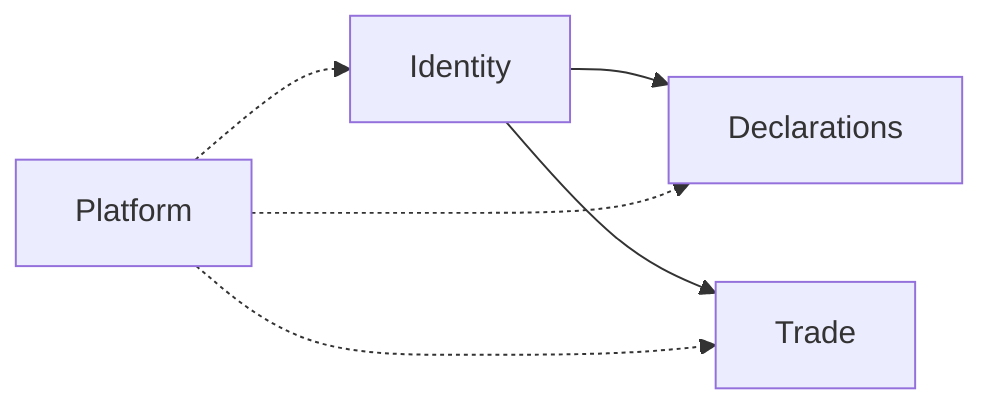

# Bounded contexts

Modules inside the monolith. Dependencies are **one-way** and minimal.

## Context map

| Context | Owns | Code today | May depend on | Must not depend on |
|---------|------|------------|---------------|--------------------|
| **Identity** | Session, org membership, invites, account | `lib/auth`, `lib/domain/invite`, `neon-auth-users`, `app/actions/account`, admin sign-in/preview | Neon Auth | Declarations, Trade |
| **Declarations** | Surveys/declarations, questions, clients list, assignments, submissions, share links, drafts | `lib/domain/surveys*`, `clients`, `questions`, `declaration-*`, `client-declaration-draft`, `app/actions/{surveys,client,declarations,admin}` | Identity (actor / org ids) | Trade |
| **Trade** | Events, orders, allocation, deposits, pickup, imports, ERP sync, RBAC | `lib/domain/trade/**`, `app/actions/trade` | Identity (allowlist / RBAC) | **Declarations** |
| **Platform** | Health, env, observability helpers | `app/api/health/*`, `lib/env` | nothing product-specific | — |

## Hard rules

1. **Trade ↛ Declarations** (and reverse). No imports across those domain trees.  
2. Shared primitives only: `lib/schemas/common`, branded IDs, copy/env utilities.  
3. New feature → pick **one** context; if it needs both Trade and Declarations data, compose at the **adapter** (page/action) by calling two ports — do not merge domains.  
4. Schema/migrations: prefer table prefixes or clear ownership comments per context when adding tables.

## Scaling path (later, needs new ADR)

- Extract Trade to a separate deployable only when team/ops cost of a monolith exceeds benefit.  
- Until then: modular folders + import bans (lint/check) beat network splits.  

## Related

- [03-ports-and-adapters.md](03-ports-and-adapters.md)  
- [adr/001-modular-monolith-hexagonal.md](adr/001-modular-monolith-hexagonal.md)  
