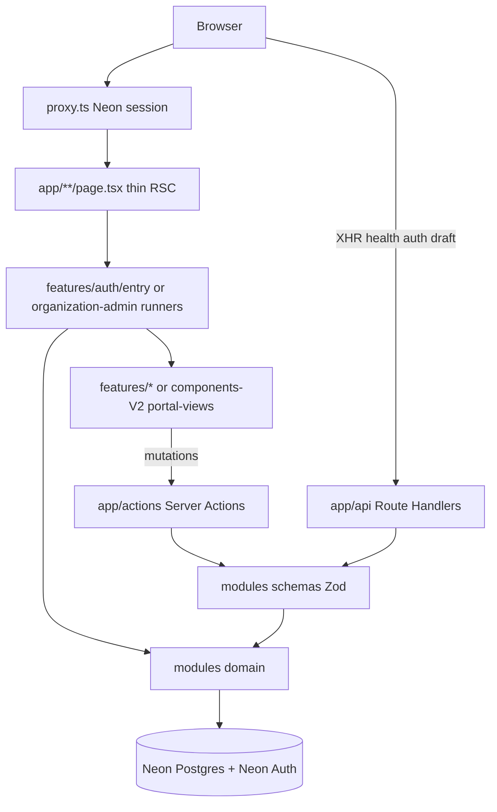

# Frontend architecture

**Audience:** engineers rebuilding product UI after the frontend wipe.  
**Runtime:** Node.js (default). Edge only as a documented exception.

## Layer diagram

## Rules (Next.js + KISS)

| Rule | Detail |
|------|--------|
| Thin routes | `page.tsx` / `layout.tsx` only compose — no business SQL, no fat JSX trees |
| RSC reads | Server Components call `modules/*/domain` or page runners **directly** |
| Mutations | Client forms/buttons call **Server Actions** (`'use server'`) |
| HTTP adapters | `app/api/**` only for health, Neon Auth proxy, draft autosave, external clients |
| Validation | Zod at adapter edge (`modules/*/schemas`); domain trusts typed input |
| Session | `require*Session` in actions/layouts; `proxy.ts` gates document navigations |
| UI homes | Auth/landing → `features/`; operator shell screens → `components-V2/.../portal-views/` |
| Do not recreate | Root `components/` was hard-deleted — do not restore as a dump; place new UI in `features/` or `components-V2/` |

## Route groups (AdminCN intent)

Mirror AdminCN `(blank)` vs `(pages)` without copying demo auth:

| Group | URL impact | Use |
|-------|------------|-----|
| `app/client/(gate)` | none | Public/client entry (login) — blank chrome |
| `app/client/(workspace)` | none | Authenticated client shell |
| `app/auth/*` | `/auth/...` | Neon Auth island (`features/auth`) — not AdminCN theme |
| `app/dashboard/*` | `/dashboard/...` | Operator AdminCN shell |

## Related

- [04-bff-and-data.md](04-bff-and-data.md) — decision tree  
- [07-nextjs-conventions.md](07-nextjs-conventions.md) — special files, async APIs, RSC boundaries  
- [../api/01-boundaries.md](../api/01-boundaries.md) — trust boundaries  
- [adr/001A-feed-farm-trade-architecture.md](adr/001A-feed-farm-trade-architecture.md) — Feed Farm Trade module architecture  
