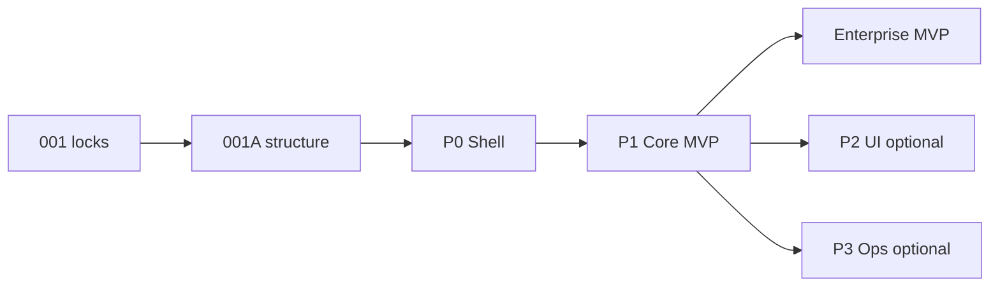

# Frontend ADR-001R — Feed Farm Trade roadmap (MVP)

| Field | Value |
|-------|-------|
| **Status** | Active |
| **Date** | 2026-07-11 |
| **Mode** | Roadmap + gap register (execution) |
| **Audience** | Engineers + agents building FFT |
| **Decision** | [001-feed-farm-trade.md](001-feed-farm-trade.md) |
| **Architecture** | [001A-feed-farm-trade-architecture.md](001A-feed-farm-trade-architecture.md) |
| **Pair** | Keep with 001 / 001A under `doc/frontend/adr/` |
| **Agent skill** | [`.cursor/skills/feed-farm-trade`](../../../.cursor/skills/feed-farm-trade/SKILL.md) |

---

## Agent load card

| Task | Load |
|------|------|
| Locks / naming / scope | **001 only** |
| Folders / vertical slice | **001A** |
| MVP exit (what to build) | **Outcome lock + P1** (skip P2/P3/Later unless tasked) |
| Why a capability is in/out | **Gap register** |
| Ops flag promote | P3 + living gate-register (G0 docs restored) |
| Code vs arch status | [completeness.md](../../../.cursor/skills/feed-farm-trade/completeness.md) |

```text
DO NOT: FftShell, /fft/[locale], customer portal, invent permission codes, rename FFT_*
MVP ≠ events/orders/alloc alone — see P1 promoted gaps G1–G6
TRUSTED: modules/fft/domain/rbac-catalog.ts · app/actions/fft.ts · modules/fft/domain/store.ts
```

**Code pack (P1):** `rbac-catalog.ts` · `app/actions/fft.ts` · `modules/fft/domain/store.ts` · shell/access · `app/fft/layout.tsx` · `navConfig.tsx` · `features/fft/*`

---

## Outcome lock — enterprise MVP

**Satisfactory enterprise grade = P0 + P1 done** (working MVP, not a documentation binder).

**Operator outcome:** Entitled sales/ops can run a full program cycle: setup event (products, **supply**, **custom fields**, **customer priority**) → open window → take orders → **transfer** when needed → **allocate** (respecting priority/supply) → **complete** orders → **audit/export** as permitted. Thin AdminCN pages OK. Full AdminCN polish = P2. Deposits/pickup/ERP = P3.

| Claim | Required |
|-------|----------|
| **Enterprise MVP** | **P0 + P1** (includes G1–G6) + AC evidence |
| UI polish | P2 — **complete 2026-07-11** (P2-AC-01..06 evidenced; optional further polish needs named AC) |
| Ops handoff | P3 — flags + gate-register (ops docs present — G0 resolved) |
| Customer portal / locale URLs / `FFT_*` rename | Later |



**Program status (2026-07-11):** P0 done; P1 engine+FE wired with AC evidence recorded (`EVALUATE_P1_MVP: YES` in skill `verify.md`); **enterprise MVP claimable**. P2 UI polish AC-01..06 done. P3 = flag-off placeholders + gate-register for any prod `FFT_*` enable. See [completeness.md](../../../.cursor/skills/feed-farm-trade/completeness.md).

---

## Critical gap register

Evidence: engine RBAC + actions + domain + AdminCN pages (2026-07-11). External trade-show/ERP features filtered out — wrong product shape.

### G0 — Ops docs tree (repo integrity) — **resolved**

| | |
|--|--|
| **Finding (was)** | Working tree briefly had **no** `docs/fft/` after `f479d5a`. |
| **Resolution** | Restored from `f479d5a^`. Living SSOT: [RUNTIME](../../../docs/fft/RUNTIME.md) · [gate-register](../../../docs/fft/ops/gate-register.md). |
| **Impact now** | P3 may cite ops docs. **Flag promotion** still requires gate-register checklist — not “docs missing.” |
| **Tag** | Closed for doc presence |

### Promote into P1 (engine present — FE wired)

| ID | Capability | Surface | Why MVP | FE status |
|----|------------|---------|---------|-----------|
| **G1** | Customer priority | `priority.manage`, `importPriorityCsvAction`, `fft_customer_priority` | Allocation is priority-ranked | Setup page — wired |
| **G2** | Supply caps | `supply.manage`, product supply in setup | Allocation without supply is unconstrained | Setup — wired |
| **G3** | Order transfer | `transfer.request` / `transfer.approve` (+ reject) | Default **sales_executive** includes `transfer.request` | My-orders — wired |
| **G4** | Order complete | `completeTradeOrderAction` / `completeOrder` | Cycle must close after allocate | My-orders / allocation — wired |
| **G5** | Custom field defs | `custom_field.manage`, field-def actions | Template-driven farm programs | Setup — wired |
| **G6** | Audit view | `audit.view`, `listAuditForEvent` / `recordFftAudit` | Minimum enterprise governance | Setup — wired |

### Fix as AC (already partly named)

| ID | Issue |
|----|--------|
| **G7** | Clone / template / schedule activate — AC under F-EVT |
| **G8** | Exports (`export.orders`) — AC under F-ADM |
| **G9** | Manual allocation override — AC under F-ALC (sensitive) |

### Keep out of MVP (noise / later)

Offline booth · barcode · floor plans · full feed ERP / formulation · VFD · customer portal · mobile-native apps · deposits/pickup/imports/ERP sync (→ **P3**) · notification delivery polish (→ P3/Later)

---

## P0 — Shell (MVP prerequisite)

**Dev spec + evaluation checklist:** [11-feed-farm-trade-phase0-shell.md](../11-feed-farm-trade-phase0-shell.md)

**Status:** Done — locale tree removed; AdminCN-only layout.

| ID | Must hold |
|----|-----------|
| F-ACC-01 | Entry only via `requireFftAccess` |
| F-ACC-02 | FFT nav only when entitled (`fft`) |
| F-ACC-03 | AdminCN on `/fft/*` |
| F-ACC-04 | No session → sign-in |
| F-ACC-05 | Locale-free `/fft` |

| AC | Pass when |
|----|-----------|
| AC-ACC-01 | No trade perm → denied + nav hidden |
| AC-ACC-02 | Trade perm → AdminCN + FFT nav |
| AC-ACC-03 | Org admin without trade → Declarations OK, `/fft` denied |
| AC-ACC-04 | Anonymous → sign-in |
| AC-SH-01..03 | No FftShell / locale segment; label **Feed Farm Trade**; no Declarations **domain** bleed (same AdminCN platform) |

**DoD:** [x] layout gate + AdminCN · [x] `resolveShellAccess` + tests · [x] nav `moduleId` · [x] fft-session deny tests · [x] pair in `doc/README.md` · [x] no live `app/fft/[locale]`

---

## P1 — Core cycle (MVP)

**Dev spec + evaluation checklist:** [12-feed-farm-trade-phase1-core-mvp.md](../12-feed-farm-trade-phase1-core-mvp.md)

**Status:** Engine + FE **wired** (2026-07-11). Claim enterprise MVP only when **all** AC rows below have evidence (including G1–G6).

Thin AdminCN pages OK. Full screens = P2.

### Features

| ID | Function | Surface |
|----|----------|---------|
| F-EVT-01..05 | List / create / setup / open-close / templates | `event.*`, templates |
| F-EVT-06 | Clone event / ensure template / activate scheduled | `cloneTradeEventAction`, `ensurePigletTemplateAction`, `activateScheduledTradeEventAction` (**G7**) |
| F-SUP-01 | Manage supply quantities on event products | `supply.manage` (**G2**) |
| F-FLD-01 | Manage custom field defs for event | `custom_field.manage` (**G5**) |
| F-PRI-01 | Manage / import customer priority for event | `priority.manage`, `importPriorityCsvAction` (**G1**) |
| F-ORD-01..04 | Create in window; own/team/all; reject bad creates | `order.*` |
| F-ORD-05 | Complete order after allocation path | `completeTradeOrderAction` (**G4**) |
| F-XFR-01 | Request transfer | `transfer.request` (**G3**) |
| F-XFR-02 | Approve / reject transfer | `transfer.approve` (**G3**) |
| F-ALC-01..03 | Preview / run / sensitive override | `allocation.*` (**G9**) |
| F-AUD-01 | View event audit trail | `audit.view` (**G6**) |
| F-ADM-01..03 | Membership + roles + exports | sales-member / `role.manage` / `export.orders` (**G8**) |

### Route map (locale-free)

| Route | Capability |
|-------|------------|
| `/fft` | Redirect → events |
| `/fft/events` | List events |
| `/fft/admin/events`, `/new`, `/[eventId]/setup` | Create / setup / open-close / supply / fields / priority / audit / export |
| `/fft/events/[eventId]/order` | Submit order in window |
| `/fft/my-orders` | Own orders + transfer + complete |
| `/fft/admin/events/[eventId]/allocation` | Preview / run / override |
| `/fft/admin/rbac` | Sales-member / RBAC admin |
| `/fft/admin/.../deposits\|pickup\|imports`, `/erp-sync` | **P3** placeholders — flag-gated |

### Acceptance

| AC | Pass when |
|----|-----------|
| AC-EVT-01..04 | Setup + window lifecycle; missing perms denied |
| AC-EVT-05 | Clone or template seed produces usable event setup (**G7**) |
| AC-SUP-01 | Supply editable with `supply.manage`; denied without (**G2**) |
| AC-FLD-01 | Field defs editable with `custom_field.manage`; denied without (**G5**) |
| AC-PRI-01 | Priority list/import works with `priority.manage`; denied without (**G1**) |
| AC-ORD-01..04 | In-window create; own list; out-of-window / no-perm fail |
| AC-ORD-05 | Complete succeeds when domain allows; denied without perm (**G4**) |
| AC-XFR-01..02 | Request/approve/reject honor codes (**G3**) |
| AC-ALC-01..02 | Preview/run only with codes |
| AC-ALC-03 | Override only with `allocation.override` (**G9**) |
| AC-AUD-01 | Audit readable with `audit.view`; denied without (**G6**) |
| AC-ADM-01 | Export orders/summary with `export.orders` when permitted (**G8**) |

### DoD

- [x] Mutations via `app/actions/fft.ts` + Zod + session/permission; no raw SQL in actions
- [x] Domain only in `modules/fft`
- [x] G1–G6 covered by setup / my-orders / allocation / rbac pages
- [x] No FftShell / locale switcher mounted; no live `[locale]` App Router tree
- [x] API catalog locale-free for trade (`doc/api/02-rest-resources.md`)
- [x] AC above green (unit and/or e2e `@journey` as available) — evidenced 2026-07-11; see skill `verify.md`

**Verify:** `modules/fft/domain/rbac-catalog.ts` · `app/actions/fft.ts` · `modules/fft/domain/store.ts` · `modules/fft/**/*.test.ts` · thin pages under `app/fft/**`

---

## P2 — UI reopen (not MVP)

**Dev spec:** [13-feed-farm-trade-phase2-ui-polish.md](../13-feed-farm-trade-phase2-ui-polish.md)

**P2 complete 2026-07-11** (P2-AC-01..06 PASS in [13](../13-feed-farm-trade-phase2-ui-polish.md)). Further polish only with a named P2-AC + Plan for visual. `features/fft` + thin pages; Feed Farm Trade copy; P1 AC stay green; templates as data; no FftShell.

---

## P3 — Ops flags (not MVP)

**Dev spec (scope-only, not authorization):** [14-feed-farm-trade-phase3-ops-flags.md](../14-feed-farm-trade-phase3-ops-flags.md)

Deposits / pickup / imports / ERP (`F-OPS-*`) only when `FFT_*` on **and** gate-register allows.

**G0 docs restored.** Do not invent promotion checklists here — use [ops/gate-register.md](../../../docs/fft/ops/gate-register.md).

| AC | Pass when |
|----|-----------|
| AC-OPS-01 | Flags off → ops writes blocked; P1 still works |
| AC-OPS-02 | Flag on + gate-register → F-OPS-* honor permissions |

---

## Later

Customer portal · locale URLs · ERP vendor packs (2D-3) · renaming `FFT_*` / `/fft` · AdminCN demo prune · offline/mobile/trade-show booth features · VFD / full mill ERP.

---

## Builder rules

1. Prefer 001 + 001A + 001R over locale trees / FftShell.
2. Do not claim enterprise MVP without **P0 + P1 including G1–G6** and AC evidence.
3. No customer-portal bleed into FFT PRs.
4. P3 needs living gate-register SSOT (present) + checklist — not FE invention.
5. Do not pull industry booth/ERP/VFD into P1 because peers have them.
6. Update [completeness.md](../../../.cursor/skills/feed-farm-trade/completeness.md) when wire status changes.
