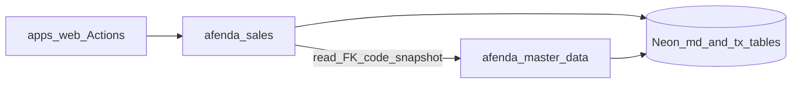

# ARCH-006 consumer contract (Scratch)

| Field | Value |
|-------|-------|
| Surface | `docs-V2/master-data/arch-006-consumer-contract.md` |
| Authority | **Scratch** — R5 phase 0 (accepted 2026-07-20) |
| Mode | Technical spec |
| Audience | Engineers building Sales / Purchasing / Inventory / … packages |
| Parents | [remaining-slices.md](remaining-slices.md) R5 · [master-data-dna.md](master-data-dna.md) §23 · §29 · [development-method.md](development-method.md) |

**Action this doc enables:** start R5-1 Sales without inventing shadow customer/product tables.

---

## Goals

1. Downstream modules **reference** Authority B masters by FK + branded id + stable `code`.
2. Snapshot commercial values at document create/post — do not re-read mutable masters as historical truth.
3. Keep transactional tables **out** of `@afenda/master-data`.

## Non-goals

| Out | Why |
|-----|-----|
| Implementing Sales schema in this doc mission | Contract only (R5-0) |
| `sales_customer` / `purchase_supplier` / `inventory_product` / `finance_vendor` | Forbidden shadow roots (DNA §27.3) |
| BOM · stock qty · CoA inside master-data | Transactional / ledger |
| Porting NATS / `x-tenant-id` | Rejected |

---

## Ownership

| Concern | Owner |
|---------|-------|
| `ref_*` · `md_*` writes | `@afenda/master-data` only |
| Sales / Purchasing / … documents | Future `@afenda/{sales,…}` (or web module) — **consumer** |
| Session org / Actions | `apps/web` thin adapters |
| Outbox for transactional docs | `@afenda/events` catalogs owned by that module |



---

## Consumer rules (binding)

1. **Party** — FK `md_party.id` + stamp `party_code` (and name) at header create/post.
2. **Item** — FK `md_item.id` (concrete variant item when variants exist) + stamp `item_code`, base UoM id/code at line create/post.
3. **Payment term** — optional FK `md_payment_term.id` + stamp `net_days` / code when commercial.
4. **Tax registration** — when R4 shipped and document needs it: FK + stamp registration number/jurisdiction; do not invent local tax-id columns that bypass `md_tax_registration`.
5. **Warehouse** — FK `md_warehouse.id` when inventory-touching docs need location master.
6. **Organization** — every transactional root non-null `organization_id`; same-org FK checks on all master refs.
7. **Lookup** — resolve masters via package commands (`getById` / `getByCode` / external-id); never SQL dual-write into `md_*`.
8. **Search** — may query `@afenda/search` for picker UX; search never authorizes or writes masters.

---

## Anti-shadow verify (every consumer PR)

```bash
rg "sales_customer|purchase_supplier|inventory_product|finance_vendor" packages apps --glob "!**/node_modules/**"
# Expect: zero product tables / dual masters (tests may assert absence)
```

Also: no org-scoped `md_uom`; no Employee under `md_*`.

---

## Locked first consumer: Sales (R5-1)

| Lock | Value |
|------|--------|
| First module | **Sales** |
| Minimum attach | Order header → `md_party`; lines → `md_item`; optional payment term |
| Package | New Rank package or web module — Agent discover name at implement; must appear in monorepo DAG |
| Must not | Local customer table; mutate `md_*` from sales store |

**R5-1 ship sketch (next implement mission, not this doc):**

- Schema for sales document roots/lines with master FKs + snapshot columns.
- Commands: create draft order, add line, post (snapshot freeze).
- Tests: org bind · FK same-org · shadow `rg` · cannot post without active party/item as policy requires.
- Web: thin Actions + minimal UI.

Purchasing / Inventory / Manufacturing / Finance = later chats, same contract.

---

## Master-data duty during R5

Stay authoritative: lifecycle, external-id, alias, search rebuild, pageSize≤100. Do not grow SO/PO/stock tables into [packages/erp/master-data](../../packages/erp/master-data).

---

## Acceptance for R5-0 (this document)

- Contract accepted (this file exists and is linked from remaining-slices).
- Q4 resolved: Sales first.
- R5-1 requires `/cursor-mission-compile` citing this path — **no** transactional schema in the method-delivery mission.

## Companions

- [development-method.md](development-method.md)
- [../monorepo/README.md](../monorepo/README.md)
- [../tax/tax-architecture.md](../tax/tax-architecture.md) (when Sales needs tax stamp)
