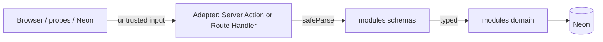

# API-001 API Boundaries

| Field | Value |
|-------|-------|
| ID | API-001 |
| Category | API |
| Version | 1.2.3 |
| Status | Living |
| Control State | Closed |
| Owner | Backend |
| Updated | 2026-07-14 |

# 1. Purpose

Contract-first, one version, validate at the edge. Enables engineers to choose the correct adapter and security pipeline before writing Actions or Route Handlers.

**Parent architecture:** [ARCH-029](../architecture/ARCH-029-interface-api-architecture.md). **Audience:** backend and frontend maintainers. **Action enabled:** pick adapter + apply auth inside the adapter.

# 2. Scope

## Trust boundaries



| Layer | May | Must not |
|-------|-----|----------|
| Adapter (`app/actions`, `app/api`) | Session guard, Zod parse, map errors, `revalidatePath` | Raw SQL, business rules duplication |
| `modules/*/schemas` | Shape + refine | DB access |
| `modules/*/domain` | Parameterized queries, domain rules | Read `Request` / cookies directly |
| UI / RSC | Call module domain (reads) or Actions (mutations) | Import `pg` / build SQL strings |

# 3. Contract

## Adapter choice

| Need | Adapter |
|------|---------|
| Same-origin UI mutation | **Server Action** (`'use server'`) — POST-only |
| Same-origin UI read | **RSC → module domain** (no HTTP) |
| Health / Auth proxy / draft XHR / external REST / webhooks | **Route Handler** under `/api` |

One domain function can serve both Action and Route Handler — DRY.

### Adapter constraints (Next.js)

- Server Actions are **public POST endpoints**. Do not rely on page-level or layout-only guards alone.
- Server Actions cannot provide HTTP GET caching semantics — do not use them as cacheable list APIs.
- Route Handlers support any HTTP method; use for external consumers, webhooks, and Client Component XHR (e.g. draft autosave / keepalive).
- Do not place `route.ts` beside `page.tsx` in the same folder — keep HTTP under `app/api/**`.
- Dynamic Route Handlers: `params` is a `Promise` — `await params` before use.
- Default **Node.js** Function runtime for DB-backed handlers. Do not set `runtime = 'edge'` unless explicitly required.
- Secrets (`DATABASE_URL`, auth keys) stay in server env accessors (`lib/env`). Never put them in Action or Route Handler response bodies.

## Adapter security pipeline

Every Server Action and every **mutating** Route Handler:

1. `parseSchema` / `safeParse` (untrusted input)
2. `require*Session` (authentication) — **inside** the adapter
3. Authorization (role, org, resource ownership / FFT access)
4. Call `modules/*/domain` with trusted types
5. Map failures to `ActionResult` or `APIErrorBody`; `revalidatePath` / `revalidateTag` on success when UI-backed

Optional: schedule non-blocking audit/side effects with `after()` so they do not delay the response.

**Public exceptions (no portal session):** explicit allowlist only. Living allowlist: health probes and Neon Auth proxy. Additional public survey / secure-link flows require approved catalogue rows ([REST-006](REST-006-public-survey-secure-link-resources.md)) and still validate token scope and resource state ([ARCH-029](../architecture/ARCH-029-interface-api-architecture.md) §3.3; [API-005](API-005-authentication-authorization-contract.md) Draft).

## Session guards (examples)

| Guard | Used by |
|-------|---------|
| `requireAdminSession` | Operator Actions |
| `requireClientSession` / client helpers | Client Actions |
| `requireAccountSession` | Account routes/actions |
| Trade access helpers | `app/actions/fft` |

## Validation rule

- **At boundary:** `parseSchema` / `safeParse` on Action input or `request.json()`
- **Not** re-validate the same shape inside every domain helper
- Third-party responses (if any) are untrusted — parse before use

## Success wire shape (Route Handlers)

Portal Route Handlers that return JSON success use a single envelope (helpers `healthJson` / `apiData`):

```typescript
// HTTP 200 / 201 body
{ data: T }
```

| Rule | Detail |
|------|--------|
| Success | Always `{ data: … }` — never a bare resource at the top level |
| Failure | Bare [`APIErrorBody`](API-002-error-contract.md) — **do not** nest under `data` |
| OpenAPI | [OPEN-001](OPEN-001-openapi.md) registers `*Envelope` schemas for api-now |

Server Actions keep `ActionResult<T>` (`{ ok: true, data }` / `{ ok: false, … }`) — that is not the HTTP envelope.

## One-version rule

Do not ship `/api/v1` and `/api/v2` in parallel. Extend resources additively (optional fields). Deprecate with a written plan before removal.

## Prefix map (interface docs)

| Prefix | Owns |
|--------|------|
| **API-** | Cross-cutting contracts (boundaries, errors, types, schema map, Phase 2 Drafts) |
| **REST-** | REST standards + domain catalogues |
| **FFT-REST-** | Feed Farm Trade module REST |
| **OPEN-** | OpenAPI machine exports — [OPEN-001](OPEN-001-openapi.md) |

# 4. References

- [ARCH-029 Interface and API Architecture](../architecture/ARCH-029-interface-api-architecture.md) (parent)
- [REST-001 Rest Resources](REST-001-rest-resources.md)
- [API-002 Error Contract](API-002-error-contract.md)
- [API-003 API Types](API-003-api-types.md)
- [API-004 Schema Map](API-004-schema-map.md)
- [OPEN-001 OpenAPI](OPEN-001-openapi.md)
- [../architecture/ARCH-013-bff-and-data-flow.md](../architecture/ARCH-013-bff-and-data-flow.md)
- [../architecture/ARCH-010-backend-conventions.md](../architecture/ARCH-010-backend-conventions.md)

# 5. Change Log

| Version | Date | Summary |
|---------|------|---------|
| 1.2.3 | 2026-07-14 | Added mandatory Control State header field (Closed); lifecycle Status unchanged. |
| 1.2.2 | 2026-07-13 | Adopted the DOC-003 six-section controlled-document structure |
| 1.2.1 | 2026-07-13 | Parent ARCH-029; public-exception allowlist aligned; prefix map synced |
| 1.2.0 | 2026-07-13 | Success `{ data }` HTTP envelope SSOT; OPEN prefix no longer “reserved” |
| 1.1.0 | 2026-07-13 | Security pipeline, Next.js/Vercel adapter constraints, prefix map |
| 1.0.0 | 2026-07-13 | Initial living boundaries |

# 6. Notes

The HTTP success envelope is governed here; resource-specific documents may specialize only the value inside `data`.
