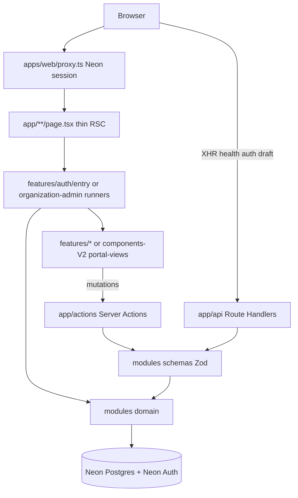

# ARCH-002 Frontend Architecture

| Field             | Value        |
| ----------------- | ------------ |
| **ID**            | ARCH-002     |
| **Category**      | Architecture |
| **Version**       | 1.3.3        |
| **Status**        | Living       |
| **Control State** | Closed       |
| **Owner**         | Frontend     |
| **Updated**       | 2026-07-14   |

---

# 1. Purpose

Living **frontend entry**: App Router layer shape, KISS data rules, and Mode A / Mode B caching. Detailed route inventory and BFF tree live in sibling SSOTs.

**Audience:** engineers rebuilding product UI after the frontend wipe.  
**Action enabled:** place UI in correct homes; pick RSC / Action / RH correctly; stay Mode A until ADR-008 Phase 2.  
**When NOT to edit:** do not paste the full [ARCH-013](ARCH-013-bff-and-data-flow.md) tree or route tables from [ARCH-012](ARCH-012-app-router-routes.md); do not recover Collapse product trees.  
**Runtime:** Node.js default; Edge only as a documented exception.  
**Method skill (not authority):** `.cursor/skills/afenda-elite-nextjs-best-practice/` — Living ARCH packs win on conflict.

---

# 2. Scope

## 2.1 In Scope

- Frontend layer diagram
- Next.js + KISS rules (RSC, Actions, Route Handlers)
- Route-group intent
- Rendering and caching policy (Mode A / Mode B)
- Accelint-aligned priorities that bind architecture (security → waterfalls → Suspense)

## 2.2 Out of Scope

- Backend ports ([ARCH-001](ARCH-001-backend-architecture.md) / [ARCH-007](ARCH-007-ports-and-adapters.md))
- Target package boundaries ([ARCH-022](ARCH-022-system-overview.md) / [ARCH-024](ARCH-024-package-boundaries.md))
- FFT product locks (FFT-MOD spine)
- File-level special-file inventory ([ARCH-016](ARCH-016-next-js-conventions.md))
- BFF decision-tree body ([ARCH-013](ARCH-013-bff-and-data-flow.md))
- Recovering Collapse-era product trees ([ARCH-028](ARCH-028-implementation-slices.md))

---

# 3. Frontend Architecture

Pack reading order: [`README.md`](README.md#frontend).

## Layer diagram

## Rules (Next.js + KISS)

| Rule | Detail |
|------|--------|
| Thin routes | `page.tsx` / `layout.tsx` only compose — no business SQL, no fat JSX trees |
| RSC reads | Server Components call `modules/*/domain` or page runners **directly** (no self-`fetch('/api')` for own RSC reads) |
| Mutations | Client forms/buttons call **Server Actions** (`'use server'`) |
| Action trust | Every Action re-checks session + org/FFT authz + Zod **inside** the Action — layout / `proxy.ts` is not enough |
| HTTP adapters | `app/api/**` only for health, Neon Auth proxy, draft autosave, external clients |
| Validation | Zod at adapter edge (`modules/*/schemas`); domain trusts typed input |
| Session | `require*Session` in actions/layouts; `apps/web/proxy.ts` gates document navigations |
| Async request APIs | Always `await` `params` / `searchParams` / `cookies()` / `headers()` (Next 16) |
| Coexistence | Never colocate `page.tsx` and `route.ts` in the same folder |
| UI homes | Auth/landing → `features/`; operator shell → Studio-promoted `components-V2/.../portal-views/` + `features/*` leaves — [ARCH-017](ARCH-017-frontend-folder-map.md) · [ARCH-015](ARCH-015-admincn-alignment.md) |
| Studio DNA | Shadcn Studio `@ss-blocks/*` scratch → promote; no AdminCN zip / `_reference` lock trees |
| Do not recreate | Root `components/` dump · `lib/` runners · Storybook · fake-db demos |

## Rendering and caching (binding)

Tenant / session product surfaces are **request-time by default**. Do not apply shared remote or untagged HTTP cache without [ARCH-023](ARCH-023-multi-tenancy.md) isolation and [ADR-008](adr/ADR-008-cache-components-mode-b.md) Mode B laws.

| Mode | When | Tools |
|------|------|-------|
| **A — Default (operational)** | ADR-008 Phase 1 Accepted; flag **off** | Request-time · Suspense / `loading.tsx` · `React.cache()` (primitive keys) · **selective `force-dynamic`** on tenant BFF · **pure session-independent chrome** (not claimed as build-time static / independently cached inside a dynamic tenant route) |
| **B — Enable (not authorized yet)** | ADR-008 Phase 2 checklist complete + `cacheComponents: true` | Extractable static shell · `'use cache'` islands · principal-safe cache keys + tags · Suspense for runtime access · **migrate off** unsupported segment configs (`dynamic` / `revalidate` / `fetchCache`) — request-time is default; **no** requirement to retain tenant `force-dynamic` |

| Surface | Mode A policy | Mode B note |
|---------|---------------|-------------|
| `/dashboard/*`, `/account/*`, `/fft/*`, `/client/*` workspace | Request-time — never `force-static` | Stay dynamic unless a named pilot island passes ADR-008 D4 scope |
| Tenant Route Handlers | Selective `force-dynamic` / contract `no-store` | Remove unsupported segment configs; use runtime data / uncached access / `connection()`; no tenant `'use cache'` without D4 |
| `/api/health/*` | `auto` + short revalidate (Mode A) | Revisit under Phase 2 GET-handler migration |
| Secondary panels | Suspense stream **now** | Still valid; no Cache Components required |
| `'use cache'` / PPR / `cacheComponents` | **Off** — Phase 1 only | Phase 2 only per ADR-008 |

### Mode B (ADR-008) — Phase 1 vs Phase 2

**Phase 1 (Accepted):** framework law only — no `cacheComponents` in `next.config`, no product `'use cache'`.

**Phase 2 enable requires** (summary; full lists in ADR-008):

1. Named pilot surface + tag graph (detail / list / aggregate).  
2. Cache-scope identity: every output-affecting value in the key (org, authz/visibility, locale/tz, flags, filters/pagination/search, draft/public) — *identical for every principal in scope, else keep dynamic*.  
3. Executable isolation tests (cross-org canaries both orders, same-org cross-role, mutation invalidation, stale/expire).  
4. Application-wide migration gate (route/RH inventory, production build, segment-config removal, Suspense for runtime APIs, metadata/dynamic routes, GET RH review, tenant route-family regression).  
5. Invalidation: `updateTag` (Actions, read-your-own-writes) · `revalidateTag(tag, "max")` (SWR / Route Handlers) · only after DB commit · centralized tag builders.

Authority: [ADR-008](adr/ADR-008-cache-components-mode-b.md). Method: skill `reference/cache-components.md`. Conventions: [ARCH-016](ARCH-016-next-js-conventions.md). BFF: [ARCH-013](ARCH-013-bff-and-data-flow.md).

### Performance priorities (architecture order)

Apply in this order when shaping routes and loaders:

1. Security (Action authz)  
2. Waterfalls (start independent work immediately)  
3. Serialization (pass only fields the client uses)  
4. Suspense streaming  
5. `React.cache()` per-request dedupe  
6. `after()` for non-blocking audit/log  
7. Import boundaries (avoid mega barrels)

## Route groups (Studio / AdminCN shell intent)

Mirror Studio `(blank)` vs `(pages)` **without** copying blank auth demos:

| Group | URL impact | Use |
|-------|------------|-----|
| `app/client/(gate)` | none | Public/client entry (login) — blank chrome |
| `app/client/(workspace)` | none | Authenticated client shell (holding until reopen) |
| `app/auth/*` | `/auth/...` | Neon Auth island (`features/auth`) — not AdminCN ThemeCustomizer |
| `app/dashboard/*`, `/account/*`, `/fft/*` | shell families | Shared AdminCN shell from Studio DNA ([ARCH-015](ARCH-015-admincn-alignment.md)) |

---

# 4. References

| ID | Title | Relationship |
| --- | --- | --- |
| DOC-001 | Documentation Control Standard | Governance |
| DOC-003 | Controlled Document Template | Structure |
| ARCH-012 | App Router Routes | Route inventory |
| ARCH-013 | BFF and Data Flow | Data decision tree |
| ARCH-015 | Shadcn Studio / AdminCN Alignment | Studio DNA → shell homes |
| ARCH-016 | Next.js Conventions | Special files, directives, Suspense |
| ARCH-017 | Frontend Folder Map | Folder homes + bans |
| ARCH-023 | Multi-Tenancy and Platform RBAC | Org isolation for Mode B tags |
| ARCH-028 | Turborepo Implementation Slices | Anti-contamination / Target greenfield |
| ADR-008 | Cache Components Mode B (Gated) | Accepted Phase 1 — Mode B enable gate |
| FFT-MOD-001 | Feed Farm Trade module architecture | Module product locks |

Agent method (not a controlled ID): `.cursor/skills/afenda-elite-nextjs-best-practice/` via `/using-afenda-elite-skills`.

---

# 5. Change Log

| Version | Date | Summary |
| ------- | ---- | ------- |
| 1.3.3 | 2026-07-14 | Utilization trio; defer BFF tree / routes to ARCH-013/012; pack README pointer. |
| 1.3.2 | 2026-07-14 | Home flattened to docs/architecture/ (trunks removed; pack reading order in README). |
| 1.3.1 | 2026-07-14 | ADR link home → `docs/architecture/adr/` (DOC-001 2.5.0). |
| 1.3.0 | 2026-07-14 | Studio DNA UI homes; route groups cite ARCH-015; bans align ARCH-017 2.0. |
| 1.2.0 | 2026-07-14 | Align Mode A/B with Accepted ADR-008: Mode B drops `force-dynamic` retention; principal-safe cache scope; chrome wording; Phase 1≠Phase 2. |
| 1.1.0 | 2026-07-14 | Rendering/caching Mode A default / Mode B ADR-gated Cache Components; Action in-action auth; Accelint priority order; skill method pointer. Bounded reopen for Next.js Elite skill sync. |
| 1.0.3 | 2026-07-14 | Checkout posture: Living map = shape only; Collapse product trees not present and forbidden to recover; Target greenfield via ARCH-028 only. |
| 1.0.2 | 2026-07-14 | DOC-003 six-section retrofit and parseable Change Log; Control State Closed after architecture sync campaign. |
| 1.0.1 | 2026-07-14 | Prior controlled revision (pre DOC-003 retrofit). |

---

# 6. Notes

### Checkout posture (Collapse · anti-contamination)

- Repo-root product trees `app/`, `modules/`, `features/`, `components-V2/` (and wiped Collapse-era ops scripts) are **not present** in this checkout after design-SSOT Collapse (`4680c91`).
- **Forbidden:** recovering those trees from git history (`f014807` / Collapse parents) — contamination of the docs-first checkout. See [ARCH-028](ARCH-028-implementation-slices.md) Anti-contamination lock.
- Paths in this document are a **logical Living map** (shape). When product code is implemented, place it under **Target** roots per [ARCH-022](ARCH-022-system-overview.md) / [ARCH-028](ARCH-028-implementation-slices.md) (`apps/web/**`, `packages/*`) after an **explicit** implement request — never as a restore of banned repo-root trees.
- Phrases such as “on disk”, “live adapters”, or “relocate complete” describe the intended shape when a Target product tree exists; they are **not** a claim that Collapse-era files may be recovered.

### Authority vs skill

- This Living ARCH is the frontend architecture SSOT for Mode A/B and layer rules.
- Mode B enablement authority is **[ADR-008](adr/ADR-008-cache-components-mode-b.md)** (Accepted Phase 1; Phase 2 not authorized).
- The Elite Next.js skill is method only — it cannot flip `cacheComponents` or ship product `'use cache'` without ADR-008 Phase 2.
