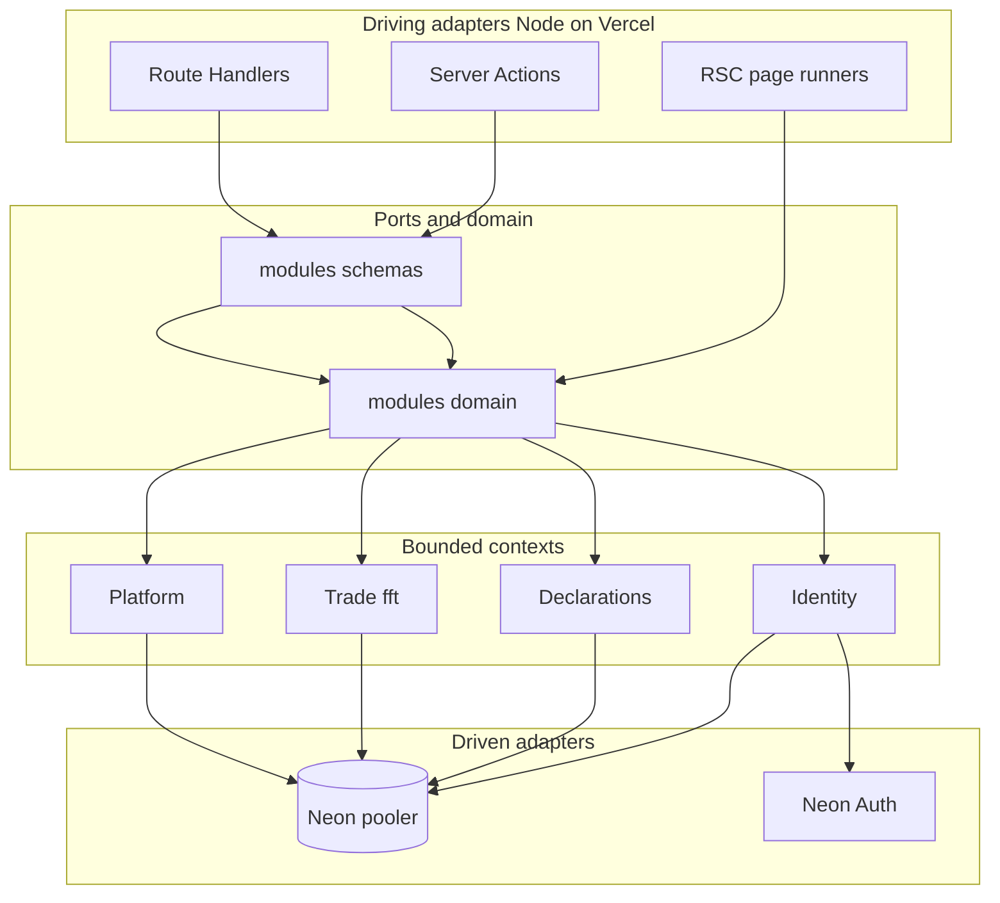

# ARCH-004 Backend Layers

| Field             | Value        |
| ----------------- | ------------ |
| **ID**            | ARCH-004     |
| **Category**      | Architecture |
| **Version**       | 1.1.1        |
| **Status**        | Living     |
| **Control State** | Closed       |
| **Owner**         | Backend     |
| **Updated**       | 2026-07-14   |

---

# 1. Purpose

Define Living backend layer rules for the Modular Monolith + Hexagonal model on the sole Next.js / Vercel deployable.

---

# 2. Scope

## 2.1 In Scope

- Layer do/don't rules
- Mandatory data-pattern tree pointer ([ARCH-013](ARCH-013-bff-and-data-flow.md))
- Driving-adapter duties (session, Zod, Result) on Node
- KISS defaults
- Pointer to Vercel adapter / deploy optimum (not a second matrix)

## 2.2 Out of Scope

- Folder inventories ([ARCH-005](ARCH-005-backend-folder-map.md))
- Port catalogs ([ARCH-007](ARCH-007-ports-and-adapters.md))
- Full Vercel region / pooler / Fluid matrix ([ARCH-010](ARCH-010-backend-conventions.md) · [ARCH-008](ARCH-008-next-js-adapter-map.md))
- Frontend UI surfaces
- Recovering Collapse-era repo-root `app/`/`modules/`/`features/`/`components-V2/` from git (contamination ban — [ARCH-028](ARCH-028-implementation-slices.md))

---

# 3. Backend Layers

**Framework version:** Next.js App Router Modular Monolith + Hexagonal (Ports & Adapters)  
**System SSOT:** [ARCH-022](ARCH-022-system-overview.md)  
**Deployable:** Target `apps/web` on Vercel (`afenda-lite`) — one binary; layers split code, not networks.

## What it means

| Term | Meaning here |
|------|----------------|
| Modular monolith | One Vercel deployable; code split by **bounded context**, not by microservices |
| Hexagonal | Domain/use-cases at the center; **driving** adapters (RSC / Action / RH) and **driven** adapters (Neon / Neon Auth) at the edges |
| Port | Contract (TypeScript interface / documented use-case set) that adapters call |
| Adapter | Next.js RSC, Server Action, or Route Handler (driving); SQL / Neon Auth (driven) |
| Runtime | **Node.js** for domain adapters — Edge is not the layer default ([ARCH-010](ARCH-010-backend-conventions.md)) |

## Layers (do / don't)

| Layer | May | Must not |
|-------|-----|----------|
| Driving adapter (RSC / Action / RH) | Session + org/FFT authz **inside** Actions/RH; Zod parse; map to ActionResult / HTTP error; `revalidatePath` / `revalidateTag`; `after()` for audit | Raw SQL; business-rule duplication; trust layout/`proxy.ts` alone; RSC `fetch('/api/...')` for ordinary reads |
| Port / use-case (`modules/*/domain` exports) | Orchestrate domain rules; call driven DB helpers | Import `Request`, `next/headers`, UI, `edge` APIs |
| Zod (`modules/*/schemas`) | Shape inbound DTOs once at the adapter edge | Touch DB |
| Driven (SQL / Neon Auth) | Persist / identity provider; short transactions; pooler-aware clients | Know about React or invent HTTP status codes |

**Platform posture (layer → deploy):** Driving adapters run as Vercel Serverless / Fluid **Node** functions. Do not put Neon/session domain work on Edge. Detail matrices: [ARCH-008](ARCH-008-next-js-adapter-map.md) · [ARCH-010](ARCH-010-backend-conventions.md).

## Next.js data-pattern tree (mandatory)

**Do not paste a second copy.** Authority: [ARCH-013](ARCH-013-bff-and-data-flow.md).

Summary: RSC reads → `modules/*/domain` (or page runner) in-process; client mutations → Server Action; HTTP Route Handlers only for health / Neon Auth proxy / draft XHR / external REST.

## Diagram

## KISS defaults

- Do **not** add `modules/*/application/` unless a port cannot be expressed as domain exports.  
- Do **not** introduce repository classes until a second store appears.  
- Do **not** expose every use-case as HTTP — see `api-now` vs `contract-only` in [REST-001](../api/REST-001-rest-resources.md).  
- Do **not** grow `lib/` for domain or schemas — use `modules/` (Target packages after ARCH-028).  
- Do **not** invent a second BFF framework beside App Router adapters.

## Alignment (must not diverge)

| Topic | Authority |
|-------|-----------|
| Data-pattern tree | [ARCH-013](ARCH-013-bff-and-data-flow.md) |
| Adapter map + Vercel runtime posture | [ARCH-008](ARCH-008-next-js-adapter-map.md) |
| Deploy optimum (region, pooler, Fluid) | [ARCH-010](ARCH-010-backend-conventions.md) |
| Errors / ActionResult | [API-002](../api/API-002-error-contract.md) |
| Tenancy | [ARCH-023](ARCH-023-multi-tenancy.md) |

---

# 4. References

| ID | Title | Relationship |
| --- | --- | --- |
| DOC-001 | Documentation Control Standard | Governance |
| DOC-003 | Controlled Document Template | Structure |
| ARCH-001 | Backend Architecture | Pack entry / reading order |
| ARCH-005 | Backend Folder Map | Homes |
| ARCH-006 | Bounded Contexts | Context splits |
| ARCH-007 | Ports and Adapters | Port catalog |
| ARCH-008 | Next.js Adapter Map | Primitive ↔ hexagon |
| ARCH-010 | Backend Conventions | Node + Vercel deploy optimum |
| ARCH-013 | BFF and Data Flow | Data-pattern SSOT |
| ARCH-022 | System Overview | Framework SSOT |

---

# 5. Change Log

| Version | Date | Summary |
| ------- | ---- | ------- |
| 1.1.1 | 2026-07-14 | Home flattened to docs/architecture/ (trunks removed; pack reading order in README). |
| 1.1.0 | 2026-07-14 | Vercel/Node layer posture; in-Action authz; fixed ARCH-013 link; RH→Zod→UC in diagram; Alignment table; cleaned References (no full deploy matrix paste). |
| 1.0.3 | 2026-07-14 | Checkout posture: Living map = shape only; Collapse product trees not present and forbidden to recover; Target greenfield via ARCH-028 only. |
| 1.0.2 | 2026-07-14 | DOC-003 six-section retrofit and parseable Change Log; Control State Closed after architecture sync campaign. |
| 1.0.1 | 2026-07-14 | Prior controlled revision (pre DOC-003 retrofit). |

---

# 6. Notes

### Checkout posture (Collapse · anti-contamination)

- Repo-root product trees `app/`, `modules/`, `features/`, `components-V2/` (and wiped Collapse-era ops scripts) are **not present** in this checkout after design-SSOT Collapse (`4680c91`).
- **Forbidden:** recovering those trees from git history (`f014807` / Collapse parents) — contamination of the docs-first checkout. See [ARCH-028](ARCH-028-implementation-slices.md) Anti-contamination lock.
- Paths in this document are a **logical Living map** (shape). When product code is implemented, place it under **Target** roots per [ARCH-022](ARCH-022-system-overview.md) / [ARCH-028](ARCH-028-implementation-slices.md) (`apps/web/**`, `packages/*`) after an **explicit** implement request — never as a restore of banned repo-root trees.
- Phrases such as “on disk”, “live adapters”, or “relocate complete” describe the intended shape when a Target product tree exists; they are **not** a claim that Collapse-era files may be recovered.
