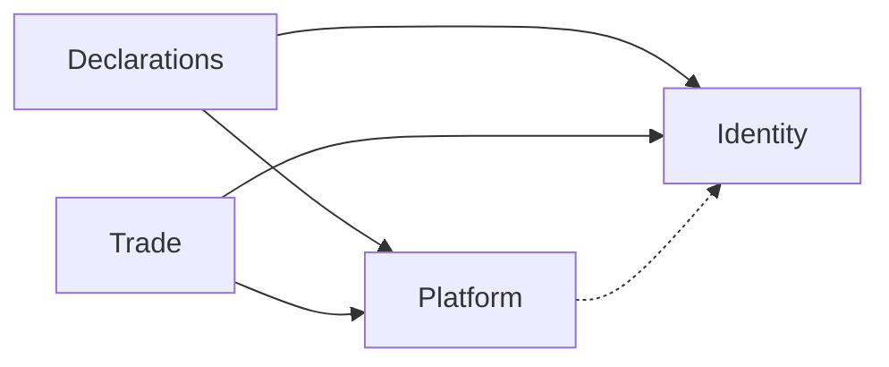

# ARCH-006 Bounded Contexts

| Field             | Value        |
| ----------------- | ------------ |
| **ID**            | ARCH-006     |
| **Category**      | Architecture |
| **Version**       | 1.1.1        |
| **Status**        | Living       |
| **Control State** | Closed       |
| **Owner**         | Backend      |
| **Updated**       | 2026-07-14   |

---

# 1. Purpose

Define Living **bounded contexts** for Afenda-Lite: Identity, Declarations, Trade (Feed Farm Trade), and Platform — import bans, shared-primitive ownership, and adapter-only composition.

**Method (not authority):** [afenda-elite-backend-modules](../../.cursor/skills/afenda-elite-backend-modules/SKILL.md) · [context-boundaries.md](../../.cursor/skills/afenda-elite-backend-modules/context-boundaries.md).

---

# 2. Scope

## 2.1 In Scope

- Context map and ownership table
- Hard dependency / import bans
- Platform-owned shared Zod and normalize helpers
- Adapter composition rule (two contexts on one screen)
- Naming: Trade prose ↔ `modules/fft` path
- Scaling note (extract deployable — ADR gate)

## 2.2 Out of Scope

- Folder L2 file inventories ([ARCH-005](ARCH-005-backend-folder-map.md))
- Port catalogs and adapter wire ([ARCH-007](ARCH-007-ports-and-adapters.md) · [ARCH-008](ARCH-008-next-js-adapter-map.md))
- Module file ownership matrix ([ARCH-009](ARCH-009-modules-ownership-map.md))
- Tenancy Decision lock ([ARCH-023](ARCH-023-multi-tenancy.md))
- FFT product locks ([FFT-MOD-001](../modules/feed-farm-trade/FFT-MOD-001-module-architecture.md))
- HTTP / OpenAPI catalogues (`docs/api`)
- Recovering Collapse-era repo-root trees ([ARCH-028](ARCH-028-implementation-slices.md))

---

# 3. Bounded Contexts

**Platform model:** one **Afenda-Lite** SaaS · **two product modules** (Declarations + Feed Farm Trade / Trade) on shared Platform + Identity. Boundaries are **domain trees and entitlements** — not separate apps or infra lanes.

**Shared infra (once for both modules):** env, Neon pool, Neon Auth, Studio/AdminCN shell DNA, `proxy.ts`, CI, Vercel deploy ([ARCH-015](ARCH-015-admincn-alignment.md) · [ARCH-010](ARCH-010-backend-conventions.md)).

**Posture:** Paths are a **logical Living map**. After Collapse, repo-root `modules/` are absent until Target implement under `apps/web/modules/**` ([ARCH-022](ARCH-022-system-overview.md) · [ARCH-028](ARCH-028-implementation-slices.md)). Product display name: Afenda-Lite ([deprecation register](../../.cursor/skills/agent-skills/skills/deprecation-and-migration/reference.md)).

## Context map

| Context | Owns | Logical code home | May depend on | Must not depend on |
| ------- | ---- | ----------------- | ------------- | ------------------ |
| **Identity** | Session, org membership, Neon Auth users, client profile gates, invite bootstrap | `modules/identity/**` | Neon Auth · Platform | Declarations · Trade |
| **Declarations** | Surveys/declarations, questions, clients, assignments, submissions, share links, drafts, profile upsert/CRUD | `modules/declarations/**` | Identity (actor/org) · Platform (shared Zod / normalize / copy ports) | Trade (`modules/fft` **any** path) |
| **Trade** | Events, orders, allocation, deposits, pickup, imports, ERP sync, FFT domain RBAC — product **Feed Farm Trade** | `modules/fft/**` (+ adapters `app/actions/fft`, UI `features/fft`) | Identity (org, session, platform `fft.access`) · Platform | **Declarations** (domain **or** schemas) |
| **Platform** | Health, env accessors, observability helpers, shared API error helpers, shell entitlement types, **shared Zod primitives**, email normalize, product copy port | `modules/platform/**`, `app/api/health/*` | Shared infra only | Product domain trees (`declarations` / `fft`); do not own Identity session helpers used as product rules |

## Hard rules

1. **Trade ↛ Declarations (and reverse).** No imports across those domain **or** schema trees. Module boundary inside one platform — not a cue for separate FFT infra.  
2. **Infra is shared.** Env, Neon, auth, Studio/AdminCN shell, proxy, CI, deploy — update once; both product modules consume it.  
3. **Shared Zod / email normalize live in Platform only** — `modules/platform/schemas/common` (`uuid` / `email` / `password` / `slug` / `parseSchema`), `modules/platform/normalize-email`. Declarations may re-export Platform common and keep Declarations-only schemas (e.g. `surveyAnswersSchema`). **Trade and Identity must import shared Zod from Platform, not from Declarations.**  
4. **New product feature → one context.** If a screen needs Trade + Declarations data, compose at the **adapter** (page / Server Action / Route Handler) by calling two ports — do not merge domain trees.  
5. **Ports never import** `Request`, `next/headers`, or UI ([ARCH-007](ARCH-007-ports-and-adapters.md)).  
6. **Schema/migrations:** table prefixes or ownership comments per context when adding tables; org hard tenancy per [ARCH-023](ARCH-023-multi-tenancy.md).  
7. **Do not recreate `lib/`** — domain under `modules/*`; UI/runners under `features/*` ([ARCH-005](ARCH-005-backend-folder-map.md) · [ARCH-017](ARCH-017-frontend-folder-map.md)).  
8. **Never create `modules/trade/` or `features/trade/` product UI** — Trade code path is `modules/fft/**`, `features/fft/fft-*.tsx`, `app/actions/fft`.  
9. **FFT entry entitlement** is platform `fft.access` — organization admin alone does not unlock Trade ([ARCH-023](ARCH-023-multi-tenancy.md) · FFT-MOD auth).

## Naming

| Prose | Code path |
|-------|-----------|
| Trade / Feed Farm Trade | `modules/fft/**`, `features/fft/fft-*.tsx`, `app/actions/fft` |
| Declarations | `modules/declarations/**` |
| Identity | `modules/identity/**` |
| Platform | `modules/platform/**` |

## Scaling path (later — needs ADR)

- Extract Trade to a separate deployable only when monolith ops cost exceeds benefit.  
- Until then: modular folders + import bans (lint/check) beat network splits.  
- Do not invent `modules/trade/` as a stepping stone.

## Checklist

- [ ] New file assigned to exactly one context  
- [ ] No Declarations ↔ Trade domain or schema imports  
- [ ] Shared Zod / normalize from Platform  
- [ ] Two-context UI composes only at adapters  
- [ ] Port has no Next.js / React imports  
- [ ] No `modules/trade/` or banished `lib/` growth  

---

# 4. References

| ID | Title | Relationship |
| --- | --- | --- |
| DOC-001 | Documentation Control Standard | Governance |
| DOC-003 | Controlled Document Template | Structure |
| ARCH-001 | Backend Architecture | Backend entry / reading order |
| ARCH-004 | Backend Layers | Hexagon layers |
| ARCH-005 | Backend Folder Map | `modules/*` L2 homes |
| ARCH-007 | Ports and Adapters | Port contracts |
| ARCH-008 | Next.js Adapter Map | Actions / RH as adapters |
| ARCH-009 | Modules Ownership Map | Inventory / residue |
| ARCH-010 | Backend Conventions | Node / SQL / Vercel |
| ARCH-015 | Shadcn Studio / AdminCN Alignment | Shared shell DNA (not domain) |
| ARCH-017 | Frontend Folder Map | `features/*` homes · `lib/` ban |
| ARCH-022 | System Overview — Turborepo | Target `apps/web` |
| ARCH-023 | Multi-Tenancy and Platform RBAC | Org + `fft.access` |
| ARCH-028 | Turborepo Implementation Slices | Anti-contamination |
| FFT-MOD-001 | Feed Farm Trade module architecture | Trade product locks |

---

# 5. Change Log

| Version | Date | Summary |
| ------- | ---- | ------- |
| 1.1.1 | 2026-07-14 | Home flattened to docs/architecture/ (trunks removed; pack reading order in README). |
| 1.1.0 | 2026-07-14 | Align Elite backend-modules: Platform shared Zod; Declarations→Platform edge; logical Target homes; `fft.access`; Studio shell shared note; full References; checklist. |
| 1.0.3 | 2026-07-14 | Checkout posture: Living map = shape only; Collapse product trees forbidden to recover. |
| 1.0.2 | 2026-07-14 | DOC-003 six-section retrofit and parseable Change Log. |
| 1.0.1 | 2026-07-14 | Prior controlled revision (pre DOC-003 retrofit). |

---

# 6. Notes

### Checkout posture (Collapse · anti-contamination)

- Repo-root `app/` / `modules/` / `features/` / `components-V2/` are **absent** after design-SSOT Collapse (`4680c91`).
- **Forbidden:** recovering those trees from git (`f014807` / Collapse parents) — [ARCH-028](ARCH-028-implementation-slices.md).
- Implement under Target `apps/web/**` / `packages/*` only after an **explicit** implement request.
- “Logical code home” is shape — not an on-disk claim until Target product trees exist.
