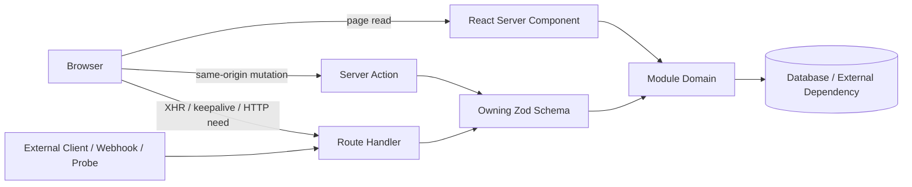

# ARCH-029 Interface and API Architecture

| Field        | Value        |
| ------------ | ------------ |
| **ID**       | ARCH-029     |
| **Category** | Architecture |
| **Version**  | 1.2.7        |
| **Status**   | Living       |
| **Control State** | Closed     |
| **Owner**    | Platform     |
| **Updated**  | 2026-07-14   |
---

# 1. Purpose

This document is the Living **parent authority** for Afenda interface and API architecture.

It establishes system-wide principles, authority hierarchy, trust boundaries, interface surfaces, compatibility rules, ownership, and change controls that govern all subordinate `API-*`, `REST-*`, and `OPEN-*` documents.

Afenda-Lite (beta) and Afenda-Elite (battle-proven) share the same documentation control ([DOC-001](../_control/DOC-001-documentation-control-standard.md)) and similar infra aliasing. This checkout's Living contracts describe the Lite surface.

This architecture ensures that:

- interface decisions are made once and applied consistently;
- internal same-origin flows are not forced through unnecessary HTTP;
- external inputs are validated at explicit trust boundaries;
- authentication and authorization are enforced inside every executable adapter;
- API contracts evolve predictably without parallel version drift;
- human-readable and machine-readable contracts remain aligned; and
- implementation documents do not redefine architecture independently.

Detailed contracts, catalogues, guides, and runbooks remain subordinate. Navigation and **reading sequence**: [`docs/api/README.md`](../api/README.md). Development order: [GUIDE-015](../api/guides/GUIDE-015-interface-pack-development-roadmap.md).

---

# 2. Scope

## 2.1 In Scope

- React Server Component data access;
- Server Actions;
- Route Handlers;
- external REST consumers;
- webhook and machine-to-machine interfaces;
- shared success and error contracts;
- schema ownership and validation boundaries;
- API type and serialization rules;
- REST resource modelling and catalogue split;
- OpenAPI generation and publication;
- interface authentication and authorization boundaries;
- idempotency, concurrency, observability, and compatibility rules;
- verification evidence expectations (the active bar is §3.14; [GUIDE-014](../api/guides/GUIDE-014-api-contract-verification-standard.md) is its planned Draft expansion);
- the relationship among architecture, contracts, guides, runbooks, and generated specifications.

## 2.2 Out of Scope

- individual endpoint field lists;
- individual Zod schema definitions;
- product-specific business rules;
- database table design;
- UI component behavior;
- infrastructure deployment instructions;
- exact package dependency versions;
- complete API resource inventories; or
- module-specific implementation plans.

These belong in subordinate contracts, module spines, runbooks, or source.

## 2.3 Authority

| Order | Authority |
| ----: | --------- |
| 1 | [DOC-001](../_control/DOC-001-documentation-control-standard.md) Documentation Control Standard |
| 2 | **This document** (ARCH-029) |
| 3 | Approved architecture decision records (when created under the ADR gate in Notes) |
| 4 | Controlled `API-*`, `REST-*`, `OPEN-*` documents |
| 5 | Generated machine artifacts (`OPEN-001-openapi.yaml`) |
| 6 | Implementation code |

Where implementation and a controlled contract differ, treat the mismatch as drift and resolve explicitly. Neither side silently overrides the other.

---

# 3. Interface and API Architecture

## 3.1 Architectural Principles

### 3.1.1 Domain First

Business rules belong in module domain functions. Adapters translate external or framework inputs into trusted domain inputs. They shall not duplicate business logic.

### 3.1.2 Contract First

Every externally callable interface shall have a defined contract before or alongside implementation, identifying: input; output; authentication; authorization; expected errors; compatibility expectations; and implementation status (`api-now` | `contract-only` | `deprecated` | `retired`).

### 3.1.3 HTTP Only When Required

Internal same-origin flows shall not use HTTP merely for symmetry. Use HTTP for external clients, webhooks, health probes, authentication proxies, browser XHR/keepalive, HTTP method semantics, independent caching, or machine-readable public contracts.

### 3.1.4 Validate at the Boundary

All external, browser, webhook, query, path, and body data is untrusted. Validate at the executable boundary before domain invocation ([API-001](../api/API-001-api-boundaries.md)).

### 3.1.5 Secure Inside the Adapter

Page, layout, middleware, or UI visibility does not replace adapter security. Every mutating boundary shall enforce: parse; authenticate; authorize; ownership/scope; domain invoke; safe error map; audit/revalidate when applicable.

### 3.1.6 One Active Contract Version

One active HTTP contract version. Do not introduce `/api/v1` and `/api/v2` in parallel unless an approved decision says otherwise. Prefer additive evolution; breaking changes need migration and the change gate (§3.14).

### 3.1.7 Generated Contracts Do Not Create Authority

OpenAPI, generated clients, and docs sites represent approved contracts. They shall not invent resources, fields, or behavior absent from architecture and controlled contracts ([OPEN-001](../api/OPEN-001-openapi.md)).

## 3.2 Interface Surface Model



| Surface | Use for | Shall not |
| ------- | ------- | --------- |
| **RSC** | Same-origin server-rendered reads → module domain | Own REST round-trips without HTTP need; raw SQL; domain duplication; leaking server-only values |
| **Server Action** | Same-origin UI mutations; full security pipeline; `ActionResult<T>` | Cacheable GET; external REST; webhooks; substitute for method semantics |
| **Route Handler** | Health, auth proxy, external REST, webhooks, XHR methods/keepalive, approved HTTP | Bare success JSON outside `{ data: T }`; Edge default for DB handlers |
| **Domain** | Business rules + persistence orchestration; trusted typed inputs | Read `Request`, cookies, route params, browser headers, or navigation state |

One domain function may serve RSC, Action, and Route Handler adapters. Related BFF tree: [ARCH-013](ARCH-013-bff-and-data-flow.md).

## 3.3 Trust Boundaries and Security Pipeline

The executable adapter is the primary trust boundary.

Every mutating Server Action and Route Handler shall, in order:

1. parse and validate input;
2. establish the authenticated actor;
3. establish organization, tenant, or module scope;
4. authorize the requested capability;
5. validate resource ownership or state constraints;
6. invoke the domain with trusted types;
7. map expected failures to the controlled error vocabulary ([API-002](../api/API-002-error-contract.md));
8. record audit evidence where required;
9. revalidate affected UI or cache where applicable; and
10. emit a safe response.

**Public exceptions** shall be an explicit allowlist. Today's Living [API-001](../api/API-001-api-boundaries.md) allowlist is health probes and Neon Auth proxy. Additional public survey / secure-link flows ([REST-006](../api/REST-006-public-survey-secure-link-resources.md)) may be added only when approved and still validate token scope and resource state ([API-005](../api/API-005-authentication-authorization-contract.md) Draft).

Never return secrets, stack traces, SQL, connection strings, or internal exception details to clients.

## 3.4 Contract Architecture

| Document | Responsibility | Status |
| -------- | -------------- | ------ |
| [ARCH-029](ARCH-029-interface-api-architecture.md) | Parent interface architecture | Living |
| [API-001](../api/API-001-api-boundaries.md) | Adapter boundaries, pipeline, success envelope, runtime | Living (refine) |
| [API-002](../api/API-002-error-contract.md) | Error vocabulary and surfaces | Living (refine) |
| [API-003](../api/API-003-api-types.md) | Types, brands, serialization, `ActionResult` | Living (refine) |
| [API-004](../api/API-004-schema-map.md) | Zod ownership map | Living (refine) |
| [API-005](../api/API-005-authentication-authorization-contract.md) | Authn/authz contract | Draft |
| [API-006](../api/API-006-idempotency-concurrency-contract.md) | Idempotency / concurrency | Draft |
| [API-007](../api/API-007-api-observability-correlation-contract.md) | Observability / correlation | Draft |
| [API-008](../api/API-008-collection-query-contract.md) | Collection query (page/filter/sort) | Draft |
| [API-009](../api/API-009-compatibility-deprecation-contract.md) | Compatibility / deprecation | Draft |
| [REST-001](../api/REST-001-rest-resources.md) | REST standards + high-level index | Living (refine → index) |
| [REST-002](../api/REST-002-identity-organization-resources.md)…[007](../api/REST-007-account-resources.md) | Domain REST catalogues | Draft |
| [FFT-REST-001](../modules/feed-farm-trade/FFT-REST-001-feed-farm-trade-resource-index.md) | FFT REST index | Draft |
| [OPEN-001](../api/OPEN-001-openapi.md) | OpenAPI governance | Living (refine) |
| `OPEN-001-openapi.yaml` | Generated machine contract | Generated |
| [`docs/api/README.md`](../api/README.md) | Navigation only | Navigation |
| [GUIDE-007](../api/guides/GUIDE-007-implementing-a-server-action.md)…[014](../api/guides/GUIDE-014-api-contract-verification-standard.md) | Implementation / verification guides | Draft |
| [RB-006](../api/runbooks/RB-006-openapi-drift-detection-recovery.md)…[008](../api/runbooks/RB-008-api-contract-rollback.md) | API ops runbooks (`docs/api/runbooks/`) | Draft |

A subordinate document shall not redefine another document's responsibility.

## 3.5 Success and Error Model

### 3.5.1 HTTP Success

```typescript
type APIResponse<T> = { data: T };
```

Avoid nested `data.data`. Prefer list payloads with `items` + `pagination` (page, pageSize, totalItems, totalPages). Freeze shared list query rules in [API-008](../api/API-008-collection-query-contract.md) when Living.

### 3.5.2 HTTP Failure

Bare `APIErrorBody` — never nested under the success envelope ([API-002](../api/API-002-error-contract.md)).

### 3.5.3 Server Action Outcomes

Expected outcomes use `ActionResult<T>`. Unexpected failures may throw to the error boundary / observability path.

### 3.5.4 Page Rendering Outcomes

Pages may use `notFound()` / `forbidden()` / `unauthorized()`. Do not catch those and convert them into Action or REST JSON responses.

## 3.6 Type and Schema Architecture

Zod under the owning module is the executable validation SSOT ([API-004](../api/API-004-schema-map.md)). Prefer inferred TypeScript types ([API-003](../api/API-003-api-types.md)).

| Layer | Responsibility |
| ----- | -------------- |
| Input | Parsed external input |
| Wire | Serializable Action / HTTP representation |
| Domain | Trusted business representation |
| Persistence | Database-facing representation |

Brands only after validation or trusted lookup. Dates on the wire are ISO strings unless a contract defines otherwise.

## 3.7 REST Architecture

Plural nouns; HTTP methods as verbs; `camelCase` query params; explicit path params; consistent success codes; controlled auth and cache labels; one active version ([REST-001](../api/REST-001-rest-resources.md)).

Non-CRUD commands may use sub-resources (e.g. invitations, ban, allocations).

| Status | Meaning |
| ------ | ------- |
| `api-now` | Implemented or authorized as Route Handler |
| `contract-only` | Future HTTP contract — does **not** authorize scaffolding |
| `deprecated` | Available during approved migration |
| `retired` | No longer available or authoritative |

Domain catalogues split to REST-002…007; FFT to [FFT-REST-001](../modules/feed-farm-trade/FFT-REST-001-feed-farm-trade-resource-index.md)+.

## 3.8 OpenAPI Architecture

```text
ARCH-029 → API-* / REST-* → owning Zod → generator → OPEN-001-openapi.yaml
```

Generated specs shall: mark api-now vs contract-only; reuse success/error shapes; use stable operation IDs; pass Spectral; exclude Neon Auth internals unless approved; never present contract-only as live; record generation metadata ([OPEN-001](../api/OPEN-001-openapi.md), recipes [GUIDE-011](../api/guides/GUIDE-011-generating-and-validating-openapi.md)).

```yaml
info:
  version: 1.0.0 # published HTTP contract version
x-afenda-document:
  id: OPEN-001
  version: 1.1.4 # controlled OpenAPI document version
  generatedAt: 2026-07-13
```

## 3.9 Compatibility and Change Control

**Additive (typical):** optional response fields; optional query params; new endpoints; unknown-tolerant enums; non-semantic error detail fields.

**Breaking (unless proven otherwise):** remove/rename fields; type changes; optional→required; authz changes; path/method changes; error-code meaning; pagination defaults; remove enums; idempotency behavior; success-envelope structure.

Breaking changes require impact analysis, migration plan, consumers, version bump, OpenAPI regenerate, verification evidence under §3.14, and approval. [GUIDE-014](../api/guides/GUIDE-014-api-contract-verification-standard.md) is the planned Draft expansion. Executable rules → [API-009](../api/API-009-compatibility-deprecation-contract.md) (Draft).

Deprecation shall name replacement, dates, consumers, and migration instructions.

## 3.10 Idempotency and Concurrency

High-risk commands (deposit/payment, submit, allocate, invite, import apply, ERP enqueue, webhook ingest) shall define idempotency. Adapters accept/derive keys; domain prevents duplicate side effects. Optimistic concurrency via version/revision/ETag/timestamp. Use `409 CONFLICT` when valid requests conflict with current state → [API-006](../api/API-006-idempotency-concurrency-contract.md) (Draft).

## 3.11 Observability and Audit

Propagate correlation IDs through adapter logs, domain logs, audit rows, dependency calls, and safe unexpected-error responses. Expected validation/authz failures are not system defects. Unexpected failures: rich internal logs, safe client body → [API-007](../api/API-007-api-observability-correlation-contract.md) (Draft).

## 3.12 Caching and Revalidation

Authenticated / tenant-scoped data: no public CDN. Default `Cache-Control: private, no-store`. Public stable resources need explicit scope, max-age, invalidation, and sensitivity. Mutations revalidate path/tag/read model when stale UI would otherwise remain.

## 3.13 Ownership and Review

| Responsibility | Owner |
| -------------- | ----- |
| Interface architecture | Platform |
| Adapter contract | Backend / Platform |
| Error and result vocabulary | Backend |
| Schema ownership | Owning module |
| REST resource contract | Owning module + Backend review |
| OpenAPI generation | Backend |
| Authentication integration | Platform |
| Authorization policy | Platform + owning module |
| External consumer compatibility | Product owner + Backend |
| Audit requirements | Platform / Compliance as applicable |
| Verification standard | Backend (active criteria in §3.14; GUIDE-014 planned Draft expansion) |

## 3.14 Change Gate

Ready only when applicable evidence exists for: architecture fit; document ownership; schema validation; authentication; authorization; resource ownership; success shape; error shape; idempotency; concurrency; audit; cache; OpenAPI generation; contract linting; implementation tests; consumer migration.

This section is the active evidence bar. [GUIDE-014](../api/guides/GUIDE-014-api-contract-verification-standard.md) is a planned Draft expansion and is not an enforceable release blocker until promoted. `contract-only` does not pass the implementation gate.

## 3.15 Prohibited Patterns

Unless an approved decision grants an exception:

- same-origin RSC → own REST without genuine HTTP need;
- raw SQL in adapters or UI;
- layout/navigation-only auth;
- duplicated business rules across Action and Route Handler;
- hand-written interfaces parallel to Zod;
- bare JSON success outside `{ data: T }`;
- alternate error formats;
- public caching of authenticated responses;
- `/api/v1` without approved versioning;
- scaffolding `contract-only` as live handlers;
- OpenAPI paths absent from controlled contracts;
- treating generated docs as architectural authority;
- secrets or internal diagnostics in client responses.

---

# 4. References

| ID | Title | Relationship |
| -- | ----- | ------------ |
| [DOC-001](../_control/DOC-001-documentation-control-standard.md) | Documentation Control Standard | Governance |
| [DOC-002](../_control/DOC-002-documentation-register.md) | Documentation Register | Catalogue |
| [DOC-003](../_control/DOC-003-controlled-document-template.md) | Controlled Document Template | Structure |
| [API-001](../api/API-001-api-boundaries.md) | API Boundaries | Adapter contract |
| [API-002](../api/API-002-error-contract.md) | Error Contract | Failures |
| [API-003](../api/API-003-api-types.md) | API Types | Types / serialization |
| [API-004](../api/API-004-schema-map.md) | Schema Map | Zod ownership |
| [API-005](../api/API-005-authentication-authorization-contract.md)…[009](../api/API-009-compatibility-deprecation-contract.md) | Cross-cutting contracts | Draft Phase 2 |
| [REST-001](../api/REST-001-rest-resources.md) | REST Standards and Resource Index | REST standard |
| [REST-002](../api/REST-002-identity-organization-resources.md)…[007](../api/REST-007-account-resources.md) | Domain REST catalogues | Draft Phase 3 |
| [FFT-REST-001](../modules/feed-farm-trade/FFT-REST-001-feed-farm-trade-resource-index.md) | FFT REST Index | Draft Phase 4 |
| [OPEN-001](../api/OPEN-001-openapi.md) | OpenAPI | Machine governance |
| [GUIDE-014](../api/guides/GUIDE-014-api-contract-verification-standard.md) | API Contract Verification Standard | Planned Draft expansion of §3.14 |
| [ARCH-013](ARCH-013-bff-and-data-flow.md) | BFF and Data Flow | Frontend data tree |
| [ARCH-023](ARCH-023-multi-tenancy.md) | Multi-Tenancy and Platform RBAC | Living IAM |

---

# 5. Change Log

| Version | Date | Summary |
| ------- | ---- | ------- |
| 1.2.7 | 2026-07-14 | Home flattened to docs/architecture/ (trunks removed; pack reading order in README). |
| 1.2.6 | 2026-07-14 | ADR link home → `docs/architecture/adr/` (DOC-001 2.5.0). |
| 1.2.5 | 2026-07-14 | Pointed API ops runbooks RB-006…008 at `docs/api/runbooks/` (API pack standalone). |
| 1.2.4 | 2026-07-14 | Added mandatory Control State header field (Closed); lifecycle Status unchanged. |
| 1.2.3 | 2026-07-13 | Clarified that §3.14 is the active evidence bar while GUIDE-014 remains a planned Draft expansion. |
| 1.2.2 | 2026-07-13 | Point Purpose at README reading sequence vs GUIDE-015 development order. |
| 1.2.1 | 2026-07-13 | Creation sequence locked in GUIDE-015 (Jack Wee); Notes point to roadmap SSOT. |
| 1.2.0 | 2026-07-13 | Synchronized with API pack: full contract map + refs, public-exception alignment, OPEN metadata 1.1.4, GUIDE-014 on change gate; Notes beautified (phases only). |
| 1.1.5 | 2026-07-13 | Documented recommended creation sequence (Phases 1–5) in Notes — not a Guide. |
| 1.1.4 | 2026-07-13 | Linked GUIDE-014 verification standard; ARCH-030 deferred. |
| 1.1.3 | 2026-07-13 | API implementation guides GUIDE-007…013 under `docs/api/guides/`; OpenAPI recipes → GUIDE-011. |
| 1.1.2 | 2026-07-13 | Linked Draft API ops runbooks RB-006…008; reserved RB-009 until webhooks exist. |
| 1.1.1 | 2026-07-13 | Recorded potential ADR-001…007 candidates with creation gate. |
| 1.1.0 | 2026-07-13 | Approved Living; mapped Draft placeholders API-005…API-009. |
| 1.0.0 | 2026-07-13 | Initial draft. |

---

# 6. Notes

## Sync status (2026-07-13)

| Gap | Finding | Resolution |
| --- | ------- | ---------- |
| Contract map / References | ARCH-029 listed Phase 1 only | Expanded §3.4 and §4 to full pack |
| Public exceptions | API-001 allowlist narrower than ARCH prose | §3.3 states Living allowlist + REST-006 future; API-001 updated |
| OPEN metadata example | Showed OPEN-001 `1.1.2` | Updated to `1.1.4` |
| Change gate | No verification pointer | Points at GUIDE-014 |
| Notes | Duplicate Phase list + backlog table | Phases only; backlog removed |
| Backlinks | Living API-001 lacked ARCH-029 parent | Added |

## Recommended creation sequence

**Locked roadmap SSOT:** [GUIDE-015 Interface Pack Development Roadmap](../api/guides/GUIDE-015-interface-pack-development-roadmap.md) — locked by **Jack Wee** on 2026-07-13.

Do not reorder phases or invent a parallel sequence in this Notes section. Summary only:

| Phase | Focus |
| ----- | ----- |
| 1 | Governance: ARCH-029 · API-001…004 · REST-001 · OPEN-001 · navigation README |
| 2 | Cross-cutting: API-005…009 |
| 3 | Resource families on demand: REST-002…006 (REST-007 gated) |
| 4 | FFT-REST-001 then children only when gates open |
| 5 | GUIDE-011/012/013/014 · RB-007/008 (+ RB-006, GUIDE-007…010 as needed) |

Architecture and contracts do **not** replace runbooks.

## Potential ADRs (do not create now)

| Candidate | Decision |
| --------- | -------- |
| ADR-001 | Use RSC for same-origin reads |
| ADR-002 | Use Server Actions for same-origin mutations |
| ADR-003 | Use Route Handlers only for explicit HTTP requirements |
| ADR-004 | Maintain one active API version |
| ADR-005 | Use Zod as executable interface schema authority |
| ADR-006 | Use generated OpenAPI from controlled contracts |
| ADR-007 | Use one success envelope and one error vocabulary |

Create an ADR under `docs/architecture/adr/` only when alternatives were materially considered, consequences are long-lived, reversal is costly, or a permanent rationale is required. Do not create ADRs merely to repeat this architecture.
