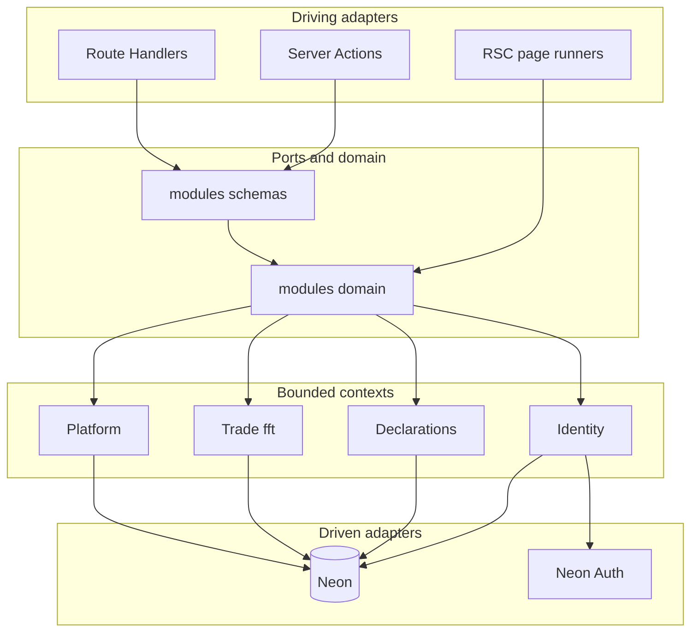

# ARCH-004 Backend Layers

| Field | Value |
|-------|-------|
| ID | ARCH-004 |
| Category | Architecture |
| Version | 1.0.0 |
| Status | Living |
| Owner | Backend |
| Updated | 2026-07-13 |

**Framework version:** Next.js App Router Modular Monolith + Hexagonal (Ports & Adapters)  
**System SSOT:** [ARCH-022](../turborepo/ARCH-022-system-overview.md)

## What it means

| Term | Meaning here |
|------|----------------|
| Modular monolith | One deployable; code split by **bounded context**, not by network |
| Hexagonal | Domain/use-cases at the center; **driving** adapters (UI/HTTP) and **driven** adapters (DB/Auth) at the edges |
| Port | Contract (TypeScript interface / documented use-case set) that adapters call |
| Adapter | Next.js RSC, Server Action, or Route Handler (driving); SQL / Neon Auth (driven) |

## Layers (do / don't)

| Layer | May | Must not |
|-------|-----|----------|
| Driving adapter | Session guard, Zod parse, map errors, `revalidatePath` | Raw SQL, business rules duplication |
| Port / use-case (`modules/*/domain` exports) | Orchestrate domain rules, call DB helpers | Import `Request`, `next/headers`, UI |
| Zod (`modules/*/schemas`) | Shape inbound DTOs | Touch DB |
| Driven (SQL / Neon Auth) | Persist / identity provider | Know about React or HTTP status codes |

## Next.js data-pattern decision tree (mandatory)

**Do not paste a second copy.** Authority: [../architecture/frontend/ARCH-013-bff-and-data-flow.md](../../architecture/frontend/ARCH-013-bff-and-data-flow.md).

Summary: RSC reads → `modules/*/domain` (or page runner); client mutations → Server Action; HTTP only for health / auth proxy / draft XHR / external REST.

## Diagram

## KISS defaults

- Do **not** add `modules/*/application/` unless a port cannot be expressed as domain exports.  
- Do **not** introduce repository classes until a second store appears.  
- Do **not** expose every use-case as HTTP — see `api-now` vs `contract-only` in [../api/REST-001-rest-resources.md](../../api/REST-001-rest-resources.md).  
- Do **not** grow `lib/` for domain or schemas — use `modules/`.  

## Related

- [02-folder-map.md](ARCH-005-backend-folder-map.md)  
- [05-nextjs-adapter-map.md](ARCH-008-next-js-adapter-map.md)  
- [07-conventions.md](ARCH-010-backend-conventions.md)  
- [03-bounded-contexts.md](ARCH-006-bounded-contexts.md)  
