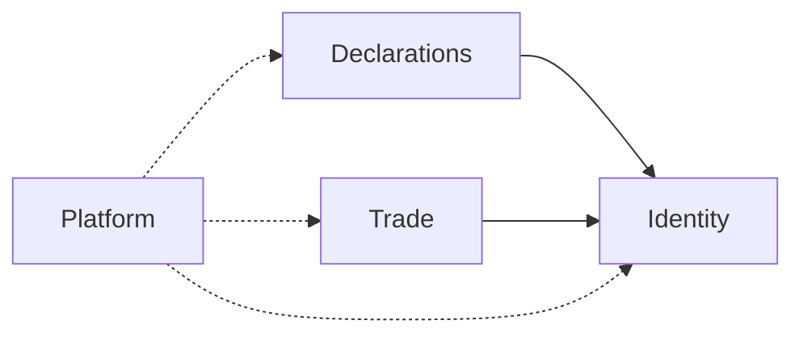

# ARCH-006 Bounded Contexts

| Field | Value |
|-------|-------|
| ID | ARCH-006 |
| Category | Architecture |
| Version | 1.0.0 |
| Status | Living |
| Owner | Backend |
| Updated | 2026-07-13 |

**Platform model:** one **Afenda-Lite** SaaS · **two product modules** (Declarations + Trade / Feed Farm Trade) on shared Platform + Identity. Module boundaries are domain trees and entitlements — **not** separate apps or infra lanes. Platform/infra changes (env, DB pool, auth, shell, proxy, CI, Vercel) apply to **both modules together**. Product name: Afenda-Lite (see [deprecation register](../../../.cursor/skills/agent-skills/skills/deprecation-and-migration/reference.md)).

Dependencies between product domains are **one-way** and minimal.

## Context map

| Context | Owns | Code today | May depend on | Must not depend on |
| ------- | ---- | ---------- | ------------- | ------------------ |
| **Identity** | Session, org membership, Neon Auth users, client profile session gates + auth invite bootstrap | `modules/identity/**` | Neon Auth, Platform | Declarations domain, Trade |
| **Declarations** | Surveys/declarations, questions, clients list, assignments, submissions, share links, drafts, profile upsert/CRUD | `modules/declarations/**` | Identity (actor / org ids, profile port) | Trade |
| **Trade** | Events, orders, allocation, deposits, pickup, imports, ERP sync, FFT domain RBAC (product: **Feed Farm Trade**) | `modules/fft/**`, `app/actions/fft`, `features/fft`, `app/fft` | Identity (org id, platform `fft.access`, session) | **Declarations** |
| **Platform** | Health, env, observability, shared API error helpers, shared shell access | `modules/platform/**`, `app/api/health/*` | nothing product-specific | — |

## Hard rules

1. **Module domains:** Trade ↛ Declarations (and reverse). No imports across those domain trees. This is a **module** boundary inside one platform — not a cue to treat FFT infra differently.  
2. **Platform/infra is shared:** env, Neon, auth, AdminCN, proxy, CI, deploy — update once; both modules consume it.  
3. Shared primitives: `modules/platform/schemas/common` (uuid/email/`parseSchema`); Declarations-only extras stay in `modules/declarations/schemas/common`.  
4. New **product** feature → pick **one** module context; if it needs both Trade and Declarations data, compose at the **adapter** (page/action) by calling two ports — do not merge domains.  
5. Schema/migrations: prefer table prefixes or clear ownership comments per context when adding tables.  
6. Do not recreate `lib/` — use `features/*` for UI and runners. Entry / org-admin / playground live under `features/auth/entry`, `features/organization-admin`, and `features/playground`.  
7. Never create `modules/trade/` — Trade code lives under `modules/fft/`.  

## Scaling path (later, needs new ADR)

- Extract Trade to a separate deployable only when team/ops cost of a monolith exceeds benefit.  
- Until then: modular folders + import bans (lint/check) beat network splits.  

## Related

- [02-folder-map.md](ARCH-005-backend-folder-map.md)  
- [06-modules-ownership.md](ARCH-009-modules-ownership-map.md)  
- [04-ports-and-adapters.md](ARCH-007-ports-and-adapters.md)  
- [ARCH-022](../turborepo/ARCH-022-system-overview.md)  
- [../modules/feed-farm-trade/FFT-MOD-001-module-architecture.md](../../modules/feed-farm-trade/FFT-MOD-001-module-architecture.md)  
