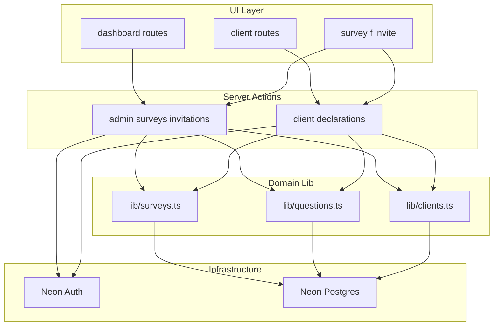

# iam-check Technical Architecture Doctrine

**Mode:** architecture + internal-guide  
**Audience:** engineers and execution agents  
**Production:** https://iam-check.vercel.app  
**Repository:** https://github.com/pohlai88/iam-check

This document is the source of truth for full-stack boundaries, slice interconnections, and enterprise hardening order. Per-slice acceptance proofs live in [slices/](./slices/).

---

## 1. System purpose

### What the system does

iam-check is a **client declaration portal** on **Next.js 16 (App Router) + Vercel + Neon Postgres + Neon Auth**. It collects structured attestations through dynamic questions (yes/no, text, file metadata) from:

- **Operators** — manage declarations, share links, invite clients, review submissions
- **Clients** — accept invite, onboard, complete assigned declarations, receive confirmation codes
- **Link recipients** — submit via open (`/survey/[slug]`) or secure (`/f/[token]`) links without an account

### Business capability

Enable regulated-style client attestations with operator oversight, optional assignment workflow, and receipt codes — without building a general-purpose form builder.

### Must never drift

1. **User-facing language** — client / declaration / submission ([lib/portal-copy.ts](../../lib/portal-copy.ts), [portal-writing.md](../portal-writing.md)). Not operator/admin/survey in UI.
2. **Permission before mutation** — `requireAdminSession` or scoped `requireClientSession`; never expose operator data to clients.
3. **Validation before persist** — answers validated against `survey_questions`; file answers must reference `evidence_records` for the same survey/question.
4. **Schema via migrations only** — DDL in [db/migrations/](../../db/migrations/); app must not run DDL on request.
5. **File evidence is metadata-only** — filename, MIME, size registered; no blob upload until an explicit future slice.
6. **Secure links hide slug** — `/f/[token]` resolves via `survey_invite_tokens`.

### Honest gaps vs enterprise bar

| Area | Today | Target (Phase C) |
|------|-------|------------------|
| Auth | Neon Auth + env operator gate | + client middleware, role claims |
| Tenancy | Global operator list | Org scope + optional RLS (S12) |
| Validation | Zod + MIME/size allowlist (S15) | Client-side pre-check |
| Audit | `audit_events` table (S11) | Retention policy |
| Observability | Structured action logs (S14) | External APM |
| CI | GitHub Actions (S13) | Branch protection on `main` |
| Background jobs | None | Outbox only when SMTP slice scoped |

---

## 2. Full-stack pipeline

| Layer | Location | Responsibility | Critical control |
|-------|----------|----------------|------------------|
| UI / AppShell | `components/portal-*.tsx` | Layout, `portalCopy`, forms | No business rules in components |
| Routes | `app/**/page.tsx` | Load data, redirect | Auth before sensitive render |
| Server actions | `app/actions/*.ts` | Auth, parse, orchestrate | Must not bypass domain validation |
| Domain | `lib/surveys.ts`, `lib/questions.ts`, `lib/clients.ts` | SQL, invariants | All DB writes here |
| Auth | `lib/auth/`, `lib/admin.ts`, `proxy.ts` | Session, operator vs client | CCP-A1–A3 |
| Database | `lib/db.ts`, `db/migrations/` | Pool, migrations | CCP-D2 |
| Audit / observability | `lib/audit.ts`, `lib/observability.ts` | Events, structured logs | CCP-AU1, CCP-O1 |
| CI / tests | `.github/workflows/ci.yml`, `e2e/` | PR gates, smoke tests | CCP-CI1 |

### Route map

| Route | Persona | Purpose |
|-------|---------|---------|
| `/` | Operator | Sign in |
| `/dashboard`, `/dashboard/[id]`, `/dashboard/clients` | Operator | Manage declarations, clients, submissions |
| `/survey/[slug]` | Public | Open declaration link |
| `/f/[token]` | Public | Secure declaration link |
| `/client/login`, `/client`, `/client/onboarding`, `/client/declare/[id]` | Client | Assigned workflow |
| `/invite/[token]` | Public | Accept client invitation |
| `/api/health/readiness` | Ops | Deploy readiness |
| `/api/auth/[...path]` | All | Neon Auth handler |

**Auth shell routes (Neon Auth — out of slice scope; do not add business logic)**

| Route | Purpose |
|-------|---------|
| `/account/[path]` | Neon Auth account UI (middleware-protected) |
| `/auth/[path]`, `/auth/admin` | Neon Auth built-in flows |
| `/org/login` | Operator sign-in alternate entry; `requireAdminSession` redirect target |

These routes are scaffolding only. Product routes and mutations remain under `/`, `/dashboard/*`, `/client/*`, `/survey/*`, `/f/*`, `/invite/*`.

### Server action → slice map

Mutations and public entry points only. Session helpers (`requireAdminSession`, `requireClientSession`, `loadAnonymousInviteLinkForSurvey`) are internal — not Zod targets.

| Action file | Function | Slice |
|-------------|----------|-------|
| `app/actions/admin.ts` | `adminSignInAction` | S1 |
| `app/actions/surveys.ts` | `createSurveyAction`, `updateSurveyAction`, `deleteSurveyAction` | S3 |
| `app/actions/surveys.ts` | `submitSurveyResponseAction` | S4 |
| `app/actions/declarations.ts` | `registerEvidenceAction` | S4 |
| `app/actions/invitations.ts` | `getAnonymousInviteLinkAction`, `regenerateAnonymousInviteLinkAction`, `recordEmailInvitationAction` | S5 |
| `app/actions/client.ts` | `clientSignInAction`, `acceptClientInviteAction`, `saveClientOnboardingAction` | S6 |
| `app/actions/client.ts` | `submitClientDeclarationAction` | S7 |
| `app/actions/client.ts` | `issueClientInviteAction` | S6, S7 |

**Phase C Zod coverage (S10):** all 14 functions above.

**Phase C audit coverage (S11):** all mutations except read-only `getAnonymousInviteLinkAction` and sign-in actions (add `auth.sign_in_failed` separately if needed).

---

## 3. Slice index

| ID | Name | Status | Sequence | Spec |
|----|------|--------|----------|------|
| S0 | Schema foundation | shipped | 1 | [s0-schema-foundation.md](./slices/s0-schema-foundation.md) |
| S1 | Auth boundary | shipped | 2 | [s1-auth-boundary.md](./slices/s1-auth-boundary.md) |
| S2 | UI shell and copy | shipped | 3 | [s2-ui-copy-doctrine.md](./slices/s2-ui-copy-doctrine.md) |
| S3 | Operator declaration CRUD | shipped | 4 | [s3-operator-crud.md](./slices/s3-operator-crud.md) |
| S4 | Submission engine | shipped | 5 | [s4-submission-engine.md](./slices/s4-submission-engine.md) |
| S5 | Anonymous share access | shipped | 6 | [s5-share-access.md](./slices/s5-share-access.md) |
| S6 | Client identity lifecycle | shipped | 7 | [s6-client-identity.md](./slices/s6-client-identity.md) |
| S7 | Client assignments and receipts | shipped | 8 | [s7-client-assignments.md](./slices/s7-client-assignments.md) |
| S8 | Operator review surface | shipped | 9 | [s8-operator-review.md](./slices/s8-operator-review.md) |
| S9 | Readiness and deploy gate | shipped | 10 | [s9-readiness.md](./slices/s9-readiness.md) |
| S10 | Validation contracts (Zod) | shipped | 11 | [s10-validation-contracts.md](./slices/s10-validation-contracts.md) |
| S11 | Audit event log | shipped | 12 | [s11-audit-events.md](./slices/s11-audit-events.md) |
| S12 | Tenancy and row scope | planned | 13 | [s12-tenancy.md](./slices/s12-tenancy.md) |
| S13 | CI quality gate | shipped | 14 | [s13-ci-gate.md](./slices/s13-ci-gate.md) |
| S14 | Observability | shipped | 15 | [s14-observability.md](./slices/s14-observability.md) |
| S15 | E2E journeys + evidence policy | shipped | 16 | [s15-e2e-journeys.md](./slices/s15-e2e-journeys.md) |

---

## 4. Interconnection map

| Slice | Depends on | Feeds into | Must not bypass | Parallel with | Blocks until |
|-------|------------|------------|---------------|---------------|--------------|
| S0 | Neon | all | runtime DDL | — | everything |
| S1 | S0 | S3–S8 | raw session in lib | S2 | authenticated features |
| S2 | S1 | all UI | inline copy | S3 | — |
| S3 | S0, S1 | S4–S8 | SQL in components | S5, S6 | submissions |
| S4 | S3 | S5, S7, S8 | unvalidated INSERT | S5, S6 | review |
| S5 | S3, S4 | S8 | slug in secure flow | S6, S7 | — |
| S6 | S0, S1 | S7 | invite without expiry | S5 | assignments |
| S7 | S4, S6 | S8 | assignment without email scope | S5 | — |
| S8 | S4 | — | unauthenticated list | — | — |
| S9 | S0, S1 | deploy | — | all | — |
| S10 | S3, S4 | S13 | hand-parse FormData | — | enterprise gate |
| S11 | S1 | compliance | mutations without audit | — | prod scale |
| S12 | S3 | multi-tenant | global admin list | — | SaaS launch |
| S13 | S10 | release | manual-only verify | — | team CI |
| S14 | S1 | ops | — | S11 | — |

---

## 5. Critical control point register

| ID | Control | Location | Today | Hardening |
|----|---------|----------|-------|-----------|
| CCP-A1 | Authentication | `proxy.ts`, Neon Auth | Partial middleware | Extend client routes |
| CCP-A2 | Operator authorization | `requireAdminSession` | Env email / role | Org scope (S12) |
| CCP-A3 | Client authorization | `requireClientSession` | Email on assignments | Role claims |
| CCP-V1 | Input validation | `lib/schemas/*` + `validateAnswers` | Zod + domain | MIME/size allowlist |
| CCP-V2 | Evidence integrity | `registerEvidence` | FK + ownership check | MIME/size allowlist |
| CCP-D1 | DB write | `lib/*` only | Yes | Multi-table transactions |
| CCP-D2 | Migration gate | `npm run db:migrate` | Manual | CI (S13) |
| CCP-AU1 | Audit event | `lib/audit.ts` | Yes (fail-open) | Retention policy |
| CCP-O1 | Observability | `lib/observability.ts` | JSON action logs | External APM |
| CCP-E1 | Error handling | actions return `{ error }` | Yes (incl. update) | Unified Result type |
| CCP-CI1 | Build proof | `.github/workflows/ci.yml` | PR workflow | Branch protection |

---

## 6. Development sequence

### Phase A — Foundation (shipped; maintain)

1. S0 → S1 → S2

### Phase B — Core product (shipped; maintain)

3. S3 → S4 → S5 ∥ S6 → S7 → S8 → S9

### Phase C — Enterprise hardening (execute next)

11. **S10** Zod contracts on all actions  
12. **S13** CI workflow (build + migrate + copy grep)  
13. **S11** Audit events on mutations  
14. **S14** Correlation ID + structured logging  
15. **S12** Tenancy — only if multi-operator SaaS confirmed

**Build principles**

- Foundation first  
- Contracts before UI expansion  
- Validation before mutation  
- Permission before data exposure  
- Audit before production integrations  
- Tests before acceptance sign-off  

---

## 7. Production acceptance checklist

- [x] Migrations applied on production branch (`npm run db:migrate`; uses `schema_migrations`)
- [ ] Env: `DATABASE_URL`, `NEON_AUTH_*`, `SHARED_ADMIN_*`, `APP_URL` on Vercel — [production go-live runbook](../runbooks/production-go-live.md)
- [ ] Neon Auth trusted domains include production URL — [runbook](../runbooks/production-go-live.md#preflight)
- [x] Operator E2E: create → share → receive submission (`e2e/smoke.spec.ts`, `e2e/secure-file.spec.ts`)
- [x] Client E2E: invite → onboard → assign → submit → receipt (`e2e/client-journey.spec.ts`)
- [x] Anonymous E2E: open + secure links, file metadata (`e2e/smoke.spec.ts`, `e2e/secure-file.spec.ts`)
- [x] Non-operator rejected → `/org/login?reason=access-denied`
- [ ] `GET /api/health/readiness` returns `ready` on production — `npm run verify:production` + [runbook](../runbooks/production-go-live.md)
- [x] CI green on PR (S13)
- [x] Audit on critical mutations (S11)
- [x] Zod on all actions (S10)
- [x] Correlation IDs in action logs (S14)

---

## 8. Do not build yet

| Item | Reason |
|------|--------|
| Blob/file upload storage | Violates metadata-only doctrine |
| Approve/reject review workflow | Needs audit + status schema |
| Reusable question-set library | Current row editor is sufficient |
| Redis / JSON workspace store | Postgres is source of truth |
| Neon RLS before `organization_id` | Premature complexity |
| Outbox + email sender | Clipboard copy works today |
| REST API replacing server actions | No consumer |
| Multi-region / read replicas | Single Neon branch is adequate |

---

## 9. Agent execution rules

1. Read the slice spec in [slices/](./slices/) before editing owned files.
2. Do not expand scope beyond the slice.
3. Add tests in the same change as behavior.
4. Update [README.md](../../README.md) if routes change; [portal-writing.md](../portal-writing.md) if copy namespaces change.
5. Never add DDL outside [db/migrations/](../../db/migrations/).
6. All user-facing strings → [lib/portal-copy.ts](../../lib/portal-copy.ts).

---

## 10. Phase C execution playbook

**Status:** Phase C shipped (S10–S14 + E2E smoke). **S12 deferred** until multi-operator SaaS confirmed.

| Step | Slice | Deliverables | Done when |
|------|-------|--------------|-----------|
| 1 | S10 | `lib/schemas/*.ts`, `safeParse` on 14 action functions | ✅ Shipped |
| 2 | S13 | `.github/workflows/ci.yml`, `scripts/check-portal-terminology.mjs` | ✅ Shipped |
| 3 | S11 | `db/migrations/004_audit_events.sql`, `lib/audit.ts` | ✅ Shipped |
| 4 | S14 | `lib/observability.ts`, `runLoggedAction` on mutations | ✅ Shipped |
| 5 | E2E | `e2e/smoke.spec.ts`, Playwright in CI | ✅ Shipped |

### S10 — validation contracts

- **Install:** `zod` dependency
- **Create:** `lib/schemas/` — `common.ts`, `auth.ts`, `surveys.ts`, `invitations.ts`, `client.ts`, `declarations.ts`
- **Wire:** action entry points listed in [Server action → slice map](#server-action--slice-map)
- **Rule:** Zod at action boundary only; keep `validateAnswers` in domain layer

### S13 — CI quality gate

- **Create:** `.github/workflows/ci.yml` — `npm ci`, `npm run build`, optional `npm run db:migrate` with `DATABASE_URL` secret
- **Create:** `scripts/check-portal-terminology.mjs` — fail if banned terms (`survey`, `admin`, `operator`) appear in `components/` outside allowed patterns
- **Add script:** `"check:copy": "node scripts/check-portal-terminology.mjs"` in `package.json`

### S11 — audit events

- **Migration:** `audit_events(id, actor_id, event_type, resource_type, resource_id, metadata jsonb, created_at)`
- `declaration.created`, `declaration.updated`, `declaration.submitted`, `invite.issued`, `invite.accepted`, `evidence.registered`
- **Policy (decided):** fail-open — log audit write failure, do not block mutation

### S14 — observability

- **Create:** `lib/observability.ts` — `withActionLog(name, fn)` generating UUID correlation ID
- **Log fields:** `correlationId`, `action`, `userId`, `durationMs`, `outcome`
- **Exclude:** full answer payloads and secrets

### E2E journeys (S15)

- **Smoke:** `e2e/smoke.spec.ts` — readiness, operator create, public load + submit
- **Secure + file:** `e2e/secure-file.spec.ts` — `/f/[token]`, file metadata, submission count
- **Client path:** `e2e/client-journey.spec.ts` — invite → onboard → submit → `CDP-*`
- **Evidence policy:** `lib/evidence-policy.ts` — MIME/size allowlist at action boundary
- **Production verify:** `npm run verify:production` — see [production go-live runbook](../runbooks/production-go-live.md)

Mark slice acceptance proofs in [slices/](./slices/) when each step completes; update slice **Status** in §3 from `planned` to `shipped`.
