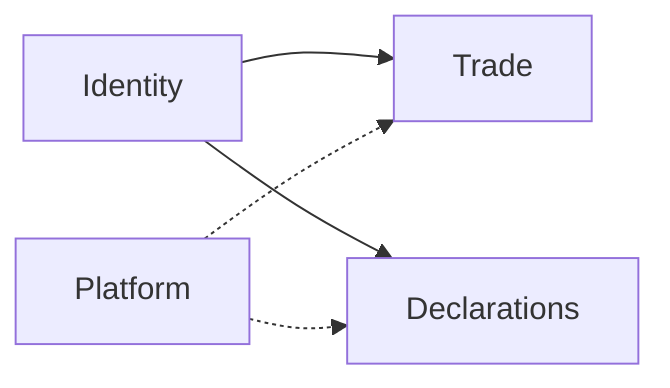
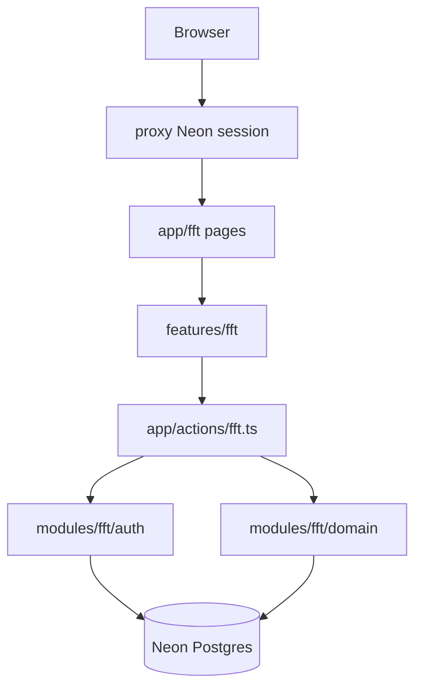

# FFT-MOD-001 Module Architecture

| Field | Value |
|-------|-------|
| ID | FFT-MOD-001 |
| Category | Module |
| Version | 2.0.0 |
| Status | Living |
| Owner | Feed Farm Trade |
| Updated | 2026-07-13 |
| Spine | MOD-001 Module Architecture |

**Absorbed:** ADR-003 (product locks) · ADR-004 (FE architecture).  
**Audience:** engineers / agents shaping `/fft` work.  
**Runtime entry:** [FFT-MOD-008](FFT-MOD-008-ops-runtime.md)  
**Roadmap / MVP:** [FFT-MOD-010](FFT-MOD-010-module-docs-index.md)  
**Skill:** [`.cursor/skills/feed-farm-trade`](../../../.cursor/skills/feed-farm-trade/SKILL.md)

```text
LOAD: product locks, context map, folders, request flow, naming, failure modes
SKIP: phase AC / gap detail → FFT-MOD-010 · ops gates → FFT-MOD-008
```

## Context

3F businesses (feedmills, farmers, Feed · Farm · Food — industry operators, **not** organization admins alone) need a **feed & farm sales** module beside Declarations inside **Afenda-Lite**: time-boxed events, orders, allocation, ops handoff — one SaaS product, not a second app, and not an end-customer storefront yet.

**Platform model:** one SaaS, two product modules — **Declarations** and **Feed Farm Trade** — plus shared Platform + Identity. Same deployable, shell, auth, DB, env, proxy, CI. Module boundaries are domain/RBAC/UI homes only.

The engine was historically named **Hot Sales** with paths under `/trade`. Module identity is **Feed Farm Trade (FFT)**. Dual naming is retired.

## Product locks (from ADR-003)

**Feed Farm Trade (FFT)** is the module name + engine + path identity on **Afenda-Lite**. Product name SSOT: Afenda-Lite ([deprecation register](../../../.cursor/skills/agent-skills/skills/deprecation-and-migration/reference.md)).

| Lock | Choice |
|------|--------|
| Host product | **Afenda-Lite** (not “Client Declaration Portal”) |
| Platform model | One SaaS · two modules (`declarations` \| `fft`) · infra updated together |
| UI / nav name | Feed Farm Trade |
| Engine / env / ops | FFT — `FFT_*` env keys; living SSOT this folder ([FFT-MOD-008](FFT-MOD-008-ops-runtime.md)) |
| DB | `fft_*` tables (migration `024_fft_rename_hot_sales_tables.sql`) |
| Actors | Organization-admin sales + ops (not end customers) |
| Shell | Shared AdminCN on `/fft/*`; entitlement `fft` |
| Paths | Locale-free `/fft` (308 redirect from legacy `/trade/*`) |
| Entry | `requireFftAccess` — org admin alone does **not** grant |
| Permissions | Codes in `modules/fft/domain/rbac-catalog.ts` |
| Domain | `modules/fft` + `app/actions/fft.ts` |
| UI home | `features/fft/*` under AdminCN — never mount `FftShell` / locale switcher |
| Deprecation | Hot Sales / `/trade` / `FftShell` = **compulsory** retire |
| Out of scope | Declarations **feature** ownership; Neon Auth chrome; ERP as ledger; **customer portal**; pixel polish beyond MVP |

**Historical tags** (`hot-sales-phase-*`) remain immutable footnotes only — do not retag.

**MVP bar:** P0 + P1 in [FFT-MOD-010](FFT-MOD-010-module-docs-index.md).

### Rejected (locks)

| Option | Why |
|--------|-----|
| Keep Hot Sales as engine name forever | Confuses agents and ops; product already FFT |
| Keep `/trade` as permanent URL | Conflicts with product FFT branding |
| Soft-deprecate Hot Sales / FftShell | Compulsory retire — agents remount soft leftovers |
| Treat FFT as separate infra course | Same platform; module domain only |
| `FEED_FARM_TRADE_*` env prefix | Too long; FFT matches registry tooling |
| Remount `FftShell` / live `/fft/[locale]` | Breaks AdminCN platform shell |

## Responsibilities and boundaries



| Boundary | Rule |
|----------|------|
| Platform vs modules | Shared Platform/Identity/AdminCN/env/CI — not FFT-only infra |
| Module domains | No domain imports Trade ↔ Declarations; compose at adapter if both needed |
| Shell entitlement | `fft` via `requireFftAccess` → platform `fft.access`; org admin alone does not grant |
| Data tenancy | Hard `organization_id = $org` on FFT tenant roots ([ARCH-011](../../architecture/ARCH-011-platform-tenancy-rbac.md) · [ARCH-023](../../architecture/turborepo/ARCH-023-multi-tenancy.md)) |
| Chrome | `AdminCnShell` only — never `FftShell` or locale switcher |
| Paths | Locale-free `/fft/**` — no live `app/fft/[locale]` |

| Owns | Does not own |
|------|----------------|
| Trade domain under `modules/fft/` | Platform tenancy SQL / org resolution |
| `/fft` routes + `features/fft` UI | Declaration portal / client workspace |
| Module RBAC catalog + `FFT_*` flags | Product-wide Afenda ERP client |
| Ops evidence in [FFT-MOD-008](FFT-MOD-008-ops-runtime.md) | Portal Atmosphere / Guardian Auth |

**Non-goals:** separate FFT deployable; `modules/trade` rename; project-per-tenant isolation.

## Components

| Layer | Path | Responsibility |
|-------|------|----------------|
| Routes | `app/fft/**` | Thin RSC: await `params`; compose only |
| Layout | `app/fft/layout.tsx` | `requireFftAccess` + `AdminCnShell` |
| UI | `features/fft/*` | Forms/panels; no shell chrome |
| Actions | `app/actions/fft.ts` | Zod + session/permission → domain → `ActionResult` |
| Domain | `modules/fft/**` | SQL, allocation rules, RBAC codes |
| Entitlement | `features/portal-chrome/resolve-shell-access.ts` | Nav module visibility |
| Session | `modules/fft/auth/fft-session.ts` | FFT access resolution |
| Nav | `components-V2/platform-config/navConfig.tsx` | `moduleId: feed-farm-trade` |
| REST contract | `docs/api/REST-001-rest-resources.md` | Locale-free `/api/fft/...` — contract-only |

### Trusted files

| Concern | Path |
|---------|------|
| Layout gate | `app/fft/layout.tsx` |
| Entitlement | `features/portal-chrome/resolve-shell-access.ts` |
| Session | `modules/fft/auth/fft-session.ts` |
| Permissions | `modules/fft/domain/rbac-catalog.ts` |
| Store / rules | `modules/fft/domain/store.ts` |
| Actions | `app/actions/fft.ts` |
| Default UI locale arg | `features/fft/trade-ui-locale.ts` (`FFT_UI_LOCALE`) |
| Routes helpers | `modules/platform/routing/portal-routes.ts` · `modules/fft/i18n/trade.ts` (`tradeHref`) |



## Data / request flow

```text
app/fft/**/page.tsx          → thin RSC (params await; no business logic)
  → features/fft/*           → UI (NO FftShell / locale switcher)
  → app/actions/fft.ts       → Zod + requireFftAccess / permission
  → modules/fft/domain/*     → SQL / rules
layout: requireFftAccess + AdminCnShell only
```

| Need | Path |
|------|------|
| RSC read | Call `modules/fft` domain directly — never fetch own `/api/fft` |
| Client mutation | Server Action → Zod → session/perm → domain → `ActionResult` |
| External HTTP | Route Handler per `docs/api` — contract-only until a consumer needs it |

**Locale note:** Actions still accept a `TradeLocale` argument for copy/domain i18n. URL paths are locale-free; pages pass `FFT_UI_LOCALE` from `features/fft/trade-ui-locale.ts`.

## Key decisions

| Decision | Rationale / where |
|----------|-------------------|
| One platform, two modules | SaaS multi-module — Declarations + FFT share infra |
| AdminCN only | One SaaS shell with Declarations / Account / FFT |
| Kill `/fft/[locale]` + FftShell | Residue fought platform shell |
| Actions-first UI | Portal BFF decision tree; REST contract-only |
| Keep `FFT_*` | Prod ops already keyed to those names |
| Permission codes, not role names | [FFT-MOD-005](FFT-MOD-005-auth-tenancy-rbac.md) · `rbac-catalog.ts` |
| Finance / pickup / imports / ERP flags | [FFT-MOD-008](FFT-MOD-008-ops-runtime.md) · [FFT-MOD-007](FFT-MOD-007-api-and-adapters.md) |

## Failure modes

| Failure | Expected behavior |
|---------|-------------------|
| No session on `/fft` | Sign-in redirect (proxy + layout) |
| Session without trade permission | Denied; FFT nav hidden |
| Org admin without platform `fft.access` | Declarations OK; `/fft` denied |
| P3 ops flags off | Deposits/pickup/imports/ERP writes blocked; P1 cycle still works |
| Missing permission on mutation | Action returns deny / error — never silent success |
| Soft tenancy / dual-mode SQL | **Retired** — never reintroduce |

## Operational considerations

- **P3 promotion:** flags + [FFT-MOD-008](FFT-MOD-008-ops-runtime.md) only — do not invent checklists elsewhere.
- **Verify slice:** `requireFftAccess` / permission · Zod at action edge · no FftShell · update [completeness.md](../../../.cursor/skills/feed-farm-trade/completeness.md) when status changes.
- **Engine lane:** 2B–2D product UI / flag work still requires MOD-008 + explicit reopen.
- Do not mix unrelated repo refactors into FFT commits.

## Known limits / future changes

| Limit | Notes |
|-------|-------|
| P2 UI polish | Closed until explicit reopen — thin AdminCN pages are MVP-OK |
| P3 ops surfaces | Placeholder / flag-gated under `/fft/admin/...` |
| Customer portal | Later — wrong actor for this module |
| `FFT_*` / `/fft` rename | Requires new architecture decision + migration |
| Full e2e AC journey | Recommended before claiming enterprise MVP (see MOD-010) |
| 2D-3 vendor adapter | Blocked until customer integration contract |
| FFT child `organization_id` denorm | Deferred (ARCH-023 **D4**) |

## Change Log

| Version | Date | Summary |
|---------|------|---------|
| 2.0.0 | 2026-07-13 | Absorbed ADR-003 locks + ADR-004 architecture; FE ADR folder deleted |
| 1.0.0 | 2026-07-13 | Initial spine |
