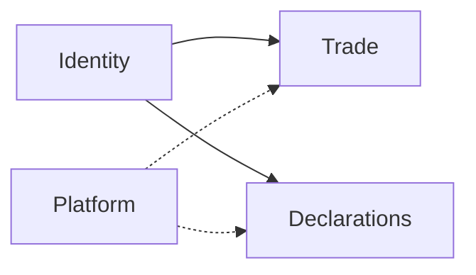
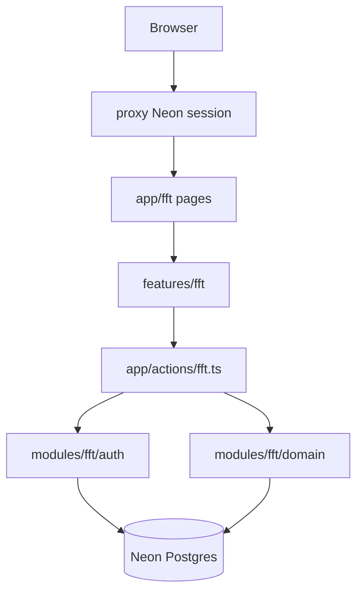

# FFT-MOD-001 Module Architecture

| Field             | Value                 |
| ----------------- | --------------------- |
| **ID**            | FFT-MOD-001           |
| **Category**      | Module                |
| **Version**       | 2.3.0 |
| **Status**        | Living                |
| **Control State** | Closed              |
| **Owner**         | Feed Farm Trade       |
| **Updated**       | 2026-07-14            |
| **Spine**         | MOD-001 Module Architecture |

---

# 1. Purpose

Living product locks and module architecture for **Feed Farm Trade (FFT)** on Afenda-Lite.

**Audience:** engineers and agents shaping `/fft` work.
**Action enabled:** decide shell, paths, ownership, and failure behavior without consulting roadmap or ops checklists.

**Read first for ops:** [FFT-MOD-008](FFT-MOD-008-ops-runtime.md). **MVP / gaps:** [FFT-MOD-010](FFT-MOD-010-module-docs-index.md). **Skill:** [`.cursor/skills/feed-farm-trade`](../../../.cursor/skills/feed-farm-trade/SKILL.md).

---

# 2. Scope

## 2.1 In Scope

- Product locks and rejected alternatives
- Context map, layer ownership, request flow
- Failure modes and known architecture limits

## 2.2 Out of Scope

- Phase AC / gap register → [FFT-MOD-010](FFT-MOD-010-module-docs-index.md)
- Production flags, allowed/forbidden coding → [FFT-MOD-008](FFT-MOD-008-ops-runtime.md)
- Permission catalog detail → [FFT-MOD-005](FFT-MOD-005-auth-tenancy-rbac.md)
- Code path inventory → [FFT-MOD-002](FFT-MOD-002-domain-and-ownership.md)

---

# 3. Architecture

## 3.1 Context

3F businesses (feedmills, farmers, Feed · Farm · Food operators) need a **feed & farm sales** module beside Declarations inside **Afenda-Lite**: time-boxed events, orders, allocation, ops handoff — one SaaS product, not a second app, and not an end-customer storefront.

**Platform model:** one SaaS, two product modules — **Declarations** and **Feed Farm Trade** — plus shared Platform + Identity. Same deployable, shell, auth, DB, env, proxy, CI. Module boundaries are domain / RBAC / UI homes only.

Historical engine name **Hot Sales** / `/trade` is retired. Module identity is **Feed Farm Trade (FFT)**.

## 3.2 Product locks

| Lock | Choice |
|------|--------|
| Host product | **Afenda-Lite** (not “Client Declaration Portal”) |
| Platform model | One SaaS · two modules (`declarations` \| `fft`) · infra updated together |
| UI / nav name | Feed Farm Trade |
| Engine / env / ops | FFT — `FFT_*` keys; runtime SSOT [FFT-MOD-008](FFT-MOD-008-ops-runtime.md) |
| DB | `fft_*` tables (migration `024_fft_rename_hot_sales_tables.sql`) |
| Actors | Organization-admin sales + ops (not end customers) |
| Shell | Shared AdminCN on `/fft/*`; entitlement `fft` |
| Paths | Locale-free `/fft` (308 from legacy `/trade/*`) |
| Entry | `requireFftAccess` — org admin alone does **not** grant |
| Permissions | Codes in `modules/fft/domain/rbac-catalog.ts` |
| Domain | `modules/fft` + `app/actions/fft.ts` |
| UI home | `features/fft/*` under AdminCN — never `FftShell` / locale switcher |
| Deprecation | Hot Sales / `/trade` / `FftShell` = compulsory retire |
| Out of scope | Declarations feature ownership; Neon Auth chrome; ERP as ledger; customer portal; polish beyond MVP |

Historical tags (`hot-sales-phase-*`) are immutable footnotes only — do not retag.

**MVP bar:** P0 + P1 in [FFT-MOD-010](FFT-MOD-010-module-docs-index.md).

### Rejected

| Option | Why |
|--------|-----|
| Keep Hot Sales as engine name forever | Confuses agents and ops; product is FFT |
| Keep `/trade` as permanent URL | Conflicts with FFT branding |
| Soft-deprecate Hot Sales / FftShell | Compulsory retire — agents remount leftovers |
| Treat FFT as separate infra course | Same platform; module domain only |
| `FEED_FARM_TRADE_*` env prefix | Too long; FFT matches tooling |
| Remount `FftShell` / live `/fft/[locale]` | Breaks AdminCN platform shell |

## 3.3 Responsibilities and boundaries

| Boundary | Rule |
|----------|------|
| Platform vs modules | Shared Platform/Identity/AdminCN/env/CI — not FFT-only infra |
| Module domains | No domain imports Trade ↔ Declarations; compose at adapter if both needed |
| Shell entitlement | `fft` via `requireFftAccess` → platform `fft.access` |
| Data tenancy | Hard `organization_id = $org` on FFT tenant roots ([ARCH-023](../../architecture/ARCH-023-multi-tenancy.md)) |
| Chrome | `AdminCnShell` only |
| Paths | Locale-free `/fft/**` — no live `app/fft/[locale]` |

| Owns | Does not own |
|------|----------------|
| Trade domain under `modules/fft/` | Platform tenancy SQL / org resolution |
| `/fft` routes + `features/fft` UI | Declaration portal / client workspace |
| Module RBAC catalog + `FFT_*` flags | Product-wide Afenda ERP client |
| Ops evidence in [FFT-MOD-008](FFT-MOD-008-ops-runtime.md) | Portal Atmosphere / Guardian Auth |

**Non-goals:** separate FFT deployable; `modules/trade` rename; project-per-tenant isolation.

## 3.4 Components and request flow

| Layer | Path | Responsibility |
|-------|------|----------------|
| Routes | `app/fft/**` | Thin RSC: await `params`; compose only |
| Layout | `app/fft/layout.tsx` | `requireFftAccess` + `AdminCnShell` |
| UI | `features/fft/*` | Forms/panels; no shell chrome |
| Actions | `app/actions/fft.ts` | Zod + session/permission → domain → `ActionResult` |
| Domain | `modules/fft/**` | SQL, allocation rules, RBAC codes |
| Entitlement | `features/portal-chrome/resolve-shell-access.ts` | Nav module visibility |
| Session | `modules/fft/auth/fft-session.ts` | FFT access resolution |
| Nav | `components-V2/platform-config/navConfig.tsx` | `moduleId: feed-farm-trade` |
| REST contract | [REST-001](../../api/REST-001-rest-resources.md) | Locale-free `/api/fft/...` — contract-only |

**Trusted files:** `app/fft/layout.tsx` · `resolve-shell-access.ts` · `fft-session.ts` · `rbac-catalog.ts` · `store.ts` · `app/actions/fft.ts` · `trade-ui-locale.ts` · `portal-routes.ts` / `tradeHref`.

| Need | Path |
|------|------|
| RSC read | Call `modules/fft` domain directly — never fetch own `/api/fft` |
| Client mutation | Server Action → Zod → session/perm → domain → `ActionResult` |
| External HTTP | Route Handler per `docs/api` — contract-only until a consumer needs it |

**Locale:** Actions may accept `TradeLocale` for copy/domain i18n. URL paths are locale-free; pages pass `FFT_UI_LOCALE` from `features/fft/trade-ui-locale.ts`.

## 3.5 Key decisions

| Decision | Rationale / where |
|----------|-------------------|
| One platform, two modules | Declarations + FFT share infra |
| AdminCN only | One SaaS shell |
| Kill `/fft/[locale]` + FftShell | Residue fought platform shell |
| Actions-first UI | BFF decision tree; REST contract-only |
| Keep `FFT_*` | Prod ops already keyed |
| Permission codes, not role names | [FFT-MOD-005](FFT-MOD-005-auth-tenancy-rbac.md) · `rbac-catalog.ts` |
| Finance / pickup / imports / ERP flags | [FFT-MOD-008](FFT-MOD-008-ops-runtime.md) · [FFT-MOD-007](FFT-MOD-007-api-and-adapters.md) |

## 3.6 Failure modes

| Failure | Expected behavior |
|---------|-------------------|
| No session on `/fft` | Sign-in redirect (proxy + layout) |
| Session without trade permission | Denied; FFT nav hidden |
| Org admin without platform `fft.access` | Declarations OK; `/fft` denied |
| P3 ops flags off | Deposits/pickup/imports/ERP writes blocked; P1 cycle still works |
| Missing permission on mutation | Action returns deny / error — never silent success |
| Soft tenancy / dual-mode SQL | **Retired** — never reintroduce |

## 3.7 Operational notes

- **P3 promotion:** flags + [FFT-MOD-008](FFT-MOD-008-ops-runtime.md) only.
- **Verify slice:** `requireFftAccess` / permission · Zod at action edge · no FftShell · update skill [completeness.md](../../../.cursor/skills/feed-farm-trade/completeness.md) when status changes.
- **Engine lane:** 2B–2D product UI / flag work still requires MOD-008 + explicit reopen.
- Do not mix unrelated repo refactors into FFT commits.

## 3.8 Known limits

| Limit | Notes |
|-------|-------|
| P2 UI polish | Closed until explicit reopen — thin AdminCN pages are MVP-OK |
| P3 ops surfaces | Flag-gated under `/fft/admin/...` |
| Customer portal | Later — wrong actor for this module |
| `FFT_*` / `/fft` rename | Needs new architecture decision + migration |
| Full e2e AC journey | Required evidence before Module Enterprise Readiness Claimable (FFT-MOD-009 / MOD-010) |
| 2D-3 vendor adapter | Blocked until customer integration contract |
| FFT child `organization_id` denorm | Deferred (ARCH-023 **D4**) |

## 3.9 Enterprise requirements

Single-owner ACs for this role. Evidence: [FFT-MOD-009](FFT-MOD-009-verification.md). Standard: [MOD-002](../MOD-002-modules-index.md).

| AC-ID | Profile | Quality Dimension | Applicability | Criterion |
| --- | --- | --- | --- | --- |
| FFT-AC-001-01 | Enterprise Core | CORE-ARCH | Core | Product locks hold: AdminCN-only `/fft`, no `FftShell` / locale switcher product UI, locale-free paths, legacy `/trade` redirect-only. |
| FFT-AC-001-02 | Enterprise Core | CORE-ARCH | Core | Entry and ownership boundaries hold: `requireFftAccess` gates module entry; org admin alone does not grant; UI mutations Actions-first; RSC reads domain directly. |
| FFT-AC-001-03 | Enterprise Core | CORE-ARCH | Core | Failure and reliability boundaries are explicit: deny/fail modes for missing entitlement and adapter/runtime faults; 2B–2D work remains blocked without MOD-008 reopen. |
---

# 4. References

| ID | Title | Relationship |
| -- | ----- | ------------ |
| DOC-001 | Documentation Control Standard | Governance |
| MOD-002 | Modules Index | Module Enterprise Readiness standard |
| ARCH-023 | Multi-Tenancy and Platform RBAC | Tenancy locks |
| ARCH-029 | Interface and API Architecture | Adapter / REST parent |
| FFT-MOD-002 | Domain and Ownership | Code map |
| FFT-MOD-005 | Auth, Tenancy and RBAC | Permission catalog |
| FFT-MOD-008 | Ops Runtime | Production / gates |
| FFT-MOD-009 | Verification | Evidence ledger |
| FFT-MOD-010 | Module Docs Index and Roadmap | Readiness claims / roadmap |
| REST-001 | REST Standards and Resource Index | `/api/fft` contract |

---

# 5. Change Log

| Version | Date       | Summary |
| ------- | ---------- | ------- |
| 2.3.0 | 2026-07-14 | Executable quality contract: profile/dimension mapping. |
| 2.2.0   | 2026-07-14 | Wave C: enterprise requirements FFT-AC-001-01…03 (architecture/failure boundaries). |
| 2.1.0   | 2026-07-14 | DOC-003 six-section retrofit; compact architecture ownership (roadmap deferred to MOD-010). |
| 2.0.1   | 2026-07-14 | Added mandatory Control State header field (Closed); lifecycle Status unchanged. |
| 2.0.0   | 2026-07-13 | Product locks + FE architecture recorded in this spine |
| 1.0.0   | 2026-07-13 | Initial spine |

---

# 6. Notes

**Spine role:** MOD-001 Module Architecture — locks and structure only.

**Skill companion:** `.cursor/skills/feed-farm-trade` mirrors this spine; docs win on conflict.
