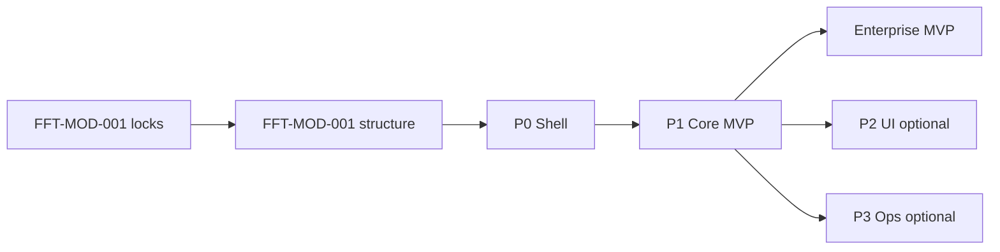

# FFT-MOD-010 Module Docs Index + Roadmap

| Field | Value |
|-------|-------|
| ID | FFT-MOD-010 |
| Category | Module |
| Version | 2.0.0 |
| Status | Living |
| Owner | Feed Farm Trade |
| Updated | 2026-07-13 |
| Spine | MOD-010 Module Docs Index |

**Absorbed:** ADR-005 (roadmap + gap register).  
**Architecture / locks:** [FFT-MOD-001](FFT-MOD-001-module-architecture.md)  
**Runtime:** [FFT-MOD-008](FFT-MOD-008-ops-runtime.md)  
**Skill:** [`.cursor/skills/feed-farm-trade`](../../../.cursor/skills/feed-farm-trade/SKILL.md)

## Agent read order

1. **[FFT-MOD-008](FFT-MOD-008-ops-runtime.md)** — production state, allowed/forbidden, verify
2. **[FFT-MOD-001](FFT-MOD-001-module-architecture.md)** — locks + structure
3. This file — MVP outcome, gaps, P0–P3
4. Other spine docs as needed (auth → [005](FFT-MOD-005-auth-tenancy-rbac.md), surfaces → [006](FFT-MOD-006-surfaces-and-routes.md), adapters → [007](FFT-MOD-007-api-and-adapters.md))

Also: [AGENTS.md](../../../AGENTS.md) · [deprecation register](../../../.cursor/skills/agent-skills/skills/deprecation-and-migration/reference.md) · [10-MOD guideline](../MOD-002-modules-index.md)

```text
DO NOT: FftShell, /fft/[locale], customer portal, invent permission codes, rename FFT_*
MVP ≠ events/orders/alloc alone — see P1 promoted gaps G1–G6
TRUSTED: modules/fft/domain/rbac-catalog.ts · app/actions/fft.ts · modules/fft/domain/store.ts
```

## Spine catalog (MOD-001…009)

| Spine | Doc |
|-------|-----|
| MOD-001 Architecture | [FFT-MOD-001](FFT-MOD-001-module-architecture.md) |
| MOD-002 Domain | [FFT-MOD-002](FFT-MOD-002-domain-and-ownership.md) |
| MOD-003 Tech stack | [FFT-MOD-003](FFT-MOD-003-tech-stack.md) |
| MOD-004 Data model | [FFT-MOD-004](FFT-MOD-004-data-model.md) |
| MOD-005 Auth / RBAC | [FFT-MOD-005](FFT-MOD-005-auth-tenancy-rbac.md) |
| MOD-006 Surfaces | [FFT-MOD-006](FFT-MOD-006-surfaces-and-routes.md) |
| MOD-007 API / adapters | [FFT-MOD-007](FFT-MOD-007-api-and-adapters.md) |
| MOD-008 Ops runtime | [FFT-MOD-008](FFT-MOD-008-ops-runtime.md) |
| MOD-009 Verification | [FFT-MOD-009](FFT-MOD-009-verification.md) |

## Depth folders

**Removed.** Do not recreate `adr/`, `ops/`, `spec/`, etc. under this module.

---

## Outcome lock — enterprise MVP (from ADR-005)

**Satisfactory enterprise grade = P0 + P1 done** (working MVP, not a documentation binder).

**Operator outcome:** Entitled sales/ops can run a full program cycle: setup event (products, **supply**, **custom fields**, **customer priority**) → open window → take orders → **transfer** when needed → **allocate** (respecting priority/supply) → **complete** orders → **audit/export** as permitted. Thin AdminCN pages OK. Full AdminCN polish = P2. Deposits/pickup/ERP = P3.

| Claim | Required |
|-------|----------|
| **Enterprise MVP** | **P0 + P1** (includes G1–G6) + AC evidence |
| UI polish | P2 — **complete 2026-07-11** |
| Ops handoff | P3 — flags + [FFT-MOD-008](FFT-MOD-008-ops-runtime.md) |
| Customer portal / locale URLs / `FFT_*` rename | Later |



**Program status (2026-07-11):** P0 done; P1 engine+FE wired with AC evidence (`EVALUATE_P1_MVP: YES` in skill `verify.md`); **enterprise MVP claimable**. P2 UI polish AC-01..06 done. P3 = flag-off placeholders + MOD-008 for any prod `FFT_*` enable. See [completeness.md](../../../.cursor/skills/feed-farm-trade/completeness.md).

---

## Critical gap register

### G0 — Ops docs — **resolved** (spine-only home)

Living SSOT: [FFT-MOD-008](FFT-MOD-008-ops-runtime.md). Flag promotion still requires MOD-008 checklist.

### Promote into P1 (wired)

| ID | Capability | Why MVP |
|----|------------|---------|
| **G1** | Customer priority | Allocation is priority-ranked |
| **G2** | Supply caps | Allocation without supply is unconstrained |
| **G3** | Order transfer | Default sales_executive includes `transfer.request` |
| **G4** | Order complete | Cycle must close after allocate |
| **G5** | Custom field defs | Template-driven farm programs |
| **G6** | Audit view | Minimum enterprise governance |

### Fix as AC (partly named)

| ID | Issue |
|----|--------|
| **G7** | Clone / template / schedule activate — AC under F-EVT |
| **G8** | Exports (`export.orders`) — AC under F-ADM |
| **G9** | Manual allocation override — AC under F-ALC (sensitive) |

### Keep out of MVP

Offline booth · barcode · floor plans · full feed ERP · VFD · customer portal · mobile-native · deposits/pickup/imports/ERP sync (→ **P3**) · notification polish (→ P3/Later)

---

## P0 — Shell

**Status:** Done. Detail in this document (outcome lock / P0).

Must hold: `requireFftAccess` · FFT nav only when entitled · AdminCN on `/fft/*` · no session → sign-in · locale-free `/fft`.

---

## P1 — Core cycle (MVP)

**Status:** Wired 2026-07-11. Detail in this document (P1 / G1–G6).

Claim enterprise MVP only with **all** AC evidence including G1–G6. Surfaces: events, setup, order, my-orders, allocation, rbac. P3 placeholders under `/fft/admin/.../deposits|pickup|imports`, `/erp-sync` — flag-gated.

**DoD highlights:** Mutations via `app/actions/fft.ts` + Zod + session/permission; domain only in `modules/fft`; no FftShell / locale tree; REST locale-free (`REST-001`).

---

## P2 — UI reopen (not MVP)

**Complete 2026-07-11**. Further polish only with named P2-AC + Plan for visual.

---

## P3 — Ops flags (not MVP)

Deposits / pickup / imports / ERP only when `FFT_*` on **and** [FFT-MOD-008](FFT-MOD-008-ops-runtime.md) allows.

| AC | Pass when |
|----|-----------|
| AC-OPS-01 | Flags off → ops writes blocked; P1 still works |
| AC-OPS-02 | Flag on + MOD-008 → F-OPS-* honor permissions |

---

## Later

Customer portal · locale URLs · ERP vendor packs (2D-3) · renaming `FFT_*` / `/fft` · offline/mobile/trade-show · VFD / full mill ERP.

## Builder rules

1. Prefer FFT-MOD-001 + this file over locale trees / FftShell.
2. Do not claim enterprise MVP without **P0 + P1 including G1–G6** and AC evidence.
3. No customer-portal bleed into FFT PRs.
4. P3 needs MOD-008 checklist — not FE invention.
5. Do not pull industry booth/ERP/VFD into P1 because peers have them.
6. Update [completeness.md](../../../.cursor/skills/feed-farm-trade/completeness.md) when wire status changes.

## Frozen boundaries

| Item | Value |
|------|-------|
| Phase 1 tag | `fft-phase-1` → `1bc1294` |
| Phase 2A tag | `fft-phase-2a` → `8e650ff` |
| Production RBAC | `FFT_RBAC_ENABLED=true` |
| Production DB | `br-tiny-hill-ao82jp6f` |

## Directory layout

```text
docs/modules/feed-farm-trade/
  README.md
  FFT-MOD-001 … FFT-MOD-010
```

## Change Log

| Version | Date | Summary |
|---------|------|---------|
| 2.0.0 | 2026-07-13 | Absorbed ADR-005 roadmap; spine-only FE SSOT |
| 1.1.0 | 2026-07-13 | Depth folders removed |
| 1.0.0 | 2026-07-13 | Initial index |
