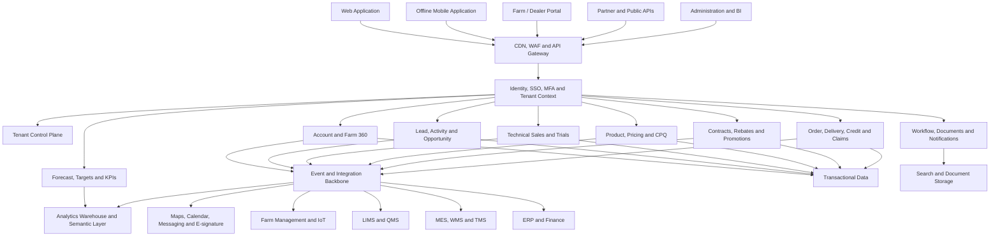

# FFT Enterprise Product and Architecture Definition

## 1. Product definition

**Feed–Farm–Trade, or FFT,** should be positioned as a **multi-tenant, industry-specific commercial operating platform** for organizations involved in animal feed and livestock or aquaculture production.

Its primary users are:

- Feedmill manufacturers and commercial teams
- Livestock, poultry, dairy, swine, and aquaculture integrators
- Independent farms and farm groups
- Feed distributors, dealers, and trading partners
- Technical sales, nutrition, pricing, credit, and customer-service teams

FFT manages the commercial lifecycle from **lead and farm identification through technical assessment, quotation, contract, order visibility, delivery, collection, retention, and expansion**.

### Recommended product boundary

| FFT owns                                                             | FFT integrates with                            |
| -------------------------------------------------------------------- | ---------------------------------------------- |
| Leads, accounts, contacts, farms, sites and commercial relationships | ERP and customer master                        |
| Sales activities, visits and tasks                                   | Feed formulation and product lifecycle systems |
| Opportunities and pipeline                                           | MES and feedmill production systems            |
| Technical assessments and feed trials                                | WMS, inventory and logistics systems           |
| Quotes, approvals and commercial contracts                           | LIMS, QMS, lot and certificate systems         |
| Sales forecasts and demand projections                               | Accounting, invoicing and payment systems      |
| Targets, KPIs, incentives and dashboards                             | Farm-management platforms and IoT              |
| Customer complaints and commercial cases                             | E-signature, mapping, messaging and calendars  |

FFT should **not initially attempt to replace** feed formulation, mill production control, general accounting, warehouse execution, veterinary diagnosis, or complete farm-management systems.

Because feed organizations may need food-safety and traceability evidence, FFT should provide configurable compliance records and integrations. ISO 22000 applies across the food chain, including feed production, while ISO 22005 specifies principles and requirements for feed and food traceability. In the United States, covered animal-food facilities may also need to support CGMP, hazard-analysis, food-safety-plan, and risk-based preventive-control processes. FFT can support those records and workflows, but deploying FFT alone does not make a tenant certified or legally compliant. ([ISO][1])

---

## 2. Business objectives

FFT should deliver five major outcomes.

| Objective                              | Expected result                                                                                                           |
| -------------------------------------- | ------------------------------------------------------------------------------------------------------------------------- |
| **Commercial visibility**              | Management sees pipeline, committed volume, expected tonnage, revenue, margin, risk and next actions in one place.        |
| **Field-sales productivity**           | Representatives can plan routes, conduct farm visits, capture findings, work offline and follow up consistently.          |
| **Pricing and margin control**         | Quotes use approved price books, freight rules, discount limits, credit conditions and approval workflows.                |
| **Demand predictability**              | Commercial forecasts combine pipeline, contracts, farm cycles, consumption models and actual orders.                      |
| **Customer and partner collaboration** | Feedmills, integrators, farms and dealers can share approved commercial information without exposing private tenant data. |

---

## 3. Target users

| User group                               | Primary responsibilities in FFT                                                         |
| ---------------------------------------- | --------------------------------------------------------------------------------------- |
| **Sales director**                       | Sales strategy, pipeline, targets, forecasts, pricing exceptions and team performance   |
| **Regional or territory manager**        | Territory planning, account assignment, opportunity reviews and coaching                |
| **Key-account manager**                  | Integrator groups, multi-site contracts, commercial plans and renewals                  |
| **Field-sales representative**           | Prospecting, farm visits, follow-ups, quotations and relationship management            |
| **Technical sales or nutrition adviser** | Farm assessment, feed-program recommendations, trials and performance reviews           |
| **Pricing manager**                      | Price books, margin floors, freight policies, discount approvals and price realization  |
| **Customer-service or order desk**       | Quote-to-order conversion, order status, delivery exceptions and complaints             |
| **Credit controller**                    | Credit limits, exposure, overdue balances, payment commitments and account blocks       |
| **Feedmill or supply planner**           | Sales forecast, mill allocation, product demand and delivery-capacity visibility        |
| **Integrator manager**                   | Consolidated farm demand, internal consumption, third-party sales and group performance |
| **Farm buyer or manager**                | Feed plans, quotes, orders, delivery tracking, documents and service requests           |
| **Dealer or distributor**                | Channel stock, downstream farms, sell-in, sell-out, rebates and claims                  |
| **Tenant administrator**                 | Organization structure, users, roles, workflows, fields, integrations and retention     |
| **Auditor**                              | Read-only access to changes, approvals, exports, access events and commercial evidence  |

---

# 4. Reference architecture



## 4.1 Architectural principles

| Principle                                        | Design consequence                                                                                                |
| ------------------------------------------------ | ----------------------------------------------------------------------------------------------------------------- |
| **Tenant-safe by construction**                  | Tenant context is enforced in identity, API, database, cache, search, storage, analytics and integration layers.  |
| **Configuration instead of customer code forks** | Pipelines, fields, forms, approvals, KPIs and workflows use metadata and configuration.                           |
| **API-first and event-enabled**                  | All important capabilities have versioned APIs and publish auditable domain events.                               |
| **Offline-capable field operation**              | Visits, notes, tasks, photos and farm assessments work without continuous connectivity.                           |
| **Clear systems of record**                      | FFT does not silently compete with ERP, formulation, production or accounting systems.                            |
| **Auditable commercial decisions**               | Price, margin, credit, contract, forecast and stage changes have actor, timestamp and reason.                     |
| **Transactional and analytical separation**      | Operational CRM transactions are separated from heavy KPI and historical analytics workloads.                     |
| **Cell-based scalability**                       | Tenants are assigned to regional deployment cells to reduce blast radius and support residency.                   |
| **Progressive service decomposition**            | Begin with strong domain modules; extract services where scaling, ownership or release independence justifies it. |

### Recommended implementation style

The core CRM and commercial functions can initially be implemented as a **modular monolith with strict domain boundaries**. Integration processing, analytics, documents, notifications, identity and mobile synchronization should be separate platform services from the beginning.

This avoids operating dozens of premature microservices while preserving a path to extract high-volume domains such as pricing, forecasting, integrations or analytics.

---

# 5. Multi-tenant architecture

Authentication alone is not sufficient tenant isolation. The architecture must separately prevent one authenticated tenant from accessing another tenant’s database rows, files, cache records, search indexes, events or analytical data. AWS explicitly distinguishes tenant isolation from ordinary authentication and authorization, while OWASP identifies cross-tenant leakage, tenant impersonation and noisy-neighbor behavior as major multi-tenant risks. ([AWS Documentation][2])

## 5.1 Tenant hierarchy

```text
Platform
└── Tenant
    ├── Legal Entity
    │   ├── Business Unit
    │   │   ├── Feedmill
    │   │   ├── Warehouse
    │   │   ├── Farm Group
    │   │   ├── Farm Site
    │   │   └── Sales Territory
    │   └── Users, Teams and Roles
    ├── Configuration
    ├── Integrations
    ├── Price Books
    ├── KPI Definitions
    └── Retention and Security Policies
```

A single tenant may represent:

- A feed company with several mills
- An integrated company with feedmills, hatcheries, farms and processing plants
- A dealer or distribution group
- A farm group
- A holding company containing multiple legal entities

## 5.2 Recommended isolation model

A **hybrid or bridge tenancy model** is recommended. Standard tenants can use pooled infrastructure, while strategic or regulated tenants receive stronger isolation without requiring a separate product codebase. AWS and Microsoft both describe pooled, siloed and hybrid tenancy patterns with different isolation, cost and complexity trade-offs. ([AWS Documentation][3])

| Service tier              | Application compute              | Transaction data                                | Files/search                         | Encryption                            | Typical customer                        |
| ------------------------- | -------------------------------- | ----------------------------------------------- | ------------------------------------ | ------------------------------------- | --------------------------------------- |
| **Standard**              | Shared regional cell             | Shared database with tenant row-level isolation | Tenant namespace                     | Platform-managed keys                 | Farm, dealer, smaller feedmill          |
| **Enterprise**            | Shared or reserved cell capacity | Dedicated schema or database                    | Dedicated index and storage boundary | Tenant-specific key option            | Large feedmill or integrator            |
| **Strategic / regulated** | Dedicated cell or account        | Dedicated database cluster                      | Dedicated storage and search         | Customer-controlled or dedicated keys | Multinational or highly regulated group |

## 5.3 Mandatory isolation controls

1. **Server-derived tenant context:** `tenant_id` must come from validated identity and membership, not from an editable client request field.

2. **Tenant-bound authorization:** Access decisions consider tenant, legal entity, business unit, territory, role, account ownership and data classification.

3. **Tenant-scoped storage:** Every tenant-owned record contains an immutable tenant identifier. Cache keys, object paths, queues, event partitions and search records also carry tenant scope.

4. **Deny by default:** Missing or inconsistent tenant context results in denial, not fallback to platform-wide access.

5. **No direct cross-tenant database joins:** Cross-company collaboration uses controlled shared records rather than exposing one tenant’s internal objects.

6. **Noisy-neighbor controls:** Per-tenant quotas, workload limits, query limits, connector limits and background-job scheduling prevent one tenant from degrading others.

7. **Regional residency:** Tenant business data remains in the contracted region. Global control-plane data contains only the minimum routing and subscription metadata.

8. **Tenant-aware backup and recovery:** The platform supports tenant exports, legal holds, deletion and tenant-scoped restoration.

9. **Support-access controls:** Platform support has no standing access to business data. Elevated access is time-bound, approved, justified and fully audited.

## 5.4 Cross-tenant Feed–Farm–Trade collaboration

When a feedmill tenant trades with a farm or integrator tenant, FFT should create a **Trade Relationship**, not give either tenant direct access to the other’s account.

A relationship contains:

- Participating tenant IDs
- Relationship type
- Approved data-sharing scopes
- Direction of sharing
- Effective and expiry dates
- Legal entity and site mappings
- Consent or agreement reference
- Revocation state
- Audit history

Examples of shareable information include:

- Published product catalog
- Quote and quote response
- Purchase order reference
- Confirmed delivery schedule
- Delivery status
- Certificate or commercial document
- Invoice status
- Complaint or claim status

Private notes, internal margins, credit scoring, internal contacts, competitor information, commissions and account strategy must never be shared automatically.

---

# 6. Core business model

## 6.1 Canonical business entities

| Domain                      | Core entities                                                                                    |
| --------------------------- | ------------------------------------------------------------------------------------------------ |
| **Tenant and security**     | Tenant, legal entity, business unit, site, territory, user, team, role, policy, entitlement      |
| **Customer and party**      | Account, prospect, contact, farm group, farm site, delivery point, distributor, integrator       |
| **Farm production context** | Species, breed or production type, barn, house, pond, herd, flock, crop cycle, production phase  |
| **Products**                | Product, SKU, product family, species applicability, life stage, feed form, package, mill source |
| **Commercial process**      | Lead, activity, visit, task, opportunity, opportunity line, competitor, next action              |
| **Technical sales**         | Farm assessment, feed recommendation, trial, baseline, observation, sample, result               |
| **Pricing and contracts**   | Price book, freight rule, quotation, discount, approval, contract, commitment, rebate            |
| **Order visibility**        | Order reference, delivery, proof of delivery, invoice, payment status, credit exposure           |
| **Service and quality**     | Case, complaint, claim, lot reference, certificate, corrective action reference                  |
| **Planning and analytics**  | Target, forecast, forecast snapshot, KPI definition, KPI fact, incentive rule                    |
| **Collaboration**           | Trade relationship, shared transaction, consent, document, comment, notification                 |
| **Governance**              | Audit event, data-retention rule, export, deletion request, integration run                      |

The feed formula itself is commercially sensitive and usually belongs in formulation or product-lifecycle software. FFT should normally store a **formula-version reference, approved commercial specification and product claims**, rather than the full formulation.

---

# 7. Features and functions

## 7.1 Tenant, organization and administration

| Feature                | Functions                                                                                          |
| ---------------------- | -------------------------------------------------------------------------------------------------- |
| Organization model     | Configure legal entities, feedmills, farms, warehouses, territories and reporting hierarchy        |
| Identity               | SSO through SAML or OIDC, MFA, user invitation, directory synchronization and lifecycle management |
| Roles and policies     | Role-based and attribute-based permissions by entity, territory, account, product and data class   |
| Tenant configuration   | Currency, language, time zone, fiscal calendar, units of measure and numbering rules               |
| Workflow configuration | Stage gates, approvals, reminders, escalations, validations and service-level rules                |
| Extensibility          | Custom fields, custom forms, calculated fields, webhooks and extension APIs                        |
| Entitlements           | Feature packages, usage limits, modules, storage and API quotas                                    |
| Audit                  | Searchable record of authentication, data access, configuration and business changes               |

## 7.2 Account and Farm 360

- Customer, prospect and partner profiles
- Parent and subsidiary account hierarchy
- Farm groups, farm sites and delivery locations
- Species, production type, capacity and production cycles
- Estimated annual feed requirement
- Current supplier and competitor information
- Product history, quote history, deliveries and complaints
- Credit, overdue and account-block visibility
- Relationship strength and decision-maker map
- Consent, communication preference and data-sharing status
- Geospatial territory and route mapping
- Account plan, risks, growth opportunities and next actions

## 7.3 Lead and opportunity management

Opportunity types should include:

- New customer acquisition
- New farm or site
- New product introduction
- Volume expansion
- Feed trial conversion
- Distributor onboarding
- Competitive replacement
- Contract renewal
- Price renewal
- Win-back opportunity

Each opportunity should support both **financial value and physical volume**, including:

- Expected tons
- Expected revenue
- Expected gross margin
- Product mix
- Species and production phase
- Expected first-delivery date
- Contract duration
- Delivery frequency
- Supplying feedmill
- Probability
- Competitor
- Credit status
- Decision makers
- Next action and due date

## 7.4 Field-sales execution

- Daily and weekly route planning
- Visit scheduling
- Calendar integration
- Map and territory view
- Offline account and farm information
- Offline visit forms
- Voice or typed notes
- Photos and attachments
- Check-in with visible, consent-based location capture
- Tasks, follow-ups and reminders
- Visit objectives and outcomes
- Manager coaching and review
- Automatic visit summary
- Duplicate and stale-activity controls

Continuous employee location tracking should be disabled by default. Location information should be limited to approved business purposes, visible to the user and governed by tenant policy.

## 7.5 Technical sales and feed trials

- Configurable farm-assessment templates
- Species- and production-stage questionnaires
- Current feeding program
- Production baseline
- Feed-consumption baseline
- Farm constraints and commercial objectives
- Proposed feed program
- Trial design and participating groups
- Start and completion dates
- Sample and laboratory references
- Trial observations
- Agreed success criteria
- Result approval
- Customer acknowledgment
- Conversion of successful trial into quote, contract or order

Technical-performance fields can include feed conversion ratio, average daily gain, mortality, egg production, milk yield or other species-relevant measures. These must be configurable because calculation methods differ by species and tenant.

FFT should record and govern technical recommendations, but automated recommendations should not be presented as veterinary diagnoses.

## 7.6 Product, pricing and CPQ

- Product catalog by country, legal entity and feedmill
- Species and life-stage applicability
- Feed form, packaging and minimum order quantity
- Commercial specification and certificate references
- Customer-specific and channel-specific price books
- Currency and unit conversion
- Bulk, bag and pallet pricing
- Freight-zone and route charges
- Tax and surcharge integration
- Contract pricing
- Commodity-index reference
- Volume tiers
- Promotion eligibility
- Margin and contribution calculation
- Discount limits
- Multi-level approval
- Quote versioning and comparison
- Quote expiry
- E-signature
- Quote-to-order conversion

Issued quotes must be immutable. Changes create a new version linked to the prior version.

## 7.7 Contracts, commitments and rebates

- Volume commitments by customer, site, species, product or period
- Minimum and maximum volume
- Take-or-pay or target commitments
- Scheduled call-offs
- Price formulas
- Freight terms
- Payment terms
- Credit requirements
- Rebate tiers
- Growth rebates
- Distributor incentives
- Accrual and settlement status
- Contract utilization
- Renewal alerts
- Approval and signature history

## 7.8 Forecasting and demand planning

FFT should maintain three related forecasts:

1. **Opportunity forecast:** Probability-weighted potential business.
2. **Commercial commitment forecast:** Sales-team committed and best-case volumes.
3. **Consumption-based forecast:** Expected feed demand from farm capacity, production cycles and feed-consumption assumptions.

Forecast dimensions should include:

- Tenant and legal entity
- Feedmill
- Territory
- Customer and farm site
- Species
- Product and product family
- Packaging type
- Month and week
- New versus existing business
- Committed versus upside volume

Forecast snapshots must be retained so management can compare what was predicted at each month-end with actual results.

## 7.9 Order, delivery, credit and collection visibility

FFT should normally display this data from ERP and logistics systems:

- Available-to-promise status
- Customer purchase order
- Sales order
- Order confirmation
- Mill allocation
- Production or stock status
- Planned delivery
- Dispatch
- Proof of delivery
- Invoice
- Payment status
- Credit limit
- Open exposure
- Overdue balance
- Account block
- Promise to pay

Commercial users should not be able to modify accounting records directly. They may submit requests or approvals through governed workflows.

## 7.10 Trade and channel management

- Dealer and distributor hierarchy
- Territory and exclusivity
- Sell-in and sell-out data
- Dealer inventory
- Downstream farm registration
- Channel opportunity attribution
- Promotion claims
- Rebate eligibility
- Channel conflict detection
- Distributor target and forecast
- Joint account plans
- Partner portal
- Shared order and delivery status

## 7.11 Complaints and commercial traceability

FFT should connect the commercial customer case to operational traceability without duplicating the complete quality system.

Required functions include:

- Complaint or claim intake
- Customer, farm and delivery identification
- Product and lot reference
- Order, delivery and invoice linkage
- Photo and document evidence
- Quantity affected
- Commercial impact
- Quality-system case reference
- Certificate-of-analysis retrieval
- Status and responsible owner
- Corrective-action reference
- Credit-note or replacement status
- Customer communication history
- Closure approval

---

# 8. Default sales pipeline

Pipeline stages must be configurable by tenant, business unit and opportunity type. A recommended feed-sales pipeline is:

| Stage                             | Required exit criteria                                                                    |
| --------------------------------- | ----------------------------------------------------------------------------------------- |
| **1. Lead identified**            | Account or farm, lead source, territory and assigned owner                                |
| **2. Qualified**                  | Valid customer need, estimated feed volume, species, decision contact and expected timing |
| **3. Technical assessment**       | Current program, farm capacity, constraints, baseline and proposed next step              |
| **4. Solution or trial**          | Proposed products or feed program, expected value and trial or evaluation plan            |
| **5. Commercial proposal**        | Product mix, tons, price, freight, payment terms, margin and quote version                |
| **6. Negotiation and approval**   | Pricing, credit and contractual approvals completed or in progress                        |
| **7. Contract or purchase order** | Signed agreement, purchase order or accepted quotation                                    |
| **8. Won and onboarding**         | First delivery plan, ERP customer reference and account-success plan                      |
| **9. Lost or deferred**           | Mandatory reason, competitor, lessons and possible reactivation date                      |
| **10. Expansion or renewal**      | Contract utilization, product expansion, additional sites or renewal plan                 |

### Stage-control requirements

- Representatives cannot bypass required fields.
- Probability is controlled by stage or authorized manager override.
- Every open opportunity must have a future next action.
- Stale opportunities generate alerts.
- Close-date changes require a reason.
- Lost opportunities require a standardized loss reason.
- Opportunity history records every stage, probability, value, tonnage and close-date change.
- A won opportunity must link to an accepted quote, contract or order reference unless an authorized exception is approved.

---

# 9. System-of-record responsibilities

| Information                | Recommended system of record | FFT responsibility                                              |
| -------------------------- | ---------------------------- | --------------------------------------------------------------- |
| Prospect and lead          | FFT                          | Create and manage                                               |
| Customer master            | ERP or MDM                   | Provisional creation, display and synchronization               |
| Farm commercial profile    | FFT or farm platform         | Manage commercial view and synchronize approved production data |
| Product and SKU            | ERP or PLM                   | Searchable commercial copy                                      |
| Formula                    | Formulation system           | Store reference and approved commercial specification only      |
| Cost                       | ERP or costing platform      | Read for authorized margin calculation                          |
| Price book                 | ERP or FFT pricing module    | Governed synchronization with effective dates                   |
| Opportunity and activity   | FFT                          | Full ownership                                                  |
| Quote                      | FFT or ERP CPQ               | Create, approve, version and synchronize                        |
| Contract                   | Contract platform or FFT     | Commercial workflow and status                                  |
| Inventory and availability | ERP or WMS                   | Read-only visibility                                            |
| Production status          | MES                          | Read-only visibility                                            |
| Order and delivery         | ERP/TMS                      | Create request or import status                                 |
| Invoice and payment        | Finance or ERP               | Read-only visibility                                            |
| Lot and certificate        | LIMS/QMS/ERP                 | Retrieve and link to case                                       |
| Sales target and forecast  | FFT                          | Full ownership                                                  |
| KPI analytical facts       | FFT analytics layer          | Calculate with lineage and reconciliation                       |

## Integration requirements

- Versioned REST or event APIs
- Per-tenant connector configuration
- Encrypted credential vault
- Idempotency keys for order and quote transactions
- Transactional outbox for publishing events
- Inbox deduplication for received events
- Retry with exponential backoff
- Dead-letter queue
- Manual and automated replay
- Mapping and transformation versioning
- Integration reconciliation
- Health dashboard by tenant and connector
- Webhook signing
- Rate limits and circuit breakers
- No silent record drops

---

# 10. KPI framework

Every KPI must have:

- Business definition
- Formula
- Units
- Source systems
- Data owner
- Refresh frequency
- Inclusion and exclusion rules
- Security scope
- Version and effective date
- Drill-through to source records

## Recommended commercial KPIs

| KPI                             | Recommended definition                                                                                    |                   |            |
| ------------------------------- | --------------------------------------------------------------------------------------------------------- | ----------------- | ---------- |
| **Sales volume**                | Delivered or invoiced feed tons during the period                                                         |                   |            |
| **Net sales**                   | Gross invoiced sales less discounts, returns, rebates and credits                                         |                   |            |
| **Gross margin per ton**        | `(Net sales − approved product cost − applicable variable logistics) ÷ delivered tons`                    |                   |            |
| **Average selling price**       | `Net sales ÷ delivered tons`                                                                              |                   |            |
| **Weighted pipeline volume**    | Sum of `opportunity tons × approved probability`                                                          |                   |            |
| **Weighted pipeline revenue**   | Sum of `opportunity net revenue × approved probability`                                                   |                   |            |
| **Pipeline coverage**           | Qualified open-pipeline value or tons divided by the remaining target                                     |                   |            |
| **Win rate**                    | Won opportunities divided by won plus lost opportunities; calculate separately by count, revenue and tons |                   |            |
| **Stage conversion**            | Opportunities entering the next stage divided by opportunities entering the current stage                 |                   |            |
| **Sales-cycle duration**        | Median days from qualification to won or lost                                                             |                   |            |
| **Stage aging**                 | Days an opportunity has remained in its current stage                                                     |                   |            |
| **Forecast accuracy**           | `1 − WAPE`, where `WAPE = Σ                                                                               | Actual − Forecast | ÷ ΣActual` |
| **Forecast bias**               | `Σ(Forecast − Actual) ÷ ΣActual`                                                                          |                   |            |
| **Quote-to-order conversion**   | Accepted quotes or resulting orders divided by issued quotes                                              |                   |            |
| **Price realization**           | Actual net selling price divided by approved target selling price                                         |                   |            |
| **Discount leakage**            | Difference between approved target price and realized net price, after authorized adjustments             |                   |            |
| **Contract utilization**        | Delivered contracted volume divided by committed contract volume                                          |                   |            |
| **Share of wallet**             | Delivered volume divided by estimated total customer feed requirement                                     |                   |            |
| **New-customer conversion**     | New qualified customers placing a first order divided by qualified new customers                          |                   |            |
| **Repeat-order rate**           | Customers placing a repeat order within the defined period divided by first-order customers               |                   |            |
| **Retention rate**              | Active customers retained from the prior comparison period                                                |                   |            |
| **Visit effectiveness**         | Visits producing a defined commercial outcome divided by completed visits                                 |                   |            |
| **Next-action compliance**      | Open opportunities with a valid future next action divided by all open opportunities                      |                   |            |
| **Trial conversion**            | Completed successful trials producing a commercial order divided by completed trials                      |                   |            |
| **Target attainment**           | Actual tons, revenue or margin divided by target                                                          |                   |            |
| **Overdue exposure**            | Total overdue receivables associated with the managed account portfolio                                   |                   |            |
| **On-time, in-full visibility** | Deliveries completed on time and in full divided by completed deliveries                                  |                   |            |
| **Complaint rate**              | Valid complaints per configured quantity, such as per 1,000 delivered tons                                |                   |            |

### Dashboard views

FFT should provide distinct dashboards for:

- Executive leadership
- Sales director
- Regional manager
- Individual representative
- Key-account team
- Pricing and margin
- Technical sales
- Feedmill demand
- Distributor or dealer performance
- Credit and collections
- Customer service and complaints

A salesperson should not see another territory’s restricted customer details merely because aggregated totals appear in the same executive KPI.

---

# 11. Enterprise business acceptance criteria

The following criteria should be treated as **go-live requirements**.

| ID                                       | Acceptance criterion                                                                                                                                                                                                 |
| ---------------------------------------- | -------------------------------------------------------------------------------------------------------------------------------------------------------------------------------------------------------------------- |
| **FFT-B01 Tenant onboarding**            | A new tenant can be provisioned with region, organization hierarchy, roles, currencies, units, pipeline templates, workflows and feature entitlements without deploying customer-specific code.                      |
| **FFT-B02 Organization hierarchy**       | A tenant can model multiple legal entities, feedmills, warehouses, farm groups, farms, sites and territories, with reporting roll-up at every level.                                                                 |
| **FFT-B03 Account and farm profile**     | One account can contain multiple farms, delivery sites, contacts, species, capacities and production cycles without duplicating the customer.                                                                        |
| **FFT-B04 Opportunity control**          | An opportunity cannot advance when mandatory stage-gate data is missing. Every stage, value, tonnage, probability and close-date change is retained.                                                                 |
| **FFT-B05 Pricing approval**             | A quote below an authorized price or margin floor cannot be issued until the required approval completes. The approval records approver, reason, time and quote version.                                             |
| **FFT-B06 Quote integrity**              | An issued quote is immutable. Commercial revisions create a new version, and the customer-facing document matches the approved database values.                                                                      |
| **FFT-B07 Technical trial**              | A user can capture baseline, objective, protocol, observations, result and customer acknowledgment, and convert an accepted result into an opportunity or quote.                                                     |
| **FFT-B08 Offline field work**           | A field user can view assigned accounts, create visits, record notes, complete forms and attach evidence offline. Synchronization resolves conflicts deterministically and does not duplicate activities.            |
| **FFT-B09 Forecast snapshots**           | Monthly and weekly forecasts can be frozen, compared with later forecasts and reconciled with actual ERP sales. Users cannot rewrite historical snapshots.                                                           |
| **FFT-B10 Order integration**            | Repeated delivery of the same order or quote-conversion message does not create duplicate orders. Failed messages are visible, recoverable and replayable.                                                           |
| **FFT-B11 Cross-tenant collaboration**   | A connected farm or dealer sees only fields authorized by the active Trade Relationship. Attempted access to any other tenant information is rejected and audited.                                                   |
| **FFT-B12 Relationship revocation**      | Revoking a Trade Relationship stops future access immediately while preserving legally required historical transaction evidence according to retention policy.                                                       |
| **FFT-B13 KPI trust**                    | Every executive KPI displays definition, refresh time and source lineage and can drill down to the authorized contributing records.                                                                                  |
| **FFT-B14 Complaint traceability**       | An authorized user can navigate from a complaint to account, farm, order, delivery, product, lot reference and quality-system case where those references exist.                                                     |
| **FFT-B15 Auditability**                 | Price, discount, credit, role, forecast, contract, data-sharing and configuration changes have immutable actor, time, old value, new value and reason.                                                               |
| **FFT-B16 Data migration**               | Imports provide validation, duplicate detection, error reporting and reconciliation totals. Production migration must match approved source totals for accounts, open opportunities, quotes, contracts and balances. |
| **FFT-B17 Localization**                 | Users can work in configured language, time zone, currency and units without changing another tenant’s settings.                                                                                                     |
| **FFT-B18 Configuration upgrade safety** | Product upgrades preserve supported tenant fields, workflows, reports and integrations, or provide a documented migration path before release.                                                                       |

---

# 12. Enterprise expected quality bar

The security baseline should target **OWASP ASVS 5.0 Level 2**, cover the OWASP Top 10:2025, and operate under an information-security management program aligned with ISO/IEC 27001. ASVS 5.0 is the current stable ASVS release, and ISO/IEC 27001 defines requirements for an information-security management system. ([OWASP Foundation][4])

The figures below are recommended starting requirements and should be tightened when contractual or regulatory obligations require more.

| Quality area                  | Enterprise quality bar                                                                                                                        | Required evidence                                            |
| ----------------------------- | --------------------------------------------------------------------------------------------------------------------------------------------- | ------------------------------------------------------------ |
| **Availability**              | At least **99.95% monthly availability** for critical commercial functions, excluding agreed maintenance                                      | SLO dashboard and monthly report                             |
| **Resilience**                | No single availability-zone or individual service-instance failure causes complete platform outage                                            | Failure and failover test                                    |
| **Recovery point**            | **RPO no greater than 15 minutes** for critical transactional data                                                                            | Backup and replication evidence                              |
| **Recovery time**             | **RTO no greater than 2 hours** for a regional service interruption within the agreed DR design                                               | Quarterly recovery exercise                                  |
| **Tenant isolation**          | Zero unauthorized cross-tenant access across API, database, cache, files, search, events, exports and analytics                               | Automated isolation suite and penetration test               |
| **Interactive performance**   | Key application views reach usable state within **2.5 seconds at p95** under the agreed enterprise network profile                            | Browser performance test                                     |
| **API performance**           | Normal transactional reads below **300 ms p95** and writes below **700 ms p95**, excluding external-system latency                            | Load-test report                                             |
| **Dashboard performance**     | Standard dashboards return within **5 seconds p95** for supported data volumes                                                                | Analytical workload test                                     |
| **Scale**                     | System passes at least **2× the forecast 12-month peak load** and **1.5× the projected largest-tenant peak**                                  | Capacity and stress test                                     |
| **Noisy-neighbor protection** | A tenant generating 10× normal workload does not push other tenants outside their contracted SLO                                              | Tenant-isolation load test                                   |
| **Data integrity**            | No lost or duplicated committed transactions; financial and tonnage calculations reconcile with authoritative sources                         | Reconciliation report                                        |
| **Integration recovery**      | External outages queue or safely reject work; processing resumes without duplication after recovery                                           | Connector outage simulation                                  |
| **Security vulnerabilities**  | No unresolved critical or high exploitable findings at production release                                                                     | SAST, DAST, dependency scan and independent penetration test |
| **Identity**                  | Enterprise SSO, MFA, user lifecycle synchronization, session controls and emergency-access procedures                                         | Identity UAT and access review                               |
| **Encryption**                | Encryption in transit and at rest, managed secret storage and documented key rotation                                                         | Configuration and control evidence                           |
| **Audit logging**             | Security and material business events are tamper-resistant, time-synchronized, searchable and exportable                                      | Audit-control test                                           |
| **Privacy**                   | Retention, legal hold, export, correction and deletion workflows operate by tenant and data category                                          | Privacy UAT                                                  |
| **Data residency**            | Business data stays in the contracted region except explicitly approved transfers                                                             | Architecture and data-flow review                            |
| **Observability**             | Critical paths emit correlated logs, metrics and traces with tenant-safe metadata and sensitive-data redaction                                | Monitoring coverage report                                   |
| **Incident detection**        | Critical outage and isolation indicators alert the on-call function within **5 minutes**                                                      | Alert simulation                                             |
| **Accessibility**             | Web application conforms to **WCAG 2.2 Level AA** for supported workflows                                                                     | Automated and manual accessibility audit                     |
| **Mobile accessibility**      | Mobile workflows apply WCAG 2.2 principles and support text scaling, keyboard or assistive input and clear focus behavior                     | Mobile accessibility review                                  |
| **Localization**              | No business logic depends on hard-coded language, currency, date, time zone or unit assumptions                                               | Localization test matrix                                     |
| **Deployment safety**         | Backward-compatible releases, controlled feature flags, database migration validation and rollback within **15 minutes** for software defects | Release rehearsal                                            |
| **API compatibility**         | Published APIs have version policy, deprecation notice and contract tests; supported versions do not change silently                          | API governance report                                        |
| **Support access**            | Support access is disabled by default, time-limited, customer-approved where required and fully audited                                       | Privileged-access review                                     |
| **Customer exportability**    | Tenant can export its business data and attachments in documented, usable formats                                                             | Export acceptance test                                       |
| **Documentation**             | Administrator, user, integration, security, recovery and operational documentation is current for the released version                        | Documentation review                                         |
| **Usability**                 | At least 95% of trained pilot users successfully complete critical tasks without administrator intervention                                   | Formal usability test                                        |
| **Field reliability**         | Offline changes survive application restart and network loss and synchronize without silent loss                                              | Offline interruption test                                    |

WCAG 2.2 provides technology-independent, testable success criteria for accessible web content and is the recommended accessibility baseline here. ([W3C][5])

---

# 13. Security and authorization model

## 13.1 Recommended authorization layers

A user must pass all applicable controls:

```text
Authenticated user
    AND active tenant membership
    AND entitled product module
    AND authorized legal entity
    AND authorized business unit or territory
    AND permitted business role
    AND permitted object action
    AND permitted data classification
    AND active cross-tenant sharing agreement, when relevant
```

### Example roles

- Tenant super administrator
- Security administrator
- Sales director
- Regional manager
- Sales representative
- Technical adviser
- Pricing approver
- Credit approver
- Customer-service agent
- Integration service account
- Partner user
- Farm portal user
- Read-only auditor

Roles should be templates. Actual authorization should also consider attributes such as assigned territory, account owner, legal entity, mill, product family and approval limit.

## 13.2 Required security behavior

- Direct-object access is reauthorized on every request.
- Client-provided tenant IDs do not override authenticated context.
- Export permissions are separate from view permissions.
- Bulk export and bulk pricing changes require stronger authorization.
- Sensitive margin, cost and credit fields use field-level permissions.
- Service accounts cannot log into the interactive user interface.
- API keys are scoped, expiring and rotatable.
- Privileged actions require step-up authentication where appropriate.
- Audit records cannot be edited through business APIs.
- Logs must not contain passwords, tokens, complete payment information or unnecessarily detailed personal data.

---

# 14. Analytics and AI governance

Optional AI functions may include:

- Visit-note summarization
- Suggested follow-up tasks
- Opportunity-risk detection
- Forecast anomaly detection
- Duplicate-account detection
- Quote explanation
- Customer-service case classification
- Search across authorized tenant documents
- Recommended next commercial action

Enterprise controls should require:

- Human approval for price, credit, contract or customer commitment decisions
- Source links for generated summaries and recommendations
- Tenant-separated retrieval indexes
- No use of one tenant’s confidential data to train or improve models for another tenant without explicit agreement
- Tenant-specific enablement and retention policy
- Prompt and output logging subject to privacy controls
- Protection against untrusted document instructions
- Cost and usage limits
- Model-version audit history
- Ability to disable AI without disabling core workflows

Current multi-tenant AI guidance emphasizes preventing tenants from accessing other tenants’ data or models, and OWASP recommends enforcing tenant isolation at retrieval time for multi-tenant vector stores. ([Microsoft Learn][6])

---

# 15. Enterprise release gates

A release should **not** be classified as enterprise-ready unless all of the following are true:

1. All critical lead-to-order, forecast, field-sales and reporting journeys pass.
2. The complete tenant-isolation test suite passes across every storage and delivery layer.
3. No open Severity 1 or Severity 2 business defects remain.
4. No unresolved critical or high exploitable security findings remain.
5. Performance and noisy-neighbor tests meet the contracted SLOs.
6. Backup restoration and disaster recovery have been successfully exercised.
7. ERP and other critical integrations pass failure, retry, replay and duplicate-prevention tests.
8. Production migration reconciles against approved source totals.
9. Accessibility testing passes for critical workflows.
10. Audit, retention, export and privileged-support controls pass.
11. User and administrator documentation is released and version-matched.
12. Sales, technical-sales, pricing, administration, support and security representatives sign off on UAT.

---

# 16. Recommended product delivery sequence

## Foundation

- Tenant and organization administration
- SSO, roles and audit
- Account and Farm 360
- Leads, activities and opportunities
- Basic product catalog
- Pricing and quotation
- Sales target and pipeline dashboards
- ERP customer, product, order and invoice integration
- Responsive web and offline field application

## Feed-industry differentiation

- Farm capacity and production-cycle model
- Technical assessments
- Feed programs and trials
- Tonnage-based pipeline
- Consumption-based demand forecasting
- Contract-volume management
- Rebate and distributor functions
- Complaint-to-lot traceability
- Feedmill allocation and delivery visibility

## Enterprise and network expansion

- Cross-tenant Trade Relationships
- Farm and dealer portals
- Dedicated enterprise tenancy options
- Advanced margin and forecast analytics
- Data residency and tenant-specific keys
- Configurable workflow builder
- Incentive management
- AI-assisted commercial workflows
- Benchmarking using explicitly anonymized and consented data

---

## Final architecture recommendation

FFT should be built as an **API-first, event-enabled, offline-capable, multi-tenant vertical commercial platform** with:

- A separate tenant control plane
- Regional cell-based data planes
- Hybrid pooled and dedicated tenant isolation
- Strict commercial-domain boundaries
- Configuration rather than customer code forks
- ERP, MES, LIMS, logistics and farm-system integration
- Tonnage, revenue and margin-based sales management
- Farm-cycle and technical-sales capabilities
- Governed cross-tenant trade collaboration
- Traceable, versioned KPI calculations
- Enterprise-grade security, recovery, observability and auditability

The key product distinction is that FFT is **not merely a generic CRM with agricultural labels**. Its pipeline, forecasting, pricing, customer model and analytics must understand **feed volume, species, production cycles, feed programs, mill source, freight, technical trials, contract utilization and farm-level demand**.

[1]: https://www.iso.org/home/insights-news/resources/iso-22000-explained.html?utm_source=chatgpt.com "ISO 22000 explained"
[2]: https://docs.aws.amazon.com/whitepapers/latest/saas-architecture-fundamentals/tenant-isolation.html?utm_source=chatgpt.com "Tenant isolation - SaaS Architecture Fundamentals"
[3]: https://docs.aws.amazon.com/whitepapers/latest/saas-tenant-isolation-strategies/the-bridge-model.html?utm_source=chatgpt.com "The bridge model - SaaS Tenant Isolation Strategies"
[4]: https://owasp.org/www-project-application-security-verification-standard/?utm_source=chatgpt.com "OWASP Application Security Verification Standard (ASVS)"
[5]: https://www.w3.org/TR/WCAG22/?utm_source=chatgpt.com "Web Content Accessibility Guidelines (WCAG) 2.2"
[6]: https://learn.microsoft.com/en-us/azure/architecture/guide/multitenant/approaches/ai-machine-learning?utm_source=chatgpt.com "Architectural Approaches for AI and Machine Learning in ..."
