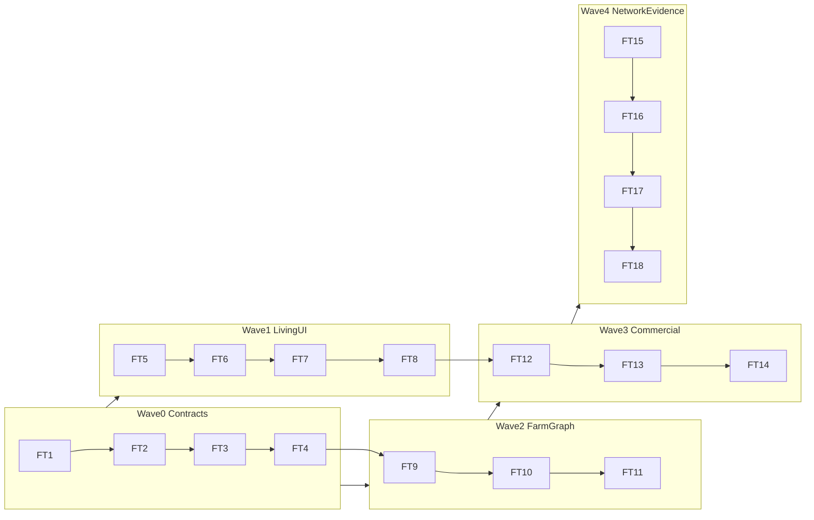
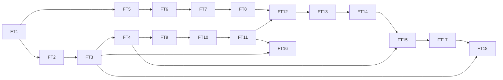
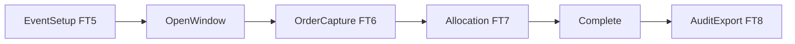

# FFT Implementation Slice Map (`FT1`–`FT18`)

> **Status:** Scratch implementation discovery
> **Authority:** Non-authoritative research material — does **not** replace Living `FFT-MOD-*`
> **Date:** 2026-07-17
> **Mode:** Internal guide + architecture-backed slice catalog (technical-writing)
> **Audience:** Engineers and agents executing one `FT*` mission at a time
> **Action enabled:** Load serial architecture-dependent slices with floor verify and AdminCN UI intent
> **Architecture gate:** [5-fft-relevant-architecture.md](5-fft-relevant-architecture.md)
> **Disposition gate:** [4-fft-reconciliation-and-promotion-map.md](4-fft-reconciliation-and-promotion-map.md)
> **Pattern reference:** Neon `N1`–`N18` map shape — IDs here are **`FT*`**, not Neon `N*`, not Living action-map `F-*`
> **Living authority:** [`FFT-MOD-001`](../../modules/feed-farm-trade/FFT-MOD-001-module-architecture.md) · [`FFT-MOD-008`](../../modules/feed-farm-trade/FFT-MOD-008-ops-runtime.md) · [`FFT-MOD-010`](../../modules/feed-farm-trade/FFT-MOD-010-module-docs-index.md) · [`ARCH-006`](../../architecture/ARCH-006-bounded-contexts.md) · [`ARCH-023`](../../architecture/ARCH-023-multi-tenancy.md)

## 1. Program posture

| Rule | Detail |
| --- | --- |
| Starts | Every `FT*` row is **UNEVALUATED** |
| Serial (default) | One runner: `FT1` -> … -> `FT18` — skip only with explicit user waiver that turn |
| Parallel (opt-in) | Multiple runners across chats/worktrees along the dependency DAG — see [§6](#6-parallel-execution-model) |
| One mission | One `FT*` per chat when executed (parallel = multiple chats, not multi-slice in one chat) |
| Quality | Enterprise production bar only — shrink stage size, never quality |
| Wave 0–1 | Wave 0 = docs/contract promotion candidates; Wave 1 = Living AdminCN spine inside FFT-MOD-008 |
| Wave 2–4 | Target expansion — **discovery / contract-first** until named program reopen + controlled-doc promotion |
| Freeze | No FFT 2B–2D domain reopen; no customer/dealer portal; no offline app; no dedicated-DB cells |
| Approval | Scratch does not self-APPROVE. Living readiness stays FFT-MOD-009/010 |

```text
1 blueprint -> 2 scorecard -> 3 critique -> 4 promotion
-> 5 relevant architecture -> 6 this FT slice map
-> controlled FFT-MOD reopen only after approval
```

## 2. Farm short names

| Short | Skill / home |
| --- | --- |
| router | `using-afenda-elite-skills` |
| slices | `afenda-elite-implementation-slices` (method; FT* is scratch, not Neon map) |
| fft | `feed-farm-trade` |
| modules | `afenda-elite-backend-modules` |
| api | `afenda-elite-api-contract` |
| scaffold | `afenda-elite-frontend-scaffold` |
| ui-compose | `afenda-elite-ui-compose` |
| nextjs | `afenda-elite-nextjs-best-practice` |
| readiness | `afenda-elite-module-readiness` |
| doc-control | `afenda-elite-doc-control` (only after explicit Controlled reopen) |

## 3. Program waves

| Wave | IDs | Theme | Gate |
| --- | --- | --- | --- |
| 0 | FT1–FT4 | Domain contracts (subdomain, aggregates, CQ/E + events, classification) | Docs promotion -> FFT-MOD-002/004/005/007 |
| 1 | FT5–FT8 | Living AdminCN spine hardening | Living FFT-MOD-001/008/010; UI under existing `/fft` |
| 2 | FT9–FT11 | Party / Farm graph + master data + Farm 360 | Target; reopen before code |
| 3 | FT12–FT14 | Opportunity, trial evidence, quotation lifecycle | Target; contracts before UI |
| 4 | FT15–FT18 | Trade Relationship, forecast, complaint case, integration + NFR evidence | Target + evidence; no ledger rebuild |



## 4. Slice table

| ID | Objective (short) | Lane | LOAD farms (order) | Living / Target authority | Depends on | Floor verify (minimum) | UI surface | State | Last score | Auditor |
| --- | --- | --- | --- | --- | --- | --- | --- | --- | --- | --- |
| **FT1** | FFT subdomain map + vocabulary | Docs | router -> fft -> doc-control | Target candidate -> FFT-MOD-002 | `5` Adopt | Header/link sync · no new ARCH-006 contexts · Controlled reopen named if promoting | none (docs) | UNEVALUATED | — | — |
| **FT2** | Aggregate + invariant catalog | Docs | router -> fft -> modules -> doc-control | Target -> FFT-MOD-004 | FT1 | Event/Order/Allocation invariants named · Opportunity/Quote as Target | none (docs) | UNEVALUATED | — | — |
| **FT3** | Command / query / event catalog | Docs | router -> fft -> api -> doc-control | Target -> FFT-MOD-007 | FT2 | Event owner · schema version · idempotency · replay fields defined | none (docs) | UNEVALUATED | — | — |
| **FT4** | Data classification + field authz | Docs | router -> fft -> modules -> doc-control | Target -> FFT-MOD-005 | FT3 | Classification matrix · export/AI rules · no invented permission codes | none (docs) | UNEVALUATED | — | — |
| **FT5** | Event setup / catalog spine | Ops | router -> slices -> fft -> scaffold -> ui-compose | Living FFT-MOD-001/010 | FT1 (contracts) | requireFftAccess · permission gates · verify.md for touched AC · no FftShell | `/fft` events + setup | UNEVALUATED | — | — |
| **FT6** | Order window capture | Ops | router -> slices -> fft -> ui-compose -> api | Living FFT-MOD-001/010 | FT5 | Zod + requireFftPermission · ActionResult · locale-free paths | `/fft` order / my-orders | UNEVALUATED | — | — |
| **FT7** | Allocation run + override | Ops | router -> slices -> fft -> modules -> ui-compose | Living FFT-MOD-001/005 | FT6 | Priority/supply rules · override permission distinct · audit trail | `/fft` allocation | UNEVALUATED | — | — |
| **FT8** | Audit / export governance | Ops | router -> slices -> fft -> readiness | Living FFT-MOD-009/010 | FT7 | Export permission · evidence row discipline · no readiness self-claim | `/fft` audit / admin export | UNEVALUATED | — | — |
| **FT9** | Party / Account / Farm Site graph | Docs/Ops | router -> fft -> modules -> doc-control | Target -> FFT-MOD-002/004 | FT4 | Vocabulary not interchangeable · schema candidate only until reopen | none until reopen | UNEVALUATED | — | — |
| **FT10** | Master-data identity resolution | Docs/Ops | router -> fft -> api -> modules | Target -> FFT-MOD-004/007 | FT9 | Match/duplicate/ERP reference rules · no soft tenancy | none until reopen | UNEVALUATED | — | — |
| **FT11** | Farm 360 commercial view | Ops | router -> fft -> scaffold -> ui-compose | Target UI | FT10 + program reopen | AdminCN Farm 360 · commercial fields only · no farmOS clone | `/fft/.../farm` (Target) | UNEVALUATED | — | — |
| **FT12** | Opportunity (feed semantics) | Ops | router -> fft -> modules -> ui-compose | Target | FT8 + FT11 + reopen | Tons + revenue + margin · stage gates · next action | `/fft/.../opportunities` (Target) | UNEVALUATED | — | — |
| **FT13** | Technical assessment vs controlled trial | Ops | router -> fft -> modules -> ui-compose | Target | FT12 | Evidence classes separated · no veterinary diagnosis claim | `/fft/.../trials` (Target) | UNEVALUATED | — | — |
| **FT14** | Quotation lifecycle (immutable issued) | Ops | router -> fft -> api -> ui-compose | Target | FT13 | Versioning · approval · SoR integrate not rebuild ERP | `/fft/.../quotes` (Target) | UNEVALUATED | — | — |
| **FT15** | Trade Relationship shared records | Ops | router -> fft -> modules -> api | Target | FT14 + FT4 | Private/shared/referenced · revocation · no cross-tenant joins | Admin relationship admin (Target) | UNEVALUATED | — | — |
| **FT16** | Demand forecast provenance | Ops | router -> fft -> modules -> ui-compose | Target | FT11 + FT3 | Assumption set · snapshot freeze · reconciliation hooks | `/fft/.../forecast` (Target) | UNEVALUATED | — | — |
| **FT17** | Complaint-to-lot commercial case | Ops | router -> fft -> modules -> ui-compose | Target | FT15 | Link account/farm/order/lot refs · integrate QMS/LIMS | `/fft/.../cases` (Target) | UNEVALUATED | — | — |
| **FT18** | Integration reconciliation + NFR evidence | Ops/Test | router -> fft -> api -> readiness | Target -> FFT-MOD-007/009 | FT3 + FT17 | Connector ownership · replay · evidence owners · no Claimable without ledger | ops dashboards (Target) | UNEVALUATED | — | — |

## 5. Serial order

```text
FT1 → FT2 → FT3 → FT4 → FT5 → FT6 → FT7 → FT8 → FT9 → FT10 → FT11 → FT12 → FT13 → FT14 → FT15 → FT16 → FT17 → FT18
```

This is the conservative **single-runner** path. For a dependency-safe parallel schedule (tracks, concurrency levels, critical path), see [§6](#6-parallel-execution-model).

**Program pointer:** last scored = none. Next open discovery ID = **FT1** only — do not sneak-start Wave 2+ code from this scratch file.

## 6. Parallel execution model

Parallelism respects the §4 `Depends on` DAG. It never reorders around a dependency. Wave 2+ (`FT9`+) still needs named program reopen before product code — scheduling does not bypass gates.

### 6.1 Dependency DAG (explicit)

Adjacency from §4 (outgoing edges):

```text
FT1  -> FT2, FT5
FT2  -> FT3
FT3  -> FT4, FT16, FT18
FT4  -> FT9, FT15
FT5  -> FT6
FT6  -> FT7
FT7  -> FT8
FT8  -> FT12
FT9  -> FT10
FT10 -> FT11
FT11 -> FT12, FT16
FT12 -> FT13
FT13 -> FT14
FT14 -> FT15
FT15 -> FT17
FT17 -> FT18
```

### 6.2 Parallel tracks

| Track | Path | Notes |
| --- | --- | --- |
| A Contracts | `FT1 -> FT2 -> FT3 -> FT4` | Docs/contract promotion |
| B Living UI | `FT5 -> FT6 -> FT7 -> FT8` | Forks from `FT1`; runs alongside Track A inside FFT-MOD-008 |
| C Farm graph | `FT9 -> FT10 -> FT11` | Starts after `FT4`; Target reopen before code |
| D Commercial | `FT12 -> FT13 -> FT14 -> FT15` | `FT12` joins `FT8` + `FT11` |
| E Evidence / network | `FT16` (off `FT11`+`FT3`); `FT17` (after `FT15`); `FT18` (after `FT17`+`FT3`) | `FT16` is not a successor of `FT15` |

### 6.3 Concurrency levels (topological)

Earliest-start levels — slices in the same level may be in-flight together once every predecessor is closed:

| Level | In-flight together |
| --- | --- |
| L0 | `FT1` |
| L1 | `FT2` · `FT5` |
| L2 | `FT3` · `FT6` |
| L3 | `FT4` · `FT7` |
| L4 | `FT9` · `FT8` |
| L5 | `FT10` |
| L6 | `FT11` |
| L7 | `FT12` · `FT16` |
| L8 | `FT13` |
| L9 | `FT14` |
| L10 | `FT15` |
| L11 | `FT17` |
| L12 | `FT18` |

- **Max concurrency:** 2 in-flight slices
- **Critical path (13 slices):** `FT1 -> FT2 -> FT3 -> FT4 -> FT9 -> FT10 -> FT11 -> FT12 -> FT13 -> FT14 -> FT15 -> FT17 -> FT18`

### 6.4 Concurrency mermaid



### 6.5 Safe-parallel rules

1. Each in-flight `FT*` uses its own chat and git worktree/branch — no shared-file coedit between concurrent slices.
2. A slice starts only when every `Depends on` entry is merged/closed (not merely started).
3. Track A (docs contracts) and Track B (Living UI) may run at once; Living UI stays inside the FFT-MOD-008 envelope while contracts promote via `4`.
4. Wave 2+ slices (`FT9`+) require program reopen before code even if the DAG allows scheduling.
5. No two concurrent slices may edit the same controlled document; contract promotion is serialized through `afenda-elite-doc-control`.
6. Independent auditor closure per slice; parallel scheduling does not batch approvals.

## 7. Hard forbids

```text
DO NOT:
  treat FT* as Living SSOT or Module Enterprise Readiness Claimable
  invent ARCH-006 bounded contexts from FFT subdomains
  remount FftShell / /fft/[locale] chrome / customer portal
  enable prod FFT_* ops flags without FFT-MOD-008 checklist
  rebuild ERP / MES / WMS / LIMS / formulation / finance ledgers
  introduce dedicated-DB tiers or regional cells against ARCH-023
  collide FT* with Neon N* or Living action-map F-* IDs
  self-APPROVE a slice from implementer chat alone
  mix Wave 2–4 product UI into Wave 1 PRs without program reopen
```

## 8. Living journey (baseline UI)



```text
+---------------------- AdminCN /fft ------------------------+
| Nav: Events | Setup | Orders | Allocation | Audit | Admin  |
+------------------------------------------------------------+
| Context: org · event · window state · permission strip     |
| Primary: one job per page                                  |
| Actions: requireFftPermission codes — never role names     |
+------------------------------------------------------------+
```

---

## 9. UI/UX illustrations (AdminCN only)

Illustrations are **intent wireframes** for agents and reviewers. They are not
Living route inventory and do not authorize new routes without Controlled reopen
(Wave 2+). Compose via `@afenda/ui-system` + AdminCN chrome (ADR-010 / ARCH-018).

### 9.1 FT5 — Event setup / catalog

**Route intent:** `/fft` events list + event setup (products, supply, priority, custom fields).

```text
+---------------- AdminCN · Feed Farm Trade -----------------+
| Nav: Events* | Orders | Allocation | Audit                 |
+------------------------------------------------------------+
| Events                                                     |
| [ + New event ]                                            |
| ------------------------------------------------------------|
| Event name     Window      Status     Owner                |
| Summer Piglet  Open        Active     sales_ops            |
| ------------------------------------------------------------|
| Selected: Summer Piglet                                    |
| Tabs: Products | Supply caps | Priority | Custom fields    |
| [ Save ]  [ Activate scheduled ]  [ Clone draft ]          |
+------------------------------------------------------------+
```

**UX rules:** one event context; thin RSC page; mutations via Actions; no locale URL.

### 9.2 FT6 — Order window

**Route intent:** order entry + my-orders under open window.

```text
+---------------- AdminCN · Feed Farm Trade -----------------+
| Nav: Events | Orders* | Allocation | Audit                 |
+------------------------------------------------------------+
| Order window · Summer Piglet · OPEN                        |
| Farm / customer picker · product lines · tons              |
| ------------------------------------------------------------|
| Lines                                                      |
| SKU            Qty (t)   Priority note                     |
| Pig Starter    12.5      —                                 |
| ------------------------------------------------------------|
| [ Submit order ]  [ Transfer request ]                     |
| Errors: Zod field messages · permission deny banner        |
+------------------------------------------------------------+
```

**UX rules:** fail closed on closed window; permission-gated submit/transfer.

### 9.3 FT7 — Allocation

**Route intent:** preview / run / override allocation.

```text
+---------------- AdminCN · Feed Farm Trade -----------------+
| Nav: Events | Orders | Allocation* | Audit                 |
+------------------------------------------------------------+
| Allocation · Summer Piglet                                 |
| Supply remaining | Demand | Mode: Priority / FCFS          |
| ------------------------------------------------------------|
| Preview table: customer · ordered · allocated · shortfall  |
| ------------------------------------------------------------|
| [ Preview ]  [ Run allocation ]                            |
| Override (permission: allocation.override)                 |
| Order id ____  New qty ____  Reason ____  [ Apply ]        |
+------------------------------------------------------------+
```

**UX rules:** override never shares run permission; reason required; audit visible.

### 9.4 FT8 — Audit / export

**Route intent:** audit view + export panel.

```text
+---------------- AdminCN · Feed Farm Trade -----------------+
| Nav: Events | Orders | Allocation | Audit*                 |
+------------------------------------------------------------+
| Audit                                                      |
| Filters: event · actor · action · date range               |
| ------------------------------------------------------------|
| Time | Actor | Action | Entity | Detail                    |
| ------------------------------------------------------------|
| Export (permission: export.orders)                         |
| Format: CSV · Scope: this event · [ Download ]             |
+------------------------------------------------------------+
```

**UX rules:** export permission separate from view; no silent bulk dump.

### 9.5 FT11 — Farm 360 (Target)

**Requires:** FT9–FT10 contracts + program reopen. Commercial view only.

```text
+---------------- AdminCN · Feed Farm Trade -----------------+
| Nav: … | Farms* | Opportunities | Trials | Quotes | …      |
+------------------------------------------------------------+
| Farm 360 · Riverside Site                                  |
| Account · species · capacity · cycles · estimated tons/yr  |
| Tabs: Overview | Contacts | History | Risk | Next actions  |
| ------------------------------------------------------------|
| Commercial history: quotes · orders · complaints           |
| ERP customer ref (read) · map/territory (optional)         |
| [ Create opportunity ]  [ Start assessment ]               |
+------------------------------------------------------------+
```

**UX rules:** no full farmOS activity journal; integrate production SoR when needed.

### 9.6 FT12 — Opportunity (Target)

```text
+---------------- AdminCN · Feed Farm Trade -----------------+
| Opportunities*                                             |
+------------------------------------------------------------+
| Pipeline board / list · stage gates enforced               |
| Card: tons · revenue · margin · species · mill · next due  |
| ------------------------------------------------------------|
| Detail: stage history · probability · competitor · credit  |
| [ Advance stage ] blocked if mandatory fields missing      |
| Won requires quote/contract/order evidence                 |
+------------------------------------------------------------+
```

### 9.7 FT13 — Trial evidence (Target)

```text
+---------------- AdminCN · Feed Farm Trade -----------------+
| Trials*                                                    |
+------------------------------------------------------------+
| Type: Commercial observation | Field evaluation | Controlled trial
| Protocol version · baseline · groups · success criteria    |
| ------------------------------------------------------------|
| Measurements · deviations · approvals                      |
| [ Technical approve ]  [ Customer acknowledge ]            |
| [ Convert to opportunity / quote ]                         |
| Banner: not a veterinary diagnosis                         |
+------------------------------------------------------------+
```

### 9.8 FT14 — Quotation lifecycle (Target)

```text
+---------------- AdminCN · Feed Farm Trade -----------------+
| Quotes*                                                    |
+------------------------------------------------------------+
| Draft -> Technical review -> Pricing approval -> Issued    |
| Issued version immutable · [ New revision ]                |
| Lines: SKU · tons · price · freight · margin               |
| ------------------------------------------------------------|
| Approvals strip · e-sign status · ERP order request        |
| [ Issue ]  [ Accept ]  [ Request order (idempotent) ]      |
+------------------------------------------------------------+
```

### 9.9 FT15 — Trade Relationship (Target)

```text
+---------------- AdminCN · Feed Farm Trade -----------------+
| Trade relationships*                                       |
+------------------------------------------------------------+
| Participants · scopes · direction · effective/expiry       |
| Shared records: quote · delivery schedule · certificate    |
| Private: margin · strategy · credit (never shared)         |
| ------------------------------------------------------------|
| [ Activate ]  [ Change scope ]  [ Revoke ]                 |
| Revoke stops future access · retains required evidence     |
+------------------------------------------------------------+
```

**UX rules:** AdminCN relationship admin for org-admin sales/ops — not a dealer portal.

### 9.10 FT16 — Forecast provenance (Target)

```text
+---------------- AdminCN · Feed Farm Trade -----------------+
| Forecast*                                                  |
+------------------------------------------------------------+
| Views: Opportunity | Commitment | Consumption              |
| Line: farm · species · assumption set · version · confidence|
| ------------------------------------------------------------|
| [ Freeze snapshot ]  [ Override + reason ]                 |
| Reconciliation: snapshot vs ERP actuals                    |
+------------------------------------------------------------+
```

### 9.11 FT17 — Complaint case (Target)

```text
+---------------- AdminCN · Feed Farm Trade -----------------+
| Cases*                                                     |
+------------------------------------------------------------+
| Intake: account · farm · delivery · product · lot ref      |
| Evidence: photos · qty · commercial impact                 |
| Links: QMS/LIMS case · CoA · credit/replacement status     |
| ------------------------------------------------------------|
| [ Open ]  [ Link lot ]  [ Close with approval ]            |
+------------------------------------------------------------+
```

## 10. Promotion and execution rules

1. Execute Wave 0 as Controlled docs promotion (explicit reopen) before treating contracts as Living.
2. Execute Wave 1 only inside FFT-MOD-008 Allowed envelope and existing Living surfaces.
3. Do not start Wave 2–4 product code until product owner names program reopen and promotes contracts from `4`/`5`.
4. UI composition: `afenda-elite-ui-compose` + `@afenda/ui-system` barrel; HITL for new FFT-UI registry IDs.
5. Close a later scored `FT*` with evidence commands + independent review — implementer does not self-APPROVE readiness.

## 11. Notes

- This map mirrors Neon slice-map **shape**, not Neon authority or scores.
- Living coding still loads FFT-MOD-001 / 008 / 010 and `feed-farm-trade` verify.md first.
- Target UI routes marked `(Target)` are illustrations for planning — absent until Approved slices land under `apps/web/**`.
- Prefer [§6](#6-parallel-execution-model) when two runners are available; otherwise stay on the §5 serial path.
