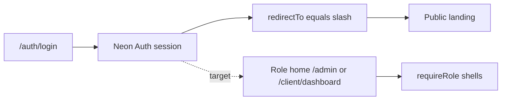

# Neon capability map and Afenda auth development roadmap

| Field | Value |
|-------|-------|
| Posture | **Scratch** — not Living, Target, Accepted, or DOC-002 registered |
| Audience | Afenda engineers (Identity / Neon Auth / session routing) |
| Updated | 2026-07-16 |
| Primary mode | Architecture report + embedded development roadmap |

## Status / posture (Scratch — not Living)

This file is a **working report** under [`docs/scratch/`](./README.md). It does **not** replace:

- [ARCH-026](../architecture/ARCH-026-auth-session.md) (auth/session packaging SSOT)
- [ARCH-023](../architecture/ARCH-023-multi-tenancy.md) (IAM / tenancy Decision lock)
- [GUIDE-018](../guides/GUIDE-018-fullstack-e2e-integration-program.md) (program roadmap)
- [AGENTS.md](../../AGENTS.md) (checkout posture and Neon ops rules)

Promote only via an explicit DOC-001 Docs-lane mission with ID approval.

## Purpose

1. Inventory **Neon platform capabilities** (Postgres, Auth, Data API, preview backend services, ops surfaces) with maturity and Afenda-Lite adoption honesty.
2. Map those capabilities into Afenda **pre-login**, **auth**, and **post-login** surfaces.
3. Record an actionable **development roadmap** for identity/session work, including the current post-login landing-page gap, aligned to GUIDE-018.

**Action this document enables:** engineers can see what Neon offers, what Afenda already ships, what is blocked or unused, and what to build next without treating scratch prose as Living architecture.

---

## Neon platform capability inventory (full)

Sources: Neon skill (platform services), neon-postgres `features.md` / `neon-auth.md`, official docs index ([neon.com/docs/llms.txt](https://neon.com/docs/llms.txt)).

### Platform services

| Capability | Maturity (Neon) | What it does | Afenda-Lite today |
|------------|-----------------|--------------|-------------------|
| **Serverless Postgres** | GA | Branchable Postgres; autoscaling compute; storage separated from compute | **In use** — shared schema multi-tenancy; prod `DATABASE_URL` must be `-pooler`; project `young-hat-54755363`, branch `br-tiny-hill-ao82jp6f` ([AGENTS.md](../../AGENTS.md), [ARCH-023](../architecture/ARCH-023-multi-tenancy.md)) |
| **Neon Auth** | GA | Managed Better Auth; users/sessions/orgs in Postgres; branches with the DB | **In use** — `@neondatabase/auth` + `@neondatabase/auth-ui` wrapped by `@afenda/auth` ([ARCH-026](../architecture/ARCH-026-auth-session.md)) |
| **Data API** | GA (product) | PostgREST-style HTTP over tables (`@neondatabase/neon-js`) | **Not a product path** — app data access is Drizzle / `@afenda/db` |
| **Object Storage** | Preview / early access | S3-compatible objects that branch with the project | **Not adopted** — preview; new projects in `us-east-2` only for early access |
| **Compute Functions** | Preview / early access | Long-running/streaming functions next to the DB | **Not adopted** — same preview caveats |
| **AI Gateway** | Preview / early access | Multi-model LLM routing with controls | **Not adopted** — same preview caveats |

### Postgres platform features

| Feature | What it does | Afenda-Lite posture |
|---------|--------------|---------------------|
| **Branching** | Instant copy-on-write DB clones | **Policy:** local and prod use the **production** branch only — no day-to-day branch switching ([AGENTS.md](../../AGENTS.md)) |
| **Autoscaling** | Compute units scale with load (configured min and max) | Configured on prod card (see [RB-001](../runbooks/RB-001-multi-org-ops.md) / RB-005) — do not raise CU without latency evidence |
| **Scale to zero** | Suspend idle compute | Prod card documents suspend settings; ops must respect cold-start behavior |
| **Instant restore / PITR** | Point-in-time recovery within retention | Launch plan **7-day** history window; named snapshots for known-good points |
| **Snapshots** | Scheduled / manual restore points | Daily schedule documented in RB-001 |
| **Read replicas** | Read-only compute sharing storage | **Not a claimed product pattern** today |
| **Connection pooling** | `-pooler` hostname / PgBouncer | **Required** for product `DATABASE_URL` |
| **IP allow lists** | Restrict DB network access | Ops option; not part of app authz |
| **Logical replication** | Replicate to/from external Postgres | **Out of Target** unless an Approved slice says otherwise |

### Neon Auth product capabilities (Neon catalogue)

From Neon Auth docs / llms.txt Auth section (capability list — not all enabled in Afenda):

| Area | Neon capability | Afenda-Lite |
|------|-----------------|-------------|
| Credentials | Email/password sign-in / sign-up | **Shipped** via Auth UI `/auth/*` |
| Password | Forgot / reset UI flows | **Shipped** (`/auth/forgot-password`, `/auth/reset-password`) |
| Email | Zoho SMTP via Neon Auth console | **Required** — not Neon shared; no app-side SMTP ([ARCH-026](../architecture/ARCH-026-auth-session.md)) |
| Organizations | Orgs, members, invitations | **Shipped** — invite adapter + `/join?invitationId=…` |
| Trusted domains | Redirect allowlist | **Ops duty** — `localhost` allowed for local sign-in; production `APP_URL` registered |
| UI | Managed Auth UI components | **Shipped** — `NeonAuthUIProvider` / `AuthView` island |
| Plugins (Neon) | Admin, JWT, magic link, OTP, OAuth, phone, webhooks, OpenAPI, etc. | **Mostly unused** — do not enable without Approved slice + production checklist |
| Branching auth | Auth state follows DB branches | Coupled to single-branch policy above |

### Ops / agent surfaces

| Surface | Role | Afenda use |
|---------|------|------------|
| Neon CLI (`neon`, `neon-auth`, …) | Link, domains, config, Functions, etc. | Env validate / domain ops; avoid day-to-day `neonctl link` rewriting `.neon` |
| Neon MCP | Project/branch/SQL for agents | Optional; `NEON_API_KEY` in user env |
| Platform API / SDKs | Programmatic Neon Cloud | Used by validate scripts / ops — not end-user product |

**Anti-claims (binding for this report):**

- Do **not** claim multi-database tenant isolation.
- `FFT_RBAC_ENABLED` ≠ soft SQL tenancy.
- Preview Neon services are not Target by proximity — they need Approved slice + access/region eligibility.

---

## Afenda mapping — Pre-login

Surfaces and Neon duties **before** a session cookie exists.

| Surface | Behavior | Neon / Afenda owner |
|---------|----------|---------------------|
| `GET /` | Public landing (200); “Sign in” CTA | App — no Neon session required |
| `/auth/login` · `forgot-password` · `reset-password` · `sign-up` · `sign-out` | Neon Auth UI forms | `@afenda/auth` + Auth island ([GUIDE-018 I1.2](../guides/GUIDE-018-fullstack-e2e-integration-program.md)) |
| `/join` (no `invitationId`) | Invitation-required messaging | App join shell |
| Unauth `GET /admin` · `/fft` · `/client/dashboard` | **307** → `/auth/login` | `apps/web/proxy.ts` + `createSessionProxy` |
| Client gate paths | `/client/login`, `/client/preview-unavailable` bypass session gate | `session-gate-policy.ts` |
| Trusted domains | Production + localhost for local sign-in | Neon Auth domain config ([ARCH-026](../architecture/ARCH-026-auth-session.md) ops) |
| Env readiness | Cloud ids, branch, neon-auth URL, API key | `pnpm validate:neon-env` (secrets stay in `.env.local`) |

**Local developer convenience (not a Neon product feature):** development-only credential autofill on `/auth/login` (`SHARED_ADMIN_*` / `PREVIEW_CLIENT_*` via server env). Absent in production builds.

---

## Afenda mapping — Auth capabilities

Identity and session packaging **while authenticating** and establishing org membership.

| Capability | Disk / package | Notes |
|------------|----------------|-------|
| Auth BFF | `apps/web/app/api/auth/[...path]/route.ts` → `createAuthApiHandlers()` | Proxies to `NEON_AUTH_BASE_URL` |
| Browser client | `getBrowserAuthClient()` (`@afenda/auth/client`) | Client Components only |
| Auth UI provider | `features/auth/auth-ui-provider.tsx` | `NeonAuthUIProvider`; `baseURL` from `resolveAuthUiOrigin` (request host preferred for reset links) |
| Session helpers | `getSession()` in `@afenda/auth` | Unauthenticated → redirect `/auth/login` |
| Coarse roles | `requireRole()` · Neon org role → shell Role | `owner→admin`, `admin→operator`, `member→client` ([ARCH-026](../architecture/ARCH-026-auth-session.md)) |
| Forbidden shell | Authenticated wrong role → `/403` | Fail-closed |
| Org invite | `inviteOrgMember` · Origin always production `APP_URL` | Neon Auth Zoho SMTP |
| Join accept | `/join?invitationId=…`; Neon mail accept → redirect `/join` | I1.3 closed |
| Env contract | `NEON_AUTH_BASE_URL`, `NEON_AUTH_COOKIE_SECRET`, `APP_URL`, `DATABASE_URL` | `@afenda/env` — never raw `process.env` in product code |
| Theme script patch | `patches/next-themes@0.4.6.patch` | Auth UI nests `next-themes`; ThemeScript omitted to avoid React 19 client script-tag / hydration issues |

**IAM boundary:** Neon membership roles are **identity signals**. Product authorization remains ARCH-023 permission codes (`hasPermission`) — Tier-2 wiring is GUIDE-018 **I3.1**, not complete merely because login works.

---

## Afenda mapping — Post-login

What happens **after** Neon Auth establishes a session.



| Concern | Current disk truth | Target behavior (this roadmap) |
|---------|--------------------|--------------------------------|
| Neon Auth UI `redirectTo` | Hardcoded `"/"` in `auth-ui-provider.tsx` | Role-aware home + safe return URL |
| Operator / admin home | `/admin` (shell `requireRole('operator')`) | Post-login destination for operator/admin |
| Client home | `/client/dashboard` (via `/client` redirect) | Post-login destination for client |
| Public `/` while signed in | Allowed (proxy matcher does not include `/`) | Signed-in visitors should leave `/` for role home |
| Tenant data | Hard `organization_id` on product SQL | Unchanged — ARCH-023 |
| Tier-2 authz | Coarse role only on many surfaces | I3.1 `hasPermission` deepen |

**Gap (evidence):** successful login lands on the **public landing page**, not a product shell. Session is valid; destination selection is incomplete. This is a **routing gap**, not a Neon Auth outage.

---

## Current gaps (evidence)

| Gap | Evidence | Severity |
|-----|----------|----------|
| Static `redirectTo="/"` | `apps/web/features/auth/auth-ui-provider.tsx` | P0 — blocks login-to-work UX |
| No signed-in redirect off `/` | `app/(public)/page.tsx` is anonymous-oriented; proxy does not gate `/` | P0 |
| Tier-2 permissions not product-wired | GUIDE-018 next Ops = **I3.1** | P1 |
| Authenticated browser E2E | GUIDE-018 I4 verify factory | P1 |
| Neon Auth plugins (OAuth, magic link, …) | Not configured as product surfaces | Later — Approved slice only |
| Neon preview backend (Functions / Storage / AI Gateway) | Not on Afenda Target tree | Later — Approved slice + region/access |
| FFT 2B–2D | Frozen until FFT-MOD-008 reopen | Do not mix into Identity work |

---

## Development roadmap

Enterprise production quality bar only. Shrink **scope** via Approved slices — never shrink quality. Program authority: [GUIDE-018](../guides/GUIDE-018-fullstack-e2e-integration-program.md).

### P0 — Post-login routing (Identity / Frontend)

| Item | Outcome | Not done until |
|------|---------|----------------|
| Role-aware post-login redirect | After Neon Auth success, operator/admin → `/admin`, client → `/client/dashboard` | Browser: operator login ends on `/admin` (200); client login ends on `/client/dashboard` (200); wrong role still `/403` when hitting the other shell |
| Safe `callbackUrl` / return path | Deep-link return when present and same-origin allowlisted | Unauth hit on `/fft` → login → return to `/fft` when authorized; open redirects rejected |
| Signed-in `/` bounce | Authenticated `GET /` redirects to role home | Signed-in `GET /` is not a dead-end landing |

**Lane note:** Prefer resolver in `@afenda/auth` or app Identity feature; keep Neon Auth UI `redirectTo` as the entry hook, not duplicated role logic in multiple places.

### P1 — Program next (GUIDE-018)

| Item | Outcome | Not done until |
|------|---------|----------------|
| **I3.1** Identity / Platform deepen | Tier-2 `hasPermission` / `clients.invite` product wiring beyond coarse `requireRole` | GUIDE-018 I3.1 acceptance / verify commands green |
| Authenticated browser E2E | Invite + login journeys in verify factory (I4) | Specs green against living factories under `testing/` |

### P2 — Product verticals (gated)

| Item | Outcome | Status (scratch honesty 2026-07-17) |
|------|---------|-------------------------------------|
| **I3.2** Declarations | Client list → submit/read under hard tenancy | **Shipped** via Neon **N17** APPROVED — GUIDE checkbox sync = Docs-lane |
| **I3.3** FFT | Operator read shell + Phase 2A RBAC only | **Shipped** via Neon **N18** APPROVED — **2B–2D remain frozen** |

### Later — Neon platform expansion

| Item | Gate |
|------|------|
| Neon Auth plugins (OAuth, magic link, JWT for external services, …) | Explicit Approved slice + Neon Auth production checklist — **not** N19 |
| Data API as a product query path | Only if Approved ADR supersedes Drizzle/`@afenda/db` for that surface |
| Object Storage / Functions / AI Gateway | Preview access + `us-east-2` (or Neon’s then-current eligibility) + Approved slice — do not handroll on ineligible projects |

### Suggested sequencing

```text
P0–P2 Neon Auth N1–N18 COMPLETE (2026-07-17)
  → do not invent N19
  → GUIDE-018 checkbox sync only via Docs-lane reopen (Control State Closed)
  → Neon plugins / preview services only with new Approved slice + ADR
  → FFT deep / 2B–2D only after FFT-MOD-008 reopen
```

---

## Non-goals / out of scope

- Treating this scratch file as Living SSOT or auto-registering a DOC-002 ID
- Implementing post-login redirect code in the same Docs-only mission (unless separately ordered)
- Reopening FFT 2B–2D or Collapse/legacy recovery
- Claiming Neon preview services as Afenda Target
- Multi-DB or project-per-tenant isolation
- App-side SMTP for Neon Auth / revert to Neon shared mail without ARCH-026 reopen
- Portal Atmosphere / Storybook remount

---

## References

| ID / path | Use |
|-----------|-----|
| [ARCH-026](../architecture/ARCH-026-auth-session.md) | Auth/session packaging SSOT |
| [ARCH-023](../architecture/ARCH-023-multi-tenancy.md) | IAM Decision lock · hard tenancy |
| [GUIDE-018](../guides/GUIDE-018-fullstack-e2e-integration-program.md) | Phase I program roadmap |
| [AGENTS.md](../../AGENTS.md) | Neon branch policy · env · hosting |
| [RB-001](../runbooks/RB-001-multi-org-ops.md) · [RB-005](../runbooks/RB-005-post-lock-coding-cheat-sheet.md) | Neon prod card · ops stamps |
| Neon docs index | https://neon.com/docs/llms.txt |
| Neon Auth overview | https://neon.com/docs/auth/overview |
| `.agents/skills/neon/SKILL.md` | Platform services + preview caveats |
| `.agents/skills/neon-postgres/references/features.md` | Postgres feature catalogue |
| `.agents/skills/neon-postgres/references/neon-auth.md` | Auth package patterns |

## Change log

| Date | Summary |
|------|---------|
| 2026-07-17 | Stamp N1–N18 complete; P2 I3.2/I3.3 shipped via N17/N18; no N19 |
| 2026-07-16 | Initial scratch: Neon capability inventory; pre-login / auth / post-login Afenda map; development roadmap with P0 post-login gap |
