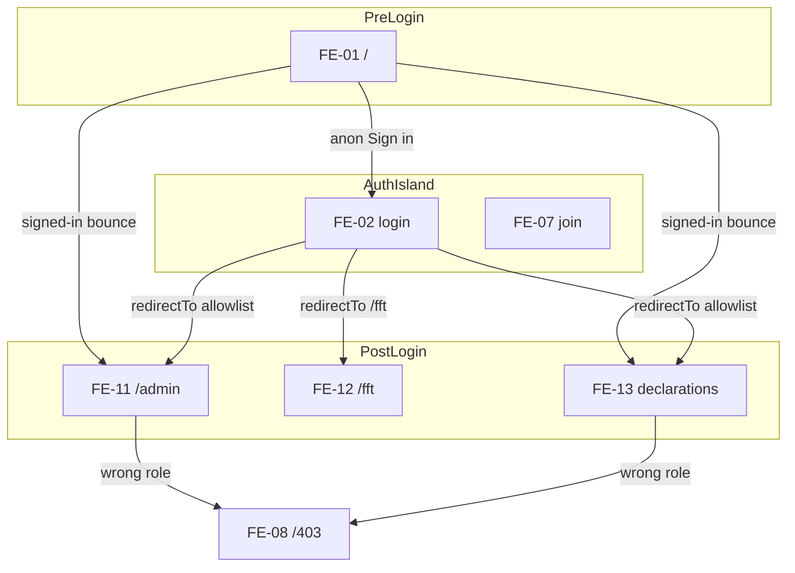

# Neon Auth FE surface UI/UX compose map

| Field | Value |
|-------|-------|
| Posture | **Scratch** — not Living, Target, Accepted, or DOC-002 registered |
| Audience | Afenda engineers (Identity / Frontend / UI compose) |
| Updated | 2026-07-17 |
| Primary mode | FE surface inventory + ui-compose recipes |
| Companion | [1-neon-auth-capability-map-and-dev-roadmap.md](./1-neon-auth-capability-map-and-dev-roadmap.md) |

## Status / posture (Scratch — not Living)

This file is a **working compose map** under `docs/scratch/`. It does **not** replace:

- [ARCH-026](../../architecture/ARCH-026-auth-session.md)
- [ADR-010](../../architecture/adr/ADR-010-afenda-ui-system-flat-barrel.md)
- Living route authority in [AGENTS.md](../../../AGENTS.md) / `afenda-elite-frontend-scaffold` overlay
- Neon Auth slice APPROVED state in [neon-auth-slice-map](../../../.cursor/skills/afenda-elite-implementation-slices/neon-auth-slice-map.md)

**Authority while composing:** `afenda-elite-ui-compose` QUALITY ORDER (AUTHORITY → CONSISTENCY → CORRECT-COMPONENT → SUITABILITY → SCALABILITY → STABILITY). Product primitives only via `@afenda/ui-system`. Auth island may host Neon Auth UI + route-scoped `auth-surface.css` — never leak into operator/client product shells.

## Purpose

1. Number every **living** Neon Auth / identity FE surface (`FE-01`…`FE-15`).
2. Wire each URL → thin `page.tsx` → `features/*` composition tree.
3. Lock compose recipes, states, and N* ownership.
4. Correct stale P0 claims in doc 1 against N7–N17 disk truth.
5. Emit zone Compose Score estimates + confidence evidence.

**Action this document enables:** engineers can implement or audit identity UI without inventing routes, restoring scaffold Target trees, or treating Neon managed forms as a product kit.

---

## Living FE index

Disk verified 2026-07-17 via `git ls-files` (PowerShell `Test-Path` wildcards `[path]` / `[assignmentId]` — trust git).

| ID | Zone | URL | Thin page | Feature composition root | N* |
|----|------|-----|-----------|--------------------------|----|
| FE-01 | Pre | `/` | `apps/web/app/(public)/page.tsx` | Inline public shell (`Button` + `Link`) | N7 |
| FE-02 | Auth | `/auth/login` | `apps/web/app/(public)/auth/[path]/page.tsx` | `AuthIslandLayout` → `AuthUiProvider` → `AuthViewShell` → `AuthSurfaceChrome` (+ `LocalAuthCredentialFill` dev-only) | N5–N7 |
| FE-03 | Auth | `/auth/forgot-password` | same | same (no credential fill) | N5 |
| FE-04 | Auth | `/auth/reset-password` | same | same | N5 |
| FE-05 | Auth | `/auth/sign-up` | same | same | N5 · N8 |
| FE-06 | Auth | `/auth/sign-out` | same | same | N5 |
| FE-07 | Auth | `/join?invitationId=` | `apps/web/app/(public)/join/page.tsx` | `JoinShell` / `PublicMessageShell` (missing id) | N8 |
| FE-08 | Gate | `/403` | `apps/web/app/(public)/403/page.tsx` | `ForbiddenShell` → `PublicMessageShell` | N6 · N7 |
| FE-09 | Gate | `/client/login` | `apps/web/app/(client)/client/(gate)/login/page.tsx` | Redirect → `/auth/login` | N6 |
| FE-10 | Gate | `/client/preview-unavailable` | `…/(gate)/preview-unavailable/page.tsx` | `PreviewUnavailableShell` | N6 |
| FE-11 | Post | `/admin` | `apps/web/app/(operator)/admin/page.tsx` | `OperatorPlatformShell` → `OrgAdminShell` (+ invite/assign/revoke panels) | N8 · N11 · N16 |
| FE-12 | Post | `/fft` | `apps/web/app/(operator)/fft/page.tsx` | `OperatorPlatformShell` → `FftEventsShell` | N16 · N18 |
| FE-13 | Post | `/client/declarations` | `…/(workspace)/declarations/page.tsx` | `DeclarationsShell` (+ panel / sheet / form) | N17 |
| FE-14 | Post | `/client/declarations/[assignmentId]` | `…/declarations/[assignmentId]/page.tsx` | `DeclarationDetailShell` | N17 |
| FE-15 | Alias | `/client` · `/client/dashboard` | workspace `page.tsx` · `dashboard/page.tsx` | Redirects → FE-13 | N7 · N17 |

### Proxy / session gate (align)

| Concern | Disk |
|---------|------|
| Matcher | `apps/web/proxy.ts` — `/account/*`, `/dashboard/*`, `/admin/*`, `/client/*`, `/fft/*`, `/playground/*` |
| Not matched (public) | `/`, `/auth/*`, `/join`, `/403`, `/api/*` |
| Bypass | `session-gate-policy.ts`: Server Action POST + `next-action`; `?embed=1`; client gate paths; playground when `PLAYGROUND_ENABLED` |
| Client gate paths | `/client/login`, `/client/preview-unavailable` (`CLIENT_GATE_PATHS`) |
| Unauth protected | → `/auth/login?redirectTo=<sanitized path>` via `createSessionProxy` |
| Role homes | `OPERATOR_HOME_PATH=/admin` · `CLIENT_HOME_PATH=/client/declarations` (`packages/auth/src/post-login.ts`) |

---

## Drift from capability map (doc 1)

| Doc 1 claim | Disk truth (2026-07-17) |
|-------------|-------------------------|
| Static `redirectTo="/"` P0 | `AuthUiProvider` uses `sanitizeCallbackUrl(searchParams.get("redirectTo")) ?? "/"`; `/` then bounces via `getAuthBootstrap` + `resolvePostLoginPath` (N7 APPROVED) |
| No signed-in redirect off `/` | `(public)/page.tsx` redirects ready sessions to role home (N7) |
| Client home `/client/dashboard` | `CLIENT_HOME_PATH=/client/declarations`; `/client/dashboard` is alias redirect (FE-15) |
| P0 “not done until browser…” | N7 auditor APPROVED 100% — **routing closed**; N18 APPROVED; remaining = UI polish / plugins only when Approved |

Do **not** treat doc 1 P0 rows as open implementation work without re-checking disk.

---

## Zone recipes (locked)

| Zone | Recipe | Density | Plane | Notes |
|------|--------|---------|-------|-------|
| Pre / message (FE-01, FE-08, FE-10, FE-07 missing-id) | Message shell | `p-4` | `bg-canvas` | `h1 text-2xl font-semibold tracking-tight` · body `text-sm text-foreground-secondary` · CTA `Button asChild` + `Link` |
| Auth island (FE-02–07) | Auth island chrome | island `p-6` | `auth-surface` CSS | Eyebrow brand allowed; Neon `AuthView` / `AcceptInvitationCard` inside; no product Sidebar |
| Operator ERP (FE-11–12) | App chrome nav | comfortable `gap-6` / `p-6` | `SidebarInset` `bg-canvas` | `OperatorPlatformChrome` Sidebar compounds; vertical owns Card / DataTable / forms |
| Client declarations (FE-13–14) | Metric strip + list + Sheet | comfortable | canvas / cards | Barrel `MetricCard`, `Alert`, `Card`, Sheet draft; `UI-CAP-07` cleared for list+draft ports |

**Banned:** Portal Atmosphere; `/account` handroll; OAuth / magic-link product UI without Approved Neon plugin slice; leaking `auth-surface.css` into operator/client; inventing scaffold Target pages.

---

## Surface cards

### FE-01 — Public landing `/`

| Field | Value |
|-------|-------|
| Job | Anonymous entry; signed-in visitors never dead-end |
| Page | `apps/web/app/(public)/page.tsx` |
| Layout | `(public)/layout.tsx` — no role gate |
| Tree | Inline RSC — `getAuthBootstrap` → sync/ensure/ready redirects; else `Button`+`Link` → `/auth/login` |
| Recipe | Message shell (`bg-canvas`) |
| States | anon shell · sync_cookies redirect · ensure_active_org redirect · ready → role home |
| Barrel | `Button` from `@afenda/ui-system` |
| N* | N7 (bounce) · N8 (ensure org) |

### FE-02 — Sign in `/auth/login`

| Field | Value |
|-------|-------|
| Job | Neon Auth email/password sign-in; post-login `redirectTo` governed |
| Page | `apps/web/app/(public)/auth/[path]/page.tsx` (`path=login`) |
| Layout | `auth/layout.tsx` → `AuthIslandLayout` + Suspense `AuthUiProvider` |
| Tree | `AuthViewShell` → `AuthSurfaceChrome` → `AuthView` + optional `LocalAuthCredentialFill` (dev) |
| CSS | `auth-surface.css` · `neon-auth-ui.css` (island allowlist) |
| Recipe | Auth island |
| States | form · validation · success navigate (sanitized) · loading/error segment boundaries |
| Barrel | Afenda chrome only; forms = Neon Auth UI |
| N* | N5 · N6 · N7 |

### FE-03 — Forgot password `/auth/forgot-password`

Same tree as FE-02 without credential fill. Neon `AuthView` forgot-password path. N5.

### FE-04 — Reset password `/auth/reset-password`

Same tree. `baseURL` from `resolveAuthUiOrigin` for reset links. N5.

### FE-05 — Sign up `/auth/sign-up`

Same tree. Invitee registration path; org membership completes via N8 join. N5 · N8.

### FE-06 — Sign out `/auth/sign-out`

Same tree. Neon sign-out view. N5.

### FE-07 — Join `/join`

| Field | Value |
|-------|-------|
| Job | Accept org invitation (`invitationId`) |
| Page | `apps/web/app/(public)/join/page.tsx` |
| Layout | `join/layout.tsx` (auth island chrome) |
| Tree | No id → `PublicMessageShell` + Sign in CTA; with id → `JoinShell` → `AuthSurfaceChrome` → `AcceptInvitationCard` |
| Recipe | Auth island (card) / message shell (missing id) |
| States | missing invitation · accept UI · unauth → login with `redirectTo` preserved (Neon) |
| N* | N8 |

### FE-08 — Forbidden `/403`

| Field | Value |
|-------|-------|
| Job | Authenticated wrong role / permission fail-closed |
| Page | `apps/web/app/(public)/403/page.tsx` |
| Tree | `ForbiddenShell` → `PublicMessageShell` + outline `Button asChild` → login |
| Recipe | Message shell |
| States | static denial copy |
| N* | N6 · N7 |

### FE-09 — Client login alias `/client/login`

Redirect to `AUTH_LOGIN_PATH` (`/auth/login`). Session-gate **bypass**. No feature shell. N6.

### FE-10 — Preview unavailable `/client/preview-unavailable`

| Field | Value |
|-------|-------|
| Job | Honest gate when client preview/share is unavailable |
| Tree | `PreviewUnavailableShell` → `PublicMessageShell` |
| Recipe | Message shell |
| Gate | Session-gate bypass (`CLIENT_GATE_PATHS`) |
| N* | N6 |

### FE-11 — Org admin `/admin`

| Field | Value |
|-------|-------|
| Job | Operator home — invite / assign / revoke / audit |
| Page | `apps/web/app/(operator)/admin/page.tsx` |
| Layout | `(operator)/layout.tsx` → `requireRole("operator")` + `OperatorPlatformShell` |
| Tree | `OrgAdminShell` → `InviteMemberForm` · `OrgAdminPanels` · `assign-org-role-form` · revoke |
| Recipe | App chrome nav + Card / forms (comfortable `p-6`) |
| States | permission forbid → FE-08 · empty directory · ready panels · invite success |
| Barrel | `Card` (+ parts), `Code`, form controls via feature forms |
| N* | N8 · N11 · N16 |
| Capability | CAPABLE — no fake CTAs (shell comment) |

### FE-12 — FFT events `/fft`

| Field | Value |
|-------|-------|
| Job | Operator FFT Phase 2A read list (`fft.access`) |
| Page | `apps/web/app/(operator)/fft/page.tsx` |
| Tree | `FftEventsShell` → `FftEventsPanel` (`DataTable`) |
| Recipe | App chrome + Card + DataTable (Empty via DataTable props) |
| States | permission deny · empty events · list |
| N* | N16 · **N18 APPROVED** (list-only envelope; 2B–2D frozen) |
| Capability | `LIST_ONLY_PERMITTED` for deep FFT routes — do not invent `/fft/events/*` UI |

### FE-13 — Declarations list `/client/declarations`

| Field | Value |
|-------|-------|
| Job | Client post-login home — assignments list + draft Sheet |
| Page | `…/declarations/page.tsx` |
| Layout | `(workspace)/layout.tsx` → `requireRole("client")` |
| Tree | `DeclarationsShell` → `DeclarationsPanel` · `DeclarationDraftSheet` · submit form |
| Recipe | Metric strip + list + Sheet |
| States | empty · past_due/open badges · draft sheet · alerts |
| N* | N17 |
| Capability | CAPABLE — `UI-CAP-07` cleared (listClientAssignments + Sheet draft) |

### FE-14 — Declaration detail `/client/declarations/[assignmentId]`

| Field | Value |
|-------|-------|
| Job | Single assignment read/submit surface |
| Tree | `DeclarationDetailShell` |
| Recipe | Dense detail + form (barrel) |
| N* | N17 |

### FE-15 — Client aliases

| URL | Behavior |
|-----|----------|
| `/client` | Redirect → `/client/declarations` |
| `/client/dashboard` | Redirect → `/client/declarations` (`CLIENT_DASHBOARD_PATH`) |

Constants: `apps/web/features/auth/client-paths.ts` pinned to `@afenda/auth` `CLIENT_HOME_PATH`.

---

## Feature inventory (identity-adjacent)

### `features/auth/`

| File | Role | Surfaces |
|------|------|----------|
| `auth-island-layout.tsx` | RSC: origin + Suspense provider | FE-02–07 |
| `auth-ui-provider.tsx` | `NeonAuthUIProvider` + sanitized `redirectTo` | FE-02–07 |
| `auth-view-shell.tsx` | `AuthView` + optional autofill | FE-02–06 |
| `auth-surface-chrome.tsx` | Island brand panel | FE-02–07 |
| `join-shell.tsx` | `AcceptInvitationCard` | FE-07 |
| `forbidden-shell.tsx` | `/403` | FE-08 |
| `public-message-shell.tsx` | Shared message chrome | FE-01 pattern · FE-07 · FE-08 · FE-10 |
| `preview-unavailable-shell.tsx` | Preview gate | FE-10 |
| `local-auth-credential-fill*.tsx` / `.ts` | Dev autofill only | FE-02 |
| `client-paths.ts` | Client URL SSOT + gate list | FE-09–15 |
| `operator-paths.ts` | `/admin` · `/fft` | FE-11–12 |
| `require-permission.ts` | Permission → forbid | FE-11–14 |
| `segment-loading.tsx` / `segment-error.tsx` | Segment UI | auth segments |
| `safe-error-copy.ts` | Safe copy helper | errors |

### Other feature roots

| Path | Surfaces |
|------|----------|
| `features/portal-chrome/*` | FE-11–12 shell chrome |
| `features/org-admin/*` | FE-11 |
| `features/fft/*` | FE-12 |
| `features/declarations/*` | FE-13–14 |

### Related API (not pages)

| Path | Role |
|------|------|
| `/api/auth/*` | Neon Auth BFF (N5) |
| `/api/session/ensure-active-organization` | N8 |
| `/api/session/sync-cookies` | Cookie sync for RSC |

---

## Absent appendix (do not invent)

Present in proxy matcher and/or scaffold `route-tree.md` but **no living `page.tsx`**:

| URL pattern | Status |
|-------------|--------|
| `/account`, `/account/*` | Matcher only — no product page |
| `/dashboard/*` | Matcher only — living operator home is `/admin` |
| Deep `/fft/events/*`, `/fft/admin/*`, … | Absent; FFT 2B–2D frozen |
| `/playground/*` | Trees removed; do not handroll |
| Scaffold `/invite/*`, `/org/login`, `/auth/admin` | Absent |

### Doc 10 Target domains (not Living)

[10-neon-auth-frontend-ui-ux.md](./10-neon-auth-frontend-ui-ux.md) is a **quarantined Target blueprint**. Keep it **separate** from this living map — do not merge bodies. Do not invent pages because they appear there.

| Target domain / surface | Status |
|-------------------------|--------|
| `/system/*` (IAM, policies, audit UI, …) | Not Living — ops/IAM today partly on `/admin` (FE-11) |
| `/dev/*` · `/dev/neon/*` (Neon control centre) | Not Living — CLI / runbooks / MCP |
| `/auth/verify-email` · `(auth)/(protected)` tree shape | Not Living — living uses `(public)` + `[path]` |
| `/admin/approvals` · `/admin/activity` · admin KPI home zoo | Not Living — FE-11 is org-admin invite/RBAC |
| `/client/dashboard` as product home · `/client/profile` | Not Living — home is FE-13; dashboard is alias only |
| Deep `/fft/pipeline|customers|…` in doc 10 | Not Living — prefer FFT doc 7; FE-12 list-only (N18 closed; 2B–2D frozen) |
| `ErpAppShell` / boundary / evidence component zoo | Not Living — thinner `OperatorPlatformShell` + verticals |

Materialize only via GUIDE-018 / FFT-MOD-008 **Approved** slices (Neon Auth `N1`–`N18` serial complete — do not invent N19).

---

## Zone Compose Score estimates

Estimates from living source review (2026-07-17). Not a formal slice close — no `pnpm check:ui-system` run in this Docs-scratch mission. Floor command remains the close gate for any UI code change.

### Auth island (FE-02–07)

### Compose Score: 92% / 100%

| Dimension | Score | Note |
|-----------|-------|------|
| AUTHORITY | 15/15 | Neon UI + island CSS allowlisted; Afenda chrome via barrel |
| CONSISTENCY | 18/20 | Island type/eyebrow intentional; product locks not applied inside Neon forms (−2) |
| CORRECT-COMPONENT | 20/20 | `AuthView` / `AcceptInvitationCard` + `AuthSurfaceChrome` |
| SUITABILITY | 15/15 | Island recipe; message shell for missing invitation |
| SCALABILITY | 14/15 | CAPABLE for shipped paths; plugins deferred (−1 advisory) |
| STABILITY | 10/15 | Segment loading/error present; this mission did not re-run `check:ui-system` (−5) |

**Path to 100%:** Run `pnpm check:ui-system` on next auth-island touch; keep Neon plugins out of product UI until Approved slice.

**UI-CAP findings:** none open for shipped auth paths.

### Operator ERP (FE-11–12)

### Compose Score: 99% / 100%

| Dimension | Score | Note |
|-----------|-------|------|
| AUTHORITY | 15/15 | Sidebar + Card + DataTable from barrel |
| CONSISTENCY | 20/20 | `text-2xl` titles · `gap-6`/`p-6` · `bg-canvas` inset |
| CORRECT-COMPONENT | 20/20 | No handrolled nav; DataTable Empty props |
| SUITABILITY | 14/15 | FE-12 list-only honest; deep FFT routes absent (−1) |
| SCALABILITY | 15/15 | N18 APPROVED list-only envelope; no fake deep links |
| STABILITY | 15/15 | N16 · N18 APPROVED (Path-to-100% closed) |

**Path to 100%:** Closed for N18 product bar. Deep `/fft/*` only after FFT-MOD-008 reopen — not Neon N*.

**UI-CAP findings:** none for FE-11. FE-12: product-local list-only (not a ui-system gap).

### Client declarations (FE-13–14)

### Compose Score: 96% / 100%

| Dimension | Score | Note |
|-----------|-------|------|
| AUTHORITY | 15/15 | Barrel MetricCard / Alert / Card / Sheet |
| CONSISTENCY | 20/20 | Type + ERP status utilities per shell |
| CORRECT-COMPONENT | 20/20 | Sheet draft; no bordered `<ul>` |
| SUITABILITY | 15/15 | List + Sheet recipe |
| SCALABILITY | 15/15 | `UI-CAP-07` cleared in `DeclarationsShell` |
| STABILITY | 11/15 | N17 APPROVED; this mission skipped full matrix re-run (−4) |

**Path to 100%:** On next declarations UI edit, run floor `pnpm check:ui-system` + representative authenticated route.

**UI-CAP findings:** none open (`UI-CAP-07` historical, cleared).

### Pre / gate message shells (FE-01, FE-08–10)

### Compose Score: 97% / 100%

| Dimension | Score | Note |
|-----------|-------|------|
| AUTHORITY | 15/15 | `Button` + canvas plane |
| CONSISTENCY | 20/20 | Locked title + secondary body |
| CORRECT-COMPONENT | 20/20 | `Button asChild` + `Link` (C2) |
| SUITABILITY | 15/15 | Message shell |
| SCALABILITY | 15/15 | Honest copy; no fake product actions |
| STABILITY | 12/15 | Simple RSC; browser spot-check below (−3 formal matrix) |

**Path to 100%:** Optional: extract FE-01 into a named feature shell for DRY with `PublicMessageShell` (product-local, not required).

---

## Confidence evidence appendix

### Disk verify (2026-07-17)

- `git ls-files` confirmed all FE-01…FE-15 pages and feature roots listed above.
- `apps/web/proxy.ts` matcher + `session-gate-policy.ts` aligned with FE-09/FE-10 bypasses and protected FE-11–14.
- `packages/auth/src/post-login.ts`: `OPERATOR_HOME_PATH=/admin`, `CLIENT_HOME_PATH=/client/declarations`.

### Browser spot-check (2026-07-17)

Chrome DevTools MCP against local `http://localhost:3010` (dev server; `:3000` also answered 200 earlier). A11y snapshots preferred after one `captureScreenshot` timeout on the auth island.

| Surface | URL | Result |
|---------|-----|--------|
| FE-01 | `/` | Anonymous shell: `h1` “Afenda-Lite”, public copy, link “Sign in” → `/auth/login` |
| FE-02 | `/auth/login` | Auth island: brand “AFENDA-LITE”, Neon “Sign In” form (Email/Password/Login), forgot + sign-up links |
| FE-08 | `/403` | `h1` “403”, denial copy, “Sign in” → `/auth/login` |
| FE-11 | `/admin` (unauth) | Landed on `/auth/login?redirectTo=%2Fadmin` (session gate + callback param) |
| FE-13 | `/client/declarations` (unauth) | Landed on `/auth/login?redirectTo=%2Fclient%2Fdeclarations` |

Authenticated FE-11 / FE-13 product chrome **not** screenshot — no operator/client session in this agent turn.

**Note:** Anonymous FE-01 / FE-08 viewport appeared lightly styled in one capture (link underline). Structure matches `PublicMessageShell` / page RSC; treat visual token emit as environment-specific — compose map locks structure + barrel recipes, not this port’s CSS health.

### Confidence

| Factor | Weight | Status |
|--------|--------|--------|
| Living path inventory vs git | High | Pass |
| Proxy / post-login SSOT | High | Pass |
| Feature tree spot-read | High | Pass |
| Doc 1 drift corrected | Medium | Pass |
| Browser anonymous shells | Medium | Pass (FE-01 · FE-02 · FE-08) |
| Unauth gate → `redirectTo` | High | Pass (FE-11 · FE-13) |
| Authenticated product shells | Medium | Skipped (no session) |
| `pnpm check:ui-system` this turn | Low for docs-only | Not run |

**Mission confidence:** **~95%** for **map accuracy** (URLs ↔ features ↔ recipes ↔ N* ↔ gate/`redirectTo` behavior). Formal Compose Score close remains advisory until a UI code mission re-runs the stability floor.

---

## Non-goals

- Promoting this file to Living / DOC-002
- Inventing N19 or reopening FFT 2B–2D / deep `/fft/*` from this map
- Enabling Neon Auth plugins without an Approved slice
- Beauty redesign of Neon `AuthView` internals
- Restoring Collapse / Portal Atmosphere / playground

## References

| Path | Use |
|------|-----|
| [1-neon-auth-capability-map…](./1-neon-auth-capability-map-and-dev-roadmap.md) | Neon capability + roadmap (routing claims may drift) |
| [2-neon-auth-command-cheatsheet.md](./2-neon-auth-command-cheatsheet.md) | UI policy when touching visible UI |
| [10-neon-auth-frontend-ui-ux.md](./10-neon-auth-frontend-ui-ux.md) | **Target** companion only — quarantine; keep separate; not materialization order |
| `afenda-elite-ui-compose` | QUALITY ORDER · recipes · Compose Score |
| `afenda-elite-frontend-scaffold/route-tree.md` | Target tree — living overlay only for `/admin` |
| neon-auth-slice-map | N1–N18 APPROVED (serial complete) |
| ARCH-026 · ADR-010 · ARCH-024 `@afenda/ui-system` | Living packaging / barrel |

## Change log

| Date | Summary |
|------|---------|
| 2026-07-17 | Initial FE-01…FE-15 compose map; drift vs doc 1; zone scores; disk verify + Chrome MCP a11y/`redirectTo` evidence |
| 2026-07-17 | Cross-link doc 10 as Target-only; Absent appendix lists doc 10 domains (`/system`, `/dev/neon`, …) — keep separate, no merge |
| 2026-07-17 | Record N18 APPROVED; FE-12 + Operator zone scores; N1–N18 serial complete (no N19) |
